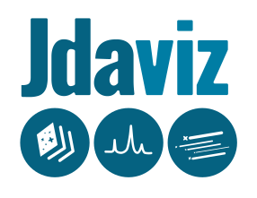

.. image:: https://zenodo.org/badge/DOI/10.5281/zenodo.5513927.svg
    :target: https://doi.org/10.5281/zenodo.5513927
    :alt: Zenodo DOI

.. image:: https://github.com/spacetelescope/jdaviz/workflows/CI/badge.svg
    :target: https://github.com/spacetelescope/jdaviz/actions
    :alt: GitHub Actions CI Status

.. image:: https://codecov.io/gh/spacetelescope/jdaviz/branch/main/graph/badge.svg
    :target: https://codecov.io/gh/spacetelescope/jdaviz

.. image:: https://readthedocs.org/projects/jdaviz/badge/?version=latest
    :target: https://jdaviz.readthedocs.io/en/latest/?badge=latest
    :alt: Documentation Status

.. image:: https://img.shields.io/badge/powered%20by-AstroPy-orange.svg?style=flat
    :target: https://www.astropy.org
    :alt: Powered by Astropy

``jdaviz`` is a package of astronomical data analysis visualization tools based on the Jupyter platform. It is one tool that is a part of STScI's larger `Data Analysis Tools Ecosystem <https://jwst-docs.stsci.edu/jwst-post-pipeline-data-analysis>`_. These GUI-based tools link data
visualization and interactive analysis.  They are designed to work
within a Jupyter notebook cell, as a standalone desktop application,
or as embedded windows within a website -- all with nearly-identical
user interfaces. ``jdaviz`` is under active development, and users who
encounter bugs in existing features are encouraged to open issues in this
repository.

``jdaviz`` provides data viewers and analysis plugins that can be flexibly
combined as desired to create interactive applications that fit your workflow.
Three named preset configurations for common use cases are provided. **Specviz**
is a tool for visualization and quick-look analysis of 1D astronomical spectra.
**Mosviz** is a visualization tool for many astronomical spectra,
typically the output of a multi-object spectrograph (e.g., JWST
NIRSpec), and includes viewers for 1D and 2D spectra as well as
contextual information like on-sky views of the spectrograph slit.
**Cubeviz** provides a view of spectroscopic data cubes (like those to be
produced by JWST MIRI), along with 1D spectra extracted from the cube.
**Imviz** provides visualization and quick-look analysis for 2D astronomical
images.

This tool is designed with instrument modes from the James Webb Space Telescope (JWST) in mind, but
the tool should be flexible enough to read in data from many astronomical telescopes.  The documentation provides a complete `table of all supported modes <https://jdaviz.readthedocs.io/en/latest/#jwst-instrument-modes-in-jdaviz>`_.

Installing
----------

You may want to consider installing ``jdaviz`` in a new virtual or conda environment to avoid 
version conflicts with other packages you may have installed, for example:

.. code-block:: bash

   conda create -n jdaviz-env python=3.9
   conda activate jdaviz-env

Installing the released version can be done using pip:

.. code-block:: bash

   pip install jdaviz --upgrade

For details on installing and using Jdaviz, see the
`Jdaviz Installation <https://jdaviz.readthedocs.io/en/latest/installation.html>`_.

Quick Start
-----------

Once installed, ``jdaviz`` can be run either as a standalone web application or in a Jupyter notebook.

As a Web Application
++++++++++++++++++++

``jdaviz`` provides a command-line tool to start the web application. To see the syntax and usage,
from a terminal, type:

.. code-block:: bash

    jdaviz --help
    jdaviz --layout=specviz /path/to/data/spectral_file

For more information on the command line interfaces for each tool, see the
`Jdaviz docs <https://jdaviz.readthedocs.io/en/latest/index.html>`_.

In a Jupyter Notebook
+++++++++++++++++++++

The power of ``jdaviz`` is that it can integrated into your Jupyter notebook workflow:

.. code-block:: python

    from jdaviz import Specviz

    specviz = Specviz()
    specviz.show()

To learn more about the various ``jdaviz`` application configurations and loading data, see the
`Specviz <https://jdaviz.readthedocs.io/en/latest/specviz/import_data.html>`_,
`Cubeviz <https://jdaviz.readthedocs.io/en/latest/cubeviz/import_data.html>`_,
`Mosviz <https://jdaviz.readthedocs.io/en/latest/mosviz/import_data.html>`_,
`Imviz <https://jdaviz.readthedocs.io/en/latest/imviz/import_data.html>`_,
or `Specviz2D <https://jdaviz.readthedocs.io/en/latest/specviz2d/import_data.html>`_ tools.

``jdaviz`` also provides a directory of `sample notebooks <https://jdaviz.readthedocs.io/en/latest/sample_notebooks.html>`_ to test the application, located in the ``notebooks`` sub-directory
of the git repository.  ``CubevizExample.ipynb`` is provided as an example that loads a JWST data cube with the
``Cubeviz`` configuration.  To run the provided example, start the Jupyter kernel with the notebook path:

.. code-block:: bash

    jupyter notebook /path/to/jdaviz/notebooks/CubevizExample.ipynb

Help
----

If you uncover any issues or bugs, you can
`open a GitHub issue <https://github.com/spacetelescope/jdaviz/issues/new/choose>`_
if they are not already reported. For faster responses, however, we encourage you to
submit a `JWST Help Desk Ticket <https://jwsthelp.stsci.edu>`_.

Recordings and instructional notebooks from live Jdaviz tutorials (as part of the JWebbinars series)
can be found at `the JWebbinar website <https://www.stsci.edu/jwst/science-execution/jwebbinars>`_
under the "Materials and Videos" expandable section. Scroll down to the bottom of that section to
find materials from the most recent session (JWebbinar 24, March 2023).

License & Attribution
---------------------

This project is Copyright (c) JDADF Developers and licensed under
the terms of the BSD 3-Clause license. This package is based upon
the `Astropy package template <https://github.com/astropy/package-template>`_
which is licensed under the BSD 3-clause licence. See the
`licenses <https://github.com/spacetelescope/jdaviz/tree/main/licenses>`_
folder for more information.

Cite ``jdaviz`` via our Zenodo record: https://doi.org/10.5281/zenodo.5513927.

Contributing
------------

We love contributions! ``jdaviz`` is open source,
built on open source, and we'd love to have you hang out in our community.

**Imposter syndrome disclaimer**: We want your help. No, really.

There may be a little voice inside your head that is telling you that you're not
ready to be an open source contributor; that your skills aren't nearly good
enough to contribute. What could you possibly offer a project like this one?

We assure you - the little voice in your head is wrong. If you can write code at
all, you can contribute code to open source. Contributing to open source
projects is a fantastic way to advance one's coding skills. Writing perfect code
isn't the measure of a good developer (that would disqualify all of us!); it's
trying to create something, making mistakes, and learning from those
mistakes. That's how we all improve, and we are happy to help others learn.

Being an open source contributor doesn't just mean writing code, either. You can
help out by writing documentation, tests, or even giving feedback about the
project (and yes - that includes giving feedback about the contribution
process). Some of these contributions may be the most valuable to the project as
a whole, because you're coming to the project with fresh eyes, so you can see
the errors and assumptions that seasoned contributors have glossed over.

Note: This disclaimer was originally written by
`Adrienne Lowe <https://github.com/adriennefriend>`_ for a
`PyCon talk <https://www.youtube.com/watch?v=6Uj746j9Heo>`_, and was adapted by
jdaviz based on its use in the README file for the
`MetPy project <https://github.com/Unidata/MetPy>`_.
