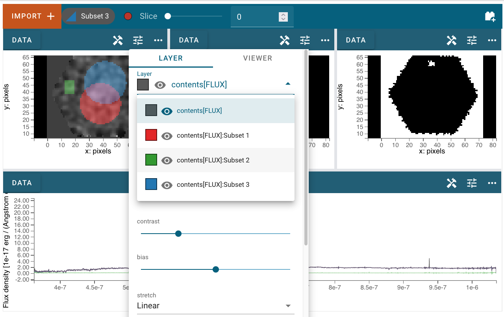

.. _cubeviz-display-cubes:

****************
Displaying Cubes
****************

The Cubeviz layout includes three image viewers (at the top of the app)
and one spectrum viewer (at the bottom of the app), which it attempts to 
populate automatically when the first dataset is loaded. By default, cubeviz
attempts to parse and display the flux in the top left viewer, the uncertainty
in the top middle viewer, and the mask into the top right viewer. The spectrum
viewer is populated by default by collapsing the spatial axes using the `max`
function. The indicators that the load machinery looks for in each HDU to 
populate the viewers are below (note that in all cases, header values are
converted to lower case):

    - Flux viewer: `hdu.name` is in the set `['flux', 'sci']`
    - Uncertainty viewer: `hdu.header.keys()` includes "errtype" or `hdu.name` 
      is in the set `['ivar', 'err', 'var', 'uncert']`
    - Mask viewer: `hdu.data.dtype` is `np.int`, `np.uint` or `np.uint32`, or
      `hdu.name` is in the set `['mask', 'dq']`

If any viewer fails to populate automatically, or if displaying 
different data is desired, the user can manually select data for each viewer
as described in the next section. Different statistics for collapsing the 
spectrum displayed in the spectrum viewer can be chosen as described in 
:ref:`Display Settings<display-settings>`. Note that any spatial subsets will 
also be collapsed into a spectrum using the same statistic and displayed in 
the spectrum viewer along with the spectrum resulting from collapsing all the
data in each spectral slice.

.. _cubeviz-selecting-data:

Selecting Data Set
==================

The data to be displayed in each viewer can be selected and de-selected by 
clicking on the :guilabel:`hammer and screwdriver` icon at the top left of each viewer. 
Then, click the :guilabel:`gear` icon to access the :guilabel:`Data` tab. Here, 
you can click the checkbox next to each listed dataset to make that dataset 
visible (checked) or invisible (unchecked).

 .. image:: img/data_tab_with_2_data.png

Changing Wavelength Slice
=========================

To change the wavelength slice, click and drag the :guilabel:`slider` at the top of the Cubeviz User Interface (UI)
to the left or right in order to get a lower or higher slice number, respectively. Another option is to
click the :guilabel:`circle` that controls the location on the :guilabel:`slider` and use the
:guilabel:`left` or :guilabel:`right` arrow keys on your keyboard to find a slice number with more precision.
A third option is to type a slice number into the :guilabel:`text box` to the right of the :guilabel:`slider`
and press :guilabel:`enter` on your keyboard. A fourth option is to use the :guilabel:`up/down arrows` inside
the :guilabel:`text box` to raise/lower the slice number.

Defining Spatial Regions
========================

Regions can be created by first clicking the :guilabel:`hammer and screwdriver` icon and
selecting either the :guilabel:`rectangular region of interest` icon or the
:guilabel:`circular region of interest` icon, then clicking and dragging (using the mouse) until the
desired region is covered by a colored shape, after which you release the mouse button.
Once you have completed the action of clicking and dragging, there is an opportunity to reposition
the region of interest by clicking on it and moving the region to a different location in the image viewer.
If you are satisfied with the positioning of your region of interest, simply click another part of the
viewer to lock it in place. Once a region is selected, the cube will be collapsed in wavelength space over the region,
and the resulting spectrum will be displayed in the 1d spectrum viewer at the bottom of the UI.

.. image:: img/subset_creation.png

There are other options available for region of interest. At the top of the User Interface,
there is a section that says either "+ No selection (create new)" or "Subset n" where n is an integer
that tells you which Subset is currently selected. To the right of this area, are red circles that allow
you to change the method of region selection. The options are `replace`, `add`, `and`, `xor`, and `remove`.
`replace` will remove the previously created selection and place the newly created subset.
`add` allows you to create another subset that extends the existing subset.
`and` only leaves behind the overlapping region between the existing subset and any additional subsets.
`xor` only leaves behind the non-overlapping region between the existing subset and any additional subsets.
`remove` will de-select any parts of the existing subset that overlaps with any additional subsets.
You can use these options to further adjust the region of interest and adapt it to your use case.

.. seealso::

    `Defining subsets using Glue <http://docs.glueviz.org/en/stable/getting_started/#defining-subsets>`_
        Glueviz documentation on defining and refining subsets. Slightly different UI but same approach.

There are options available in the :guilabel:`Layer` tab to make subsets visible or invisible,
to change their color, and to change their opacity.

Defining Spectral Regions
=========================

Spectral regions can be defined in the spectrum viewer in the same way they
are defined in Specviz.

.. seealso::

    `Defining Spectral Regions (Specviz) <https://jdaviz.readthedocs.io/en/latest/specviz/displaying.html#spectral-regions>`_
        Documentation on defining spectral regions in a 1D spectrum viewer.

Pan/Zoom
========

Panning and zooming in the Cubeviz viewers works the same as described in the
section on :ref:`Panning and Zooming in Specviz <pan-zoom>`, with the exception
that image viewers have only the bidirectional Pan/Zoom tool enabled. The 
1D spectrum viewer allows panning and zooming along a single axis as in 
Specviz.

.. _display-settings:

Display Settings
================

To access all of the different display settings for an image viewer, click
the :guilabel:`hammer and screwdriver` and go to the :guilabel:`Layer` tab.
Changing the display settings DOES NOT change the underlying data, only the
visualization of that data.

Layer
-----

This option allows you to change which layer you are changing the settings for.

Attribute
---------

This shows which extension of the data is being displayed in the current viewer.

Contour
-------

This option selects whether to show or hide contours.

Bitmap
------

This option selects whether to show or hide the bitmap (image) in the viewer.

Opacity
^^^^^^^

Change the translucence of the image.

Contrast
^^^^^^^^

Change the luminance of the color in the image.

Bias
^^^^

Set a constant to subtract from every point in the data array before
applying the conversion between data value and displayed pixel saturation.
The :guilabel:`bias` slider center position is 0 bias, such that a user can apply negative
bias values by sliding it left.

Stretch
^^^^^^^

Change the equation that is used to convert data values between
:guilabel:`min` and :guilabel:`max` to the 0 to 1 scale of pixel saturation on the displayed
image.

Percentile
^^^^^^^^^^

Can be used to set the :guilabel:`min` and :guilabel:`max` values based on percentiles of the data.

Min
"""

If the percentile is "custom", then the data value corresponding to the
minimum of the colormap scale (e.g. black in grayscale) can be set.

Max
"""

If the percentile is "custom", then the data value corresponding to the
maximum of the colormap scale (e.g. white in grayscale) can be set.

Colormap
^^^^^^^^

The spectrum of colors used to visualize data can be changed using this drop down.

.. seealso::

    `Plot Settings (Specviz) <https://jdaviz.readthedocs.io/en/latest/specviz/displaying.html#plot-settings>`_
        Plot settings for the spectrum 1D viewer.
