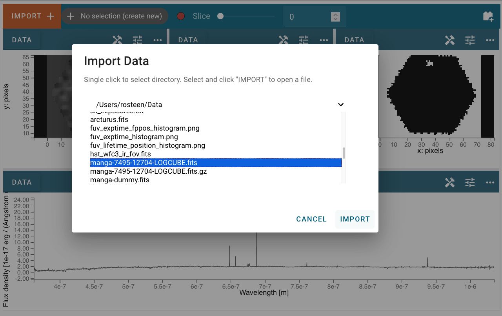

.. _cubeviz-import-data:

***********
Import Data
***********

There are two primary ways in which a user can load their data into the Cubeviz 
application. Cubeviz supports loading FITS files that can be parsed as 
:class:`~spectral_cube.SpectralCube` objects, in which case the application will
attempt to automatically parse the data into the viewers as described in 
:ref:`cubeviz-display-cubes`. Cubeviz also supports loading FITS files that can
be parsed as :class:`~specutils.Spectrum1D`, which will be loaded into the 
1D spectrum viewer.

Importing data through the GUI
------------------------------

The first way that users can load their data into the Cubeviz application is 
by clicking the :guilabel:`Import` button at the top left of the application's 
user interface. This opens a dialogue where the user can enter the path of file 
that can be parsed as a :class:`~spectral_cube.SpectralCube`
or :class:`~specutils.Spectrum1D` in the text field:

After clicking :guilabel:`Import`, the data file will be parsed and loaded into the 
application. A notification will appear to let users know if the data import 
was successful. Afterward, the new data set can be found in the :guilabel:`Data` 
tab of each viewer's options menu as described in :ref:`cubeviz-selecting-data`

Importing data via the API
--------------------------

Alternatively, if users are working in a coding environment like a Jupyter 
notebook, they have access to the Cubeviz helper class API. Using this API, 
users can load data into the application through code using the `load_data` 
method, which takes as input either the name of a local file or a 
:class:`~spectral_cube.SpectralCube` or :class:`~specutils.Spectrum1D` object.

    >>> from jdaviz import CubeViz
    >>> cubeviz = CubeViz()
    >>> cubeviz.load_data("/Users/demouser/data/cube_file.fits") #doctest: +SKIP

