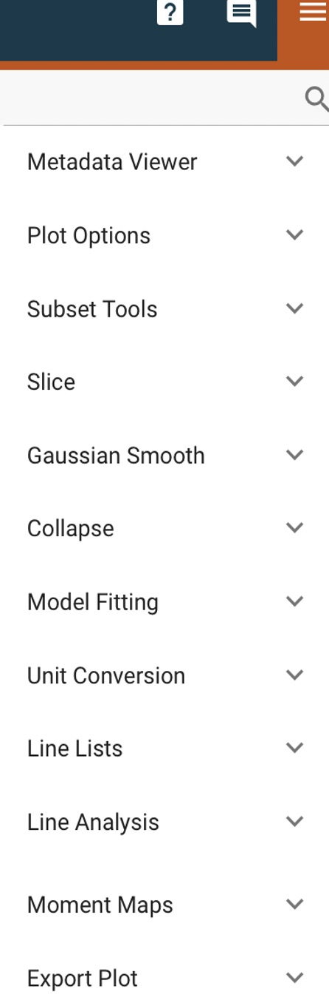
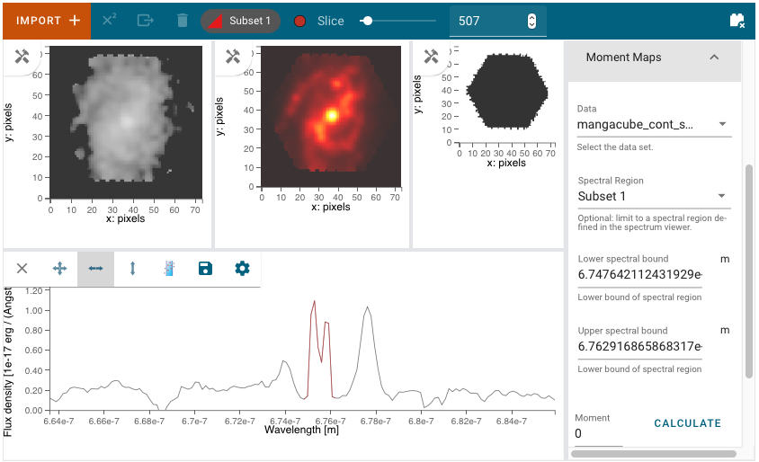

*********************
Data Analysis Plugins
*********************

The Cubeviz data analysis plugins are meant to aid quick-look analysis
of 2D image data. All plugins are accessed via the :guilabel:`plugin`
icon in the upper right corner of the Cubeviz application.

The data analysis plugins are meant to aid quick-look analysis
of both 3D and 1D spectroscopic data. In many cases, functions can be applied to
`~specutils.Spectrum1D` objects, which include both 3D and 1D datasets.
Plugins that are specific to 1D spectra are described in
more detail under :ref:`Specviz: Data Analysis Plugins <specviz-plugins>`.
In many cases, these capabilities can be further applied on a per spaxel basis
within a cube.

.. _cubeviz-metadata-viewer:

Metadata Viewer
===============

.. seealso::

    :ref:`Metadata Viewer <imviz_metadata-viewer>`
        Documentation on using the metadata viewer.

.. _cubeviz-plot-options:

Plot Options
============

This plugin gives access to per-viewer and per-layer plotting options.

.. seealso::

    :ref:`Image Plot Options <imviz-display-settings>`
        Documentation on Imviz display settings in the Jdaviz viewers.

.. seealso::

    :ref:`Spectral Plot Options <specviz-plot-settings>`
        Documentation on Specviz display settings in the Jdaviz viewers.

.. _cubeviz-subset-plugin:

Subset Tools
============

.. seealso::

    :ref:`Subset Tools <imviz-subset-plugin>`
        Imviz documentation describing the concept of subsets in Jdaviz.

Markers
=======

.. seealso::

    :ref:`Markers <markers-plugin>`
        Imviz documentation describing the markers plugin.

.. _slice:

Slice
=====

The slice plugin provides the ability to select the slice
of the cube currently visible in the image viewers, with the
corresponding wavelength highlighted in the spectrum viewer.

The slider can be grabbed to scrub through the cube.  To choose
a specific slice, enter a slice number (integer) or an approximate
wavelength (in which case the nearest slice will be selected and 
the wavelength entry will update to the exact value of that slice).

The spectrum viewer also contains a tool to allow clicking and 
dragging in the spectrum plot to choose the currently selected slice.
When the slice tool is active, clicking anywhere on the spectrum viewer
will select the nearest slice across all viewers, even if the indicator
is off-screen.

For your convenience, there are also player-style buttons with
the following functionality:

* Jump to first
* Play/Pause
* Next slice
* Jump to last

Gaussian Smooth
===============

Gaussian smoothing can be applied either to the spectral
or spatial dimensions of a cube.

.. seealso::

    :ref:`Gaussian Smooth <gaussian-smooth>`
        Specviz documentation on gaussian smoothing in the spectral dimension of 1D spectra.

.. _collapse:

Collapse
========

.. image:: ../img/collapse_plugin.png

The Collapse plugin collapses a spectral cube along
the wavelength axis to create a 2D spatial image.
For spatial axes, the full extent of the selected dimension
is included in the collapse. For the spectral axis, a wavelength
range for collapse can be specified using a spectral subset or
by entering the wavelength range manually.

To make a 2D image, first go to the Collapse plugin and
select the cube dataset using the
:guilabel:`Data` pulldown. Next, select the method
for collapse (Mean, Median, Min, Max, or Sum) in the
:guilabel:`Method` pulldown. To collapse a limited spectral subregion,
you can either create and select a
:guilabel:`Region` in the spectrum viewer, or enter the lower and
upper spectral bounds manually. When you :guilabel:`APPLY` the
Collapse, a 2D image is created. You can load this into any image
viewer pane to inspect the result.  For example, the Collapse Sum
over an emission line is shown in the middle image viewer of
the above figure.

.. _model-fitting:

Model Fitting
=============

.. seealso::

    :ref:`Model Fitting <specviz-model-fitting>`
        Specviz documentation on fitting spectral models.

For Cubeviz, there is an additional option to fit the model over each individual spaxel by
enabling the :guilabel:`Cube Fit` toggle before pressing :guilabel:`Fit Model`.  
The best-fit parameters for each spaxel are stored in planes and saved in a data structure.
The resulting model itself is saved with the label specified in the :guilabel:`Output Data Label` field.

.. seealso::

    :ref:`Export Models <cubeviz-export-model>`
        Documentation on exporting model fitting results.

Unit Conversion
===============

.. seealso::

    :ref:`Unit Conversion <unit-conversion>`
        Specviz documentation on unit conversion.

Line Lists
==========

.. seealso::

    :ref:`Line Lists <line-lists>`
        Specviz documentation on line lists.

Line Analysis
=============

.. seealso::

    :ref:`Line Analysis <line-analysis>`
        Specviz documentation on line analysis.

Currently the Line Analysis plugin in Cubeviz will calculate statistics
for spectral features in the collapsed spectrum, which is visualized in
the spectrum viewer. The propagation of uncertainties from the uncertainty
cube to the collapsed spectrum is still work in progress. As a result,
uncertainties on values provided by the Line Analysis plugin are
not provided.

.. _moment-maps:

Moment Maps
===========

.. image:: ../img/moment1_map.png

The Moment Maps plugin can be used to create a 2D image from
a data cube. Mathematically, a moment is an integral
of a 1D curve multiplied by the abscissa to some power. The plugin
integrates the flux density along the spectral axis to compute
a moment map. The order of the moment map (0, 1, 2, ...) indicates
the power-law index to which the spectral axis is raised.  A 'moment 0' map
gives the integrated flux over a spectral region. Similarly, 'moment 1'
is the flux-weighted centroid (e.g., line center) and 'moment 2'
is the dispersion (e.g., wavelength or velocity dispersion)
along the spectral axis.  Moments 3 and 4 are less commonly utilized,
but correspond to the skewness and
kurtosis of a spectral feature.

To make a moment map, first go to the Moment Maps plugin and
select the cube dataset using the :guilabel:`Data` pulldown.
To specify the spectral feature of interest, you can either create
and select a :guilabel:`Region` in the spectrum viewer, or enter
the lower and upper spectral bounds manually in the plugin.
Next, enter the :guilabel:`Moment` index to specify the order
of the moment map.   When you press :guilabel:`CALCULATE`, a 2D moment
map is created. You can load this into any image
viewer pane to inspect the result. You can also save the result to
a FITS format file by pressing :guilabel:`SAVE AS FITS`.

For example, the middle image viewer in the screenshot above shows the Moment 1 map
for a continuum-subtracted cube.  Note that the cube should first be
continuum-subtracted in order to create continuum-free moment maps of an
emission line. Moment maps of continuum emission can also be created, but
moments other than moment 0 may not be physically meaningful.  Also note
that the units in the moment 1 and moment 2 maps reflect the units of the spectral
axis (Angstroms in this case). The units of the input cube should first be
converted to velocity units before running the plugin if those units are
desired for the output moment maps.

Line or Continuum Maps
----------------------

There are at least three ways to make a line map using
one of three Cubeviz plugins: :ref:`Collapse <collapse>`,
:ref:`Moment Maps <moment-maps>`,
or :ref:`Model Fitting <model-fitting>`.
Line maps created using the first two methods require an
input data cube that is already continuum-subtracted.  Continuum
maps can be created in a similar way for data that is not
continuum-subtracted.

To make a line or continuum map using the :ref:`Collapse Plugin <collapse>`, first
import a data cube into Cubeviz.  Next, go to the
Collapse plugin and select the input data using the
:guilabel:`Data` pulldown. Then set the :guilabel:`Axis` to the
wavelength axis (e.g. 0 for JWST data) and the method to 'Sum'
(or any other desired method). Next either create and select a
:guilabel:`Region` in the spectrum viewer, or enter the lower and upper
spectral bounds manually. When you :guilabel:`Apply` the Collapse, a 2D image
of the spectral region is created. You can load this line map in any image
viewer pane to inspect the result.

A line map can also be created using the :ref:`Moment Maps Plugin <moment-maps>` using a
similar workflow. Select the (continuum-subtracted) dataset in the
Plugin using the :guilabel:`Data` pulldown.  Then either select a
subset in the Spectral Region pulldown or enter the lower and upper
spectral bounds. Enter '0' for :guilabel:`Moment` and press
:guilabel:`Calculate` to create the moment 0 map. The resultant 2D
image is the flux integral of the cube over the selected spectral
region, and may be displayed in any image viewer, as shown in the
middle image viewer in the figure above.

The third method to create a map is via the :ref:`Model Fitting Plugin <model-fitting>`.
First create and fit a model (e.g. a Gaussian plus continuum model)
to an individual spectrum. Next, fit this model to every spaxel in
your data cube. The resultant model parameter cube can be retrieved
in a notebook. The line or continuum flux in each spatial pixel
can then be computed by integrating over the line or continuum
spectral region of interest.

.. _cubeviz-export-plot:

Export Plot
===========

This plugin allows exporting the plot in a given viewer to various image formats.

If you have ``opencv-python`` installed, you are also able to export selected
cube slices to a video file.
