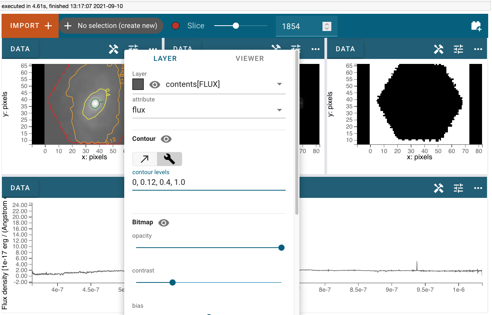
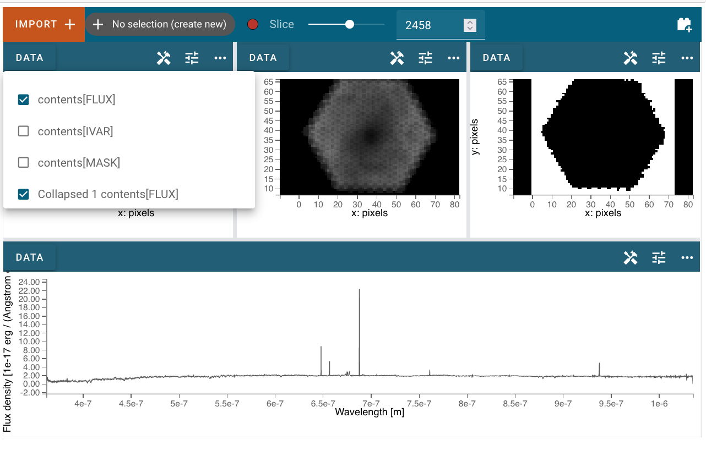

*********************
Data Analysis Plugins
*********************

The Cubeviz data analysis plugins include operations on both
Spectrum1D one dimensional datasets and SpectralCube objects.
Plugins that are specific to 1D spectra are described in
more detail under Specviz:Data Analysis Plugins.  All plugins
are accessed via the plugin icon in the upper right corner
of the Cubeviz application.

Gaussian Smooth
===============

Gaussian smoothing can be applied either to the spectral
or spatial dimensions of a cube.  Spectral smoothing is
described in more detail under Specviz:Data Analysis
Plugins:Gaussian Smoothing.

.. seealso::

    `Gaussian Smooth <https://jdaviz.readthedocs.io/en/latest/specviz/plugins.html#gaussian-smooth>`_
        Specviz documentation on gaussian smoothing of 1D spectra.

.. _collapse:

Collapse
===============

The Collapse plugin collapses a spectral cube along
any one axis (x, y , or wavelength) to create a 2D image.
For spatial axes, the full extent of the selected dimension
is included in the collapse. For the spectral axis, a wavelength
range for collapse can be specified using a spectral subset or
by entering the wavelength range manually.

To make a 2D image, first go to the Collapse plugin and
select the cube dataset using the
:guilabel:`Data` pulldown. Then set the :guilabel:`Axis` to the
dimension to be collapsed (0, 1, or 2). Next, select the method
for collapse (Mean, Median, Min, Max, or Sum) in the
:guilabel:`Method` pulldown. To collapse a limited spectral subregion,
you can either create and select a
:guilabel:`Region` in the spectrum viewer, or enter the lower and
upper spectral bounds manually. When you :guilabel:`Apply` the
Collapse, a 2D image is created. You can load this into any image
viewer pane to inspect the result.

.. _model-fitting:

Model Fitting
=============

The Model Fitting plugin is described in more detail by the
Specviz:Data Analysis Plugins:Model Fitting documentation.
For Cubeviz, there is an additional option to fit the model over each individual spaxel by
pressing :guilabel:`Apply to Cube`.  The fit parameter planes are saved in a data structure
that can be accessed in a jupyter notebook. The best model fit, evaluated over the cube is
also saved to a dataset with the label specified in the :guilabel:`Model Label` field (default 'Model').

.. seealso::

    `Model Fitting <https://jdaviz.readthedocs.io/en/latest/specviz/plugins.html#model-fitting>`_
        Specviz documentation on fitting spectral models.

Contours
========

:guilabel:`Contours` can be accessed in the :guilabel:`Layer` tab in the viewer settings window.
To activate :guilabel:`Contours`, click on the :guilabel:`Eye with a cross` icon and choose either the :guilabel:`Linear` icon for auto-contours or the :guilabel:`Custom` icon to set your own levels.

.. image:: img/contour_location.png

The :guilabel:`Contours` of a 2D image can also be plotted over an image viewer.
A user can create a 2D image using a plugin like :ref:`Collapse <collapse>` and then add it to an image viewer as a 2nd layer.

To visualize the contours of this 2D image over the image viewer, first go to the :guilabel:`Layer` tab, select the 2nd layer (which should be the 2D image), and then set its :guilabel:`Contour` to be on and its :guilabel:`Bitmap` to be off.

.. image:: img/layer_tab_with_2_layers.png

Unit Conversion
===============

.. seealso::

    `Unit Conversion <https://jdaviz.readthedocs.io/en/latest/specviz/plugins.html#unit-conversion>`_
        Specviz documentation on unit conversion.

Line Lists
==========

.. seealso::

    `Line Lists <https://jdaviz.readthedocs.io/en/latest/specviz/plugins.html#line-lists>`_
        Specviz documentation on line lists.

Line Analysis
=============

.. seealso::

    `Line Analysis <https://jdaviz.readthedocs.io/en/latest/specviz/plugins.html#line-analysis>`_
        Specviz documentation on line analysis.

.. _moment-maps:

Moment Maps
=============

The Moment Maps plugin can be used to create a 2D image from
a data cube. Mathematically, a moment is an integral
of a 1D curve multiplied by the abscissa to some power. The plugin
integrates the flux density along the spectral axis to compute
a moment map. The spectral axis is first shifted so that the
center of the spectral region is at zero. The order of the moment
map (0, 1, 2, ...) indicates the power-law index to which the
spectral axis is raised.  A 'moment 0' map gives the integrated
line flux over the spectral region. Similarly, 'moment 1'
is the flux-weighted centroid (e.g. line center) and a 'moment 2'
is the dispersion (e.g. wavelength or velocity dispersion)
along the spectral axis.  Moments 3 and 4 are less commonly utilized, but correspond to the skewness and
kurtosis of a spectral feature.

To make a moment map, first go to the Moment Maps plugin and
select the cube dataset using the :guilabel:`Data` pulldown.
To specify the spectral feature of interest, you can either create
and select a :guilabel:`Region` in the spectrum viewer, or enter
the lower and upper spectral bounds manually in the plugin.
Next, enter the :guilabel:`Moment` index to specifiy the order
of the moment map.   When you press :guilabel:`Calculate`, a 2D moment
map is created. You can load this into any image
viewer pane to inspect the result.

Line or Continuum Maps
===================================

There are at least three ways to make a line map using
one of three Cubeviz plugins: :ref:`Collapse <collapse>`,
:ref:`Moment Maps <moment-maps>`,
or :ref:`Model Fitting <model-fitting>`.
Line maps created using the first two methods require an
input data cube that is already continuum-subtracted.  Continuum
maps can be created in a similar way for data that is not
continuum-subtracted.

To make a line or continuum map using the Collapse plugin, first
import a data cube into Cubeviz.  Next, go to the
Collapse plugin and select the input data using the
:guilabel:`Data` pulldown. Then set the :guilabel:`Axis` to the
wavelength axis (e.g. 0 for JWST data) and the method to 'Mean'.
Next either create and select a :guilabel:`Region` in the spectrum
viewer, or enter the lower and upper spectral bounds manually.
When you :guilabel:`Apply` the Collapse, a 2D image of the spectral
region is created. You can load this line map in any image viewer
pane to inspect the result.

A line map can also be created using the Moment Maps Plugin using a
similar workflow. Select the (continuum-subtracted) dataset in the
Plugin using the :guilabel:`Data` pulldown.  Then either select a
subset in the Spectral Region pulldown or enter the lower and upper
spectral bounds. Enter '0' for :guilabel:`Moment` and press
:guilabel:`Calculate` to create the moment 0 map. The resultant 2D
image is the flux integral of the cube over the selected spectral
region, and may be displayed in any image viewer.

The third method to create a map is via the Model Fitting plugin.
First create and fit a model (e.g. a Gaussian plus continuum model)
to an individual spectrum. Next, fit this model to every spaxel in
your data cube. The resultant model parameter cube can be retrieved
in a notebook. The line or continuum flux in each spatial pixel
can then be computed by integrating over the line or continuum
spectral region of interest.
