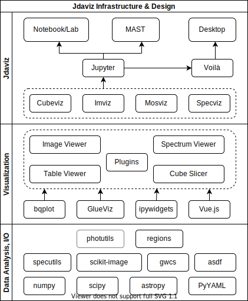

********************************
JDAViz Design and Infrastructure
********************************

This document outlines the top-level structure of jdaviz. At the highest level, jdaviz layers different, sometimes changing technologies in the Jupyter platform to do its visualization, and therefore provides a framework for these technologies to work together.  This document describes that framework, as well as the high-level sets of components needed for the jdaviz use cases at the time of this document's writing. Bear in mind, though, that the fast moving scientific and technical fields jdaviz is aimed at mean that some of the specific details in this document may change faster than the document can be kept up, so the high-level structure is the primary focus of this document, with the specific components best thought of as *examples* rather than a comprehensive list of all components implemented.  (For that, see the documentation itself).

This document lists the layers of the `jdaviz` framework in essentially the order in which they contact users in a typical visualization-heavy workflow.  These layers are: interfaces, applications, component widgets, and libraries. An overview of the layers is in this diagram, and each is described in more detail below:

Interfaces
==========

"Interfaces" are the tool the user is using to access the analysis tools. The word "platform" might at first seem more applicable, but in this case all of the interfaces are using Jupyter as the platform, to ensure a consistent look-and-feel and a single platform for which to target the tools.  The interfaces are then specific interfaces through which users access this platform.  The target interfaces are:

* **Notebook**: while the actual app the user is running may be either `JupyterLab <https://jupyterlab.readthedocs.io>`_ or the "classic" `Jupyter Notebook <https://jupyter-notebook.readthedocs.io/en/stable/>`_, the interface idiom is similar - a relatively linear notebook-style workflow. Lower layers are viewed .  This is the most flexible interface as it allows the user to implement their own code free-form in the notebook and it with cells using jdaviz tools.  Hence this layer particularly emphasizes modularity and flexibility.
* **Desktop app**: this interface is meant to behave like a more traditional "desktop app", meaning a window with a fixed set of functionality and a particular layout for a specific set of scientific use cases.  This interface is accessed via an `Electron <https://electronjs.org/>`_  wrapper that loads the same machinery as other interfaces but presents the outputs of notebook "cells" as the only view. This trades the flexibility of the notebook interface for a consistent and reproducible layout and simpler interface without the distraction of the notebook and associated code.
* **Embedded web site/"MAST"**: this interface embeds particular jdaviz applications inside existing web sites.  This provides the capabilities of the jdaviz tools in other web sites (e.g., `the Mikulski Archive for Space Telescopes <http://archive.stsci.edu/>`_), while providing the sites the freedom to be designed and laid out independently from the visualization tool framework.  While this even further restricts the functionality, it provides maximum flexibility in embedding.

Each of these interfaces uses a common set of applications implemented in Python and leverging ipywidgets_ as the communication layer between Python and the javascript-level layout, rendering, and iteractivity libraries. Hence the following layers are primarily implemented in Python, but utilize tools like ipyvuetify_ and ipygoldenlayout_ to allow the Python code to interact with the javascript implementations at the interface level.

Applications
============

The next layer is the "Application" layer. These applications in and of themselves do not implement significant functionality, but are particular layouts that combine the lower layers (primarily component widgets) to accomplish specific visualization tasks. They have particular science goals that are then mainly reflected in the capabilities of the lower layers, but the functionality in those widgets are connected together to solve those goals in the applications. The desktop app and embedded web site interfaces will typically wrap exactly one of these applications, while the notebook's additional flexibility means it may include multiple applications, or a mix of applications and individual widgets.

Specific target applications include:

* *specviz*: this application provides a view into a single astronomical spectrum.  It provides a UI to view the spectrum, as well as perform common scientific operations like marking spectral regions for further analysis (in e.g. a notebook), subtracting continuua, measuring and fitting spectral lines, etc.
* *mosviz*: this application provides a view into many astronomical spectra, typically the output of a multi-object spectrograph (e.g. `JWST NIRSpec <https://jwst.nasa.gov/content/observatory/instruments/nirspec.html>`_).  It provides capabilities for individual spectra like specviz, but for multiple spectra at a time along with additional contextual information like on-sky views of the spectrograph slit.
* *cubeviz*: this application provides a view of spectroscopic data cubes (like those to be produced by `JWST MIRI <https://jwst.nasa.gov/content/observatory/instruments/miri.html>`_), along with 1d spectra extracted from the cube. In addition to common visualization capabilities like viewing slices or averages in image or wavelength space, the application will provide some standard manipulations like smoothing, moment maps, parallelized line fitting, etc.
* *imviz*: this application provides an image-viewer for 2d images leveraging the same machinery as the other applications.  While this application is not intended to encapsulate a complete range of astronomical imaging-based workflows, it enables quick-look style visualization of images in a way that is compatible with the rest of the jdaviz framework.
* *glapp*: while not part of `jdaviz` itself, another application of relevance is the fully-flexible glue-jupyter application, designed to reproduce the functionality of the `QtGlue application <https://github.com/glue-viz/glue>`_ using this framework. While the above applications are intentionally limited in scope to focus on specific science use cases, the glapp is more flexible, so it will be desirable to have mechanisms to transition the other applications to the more complex but flexible view that the glapp can provide for the users that desire this.

Application Engine
------------------

The applications are driven by a shared layer that connects the "high-level" layers to the "low-level" layers discussed below.  The application engine manages this shared layer.  Or more concretely, the application engine is the Python-level object that can be accessed by the user in any of the interfaces to interact with a particular application.  It contains several sub-pieces to achieve this goal.  The most directly-used portion of this is the layout configuration management - `jdaviz` applications specify the UI layout they use via this part of the application engine. The application engine then constructs the layout using glue-jupyter_, `ipywidgets`, and other layout javascript/python libraries like ipyvuetify_. The application engine also is responsible for managing application-level events and data.  This is done via the built-in functionality of the `glue-core <https://github.com/glue-viz/glue>`_ library, so the application engine also provides the interface for registering new functionality (both UI and data/processing) via glue's registries.

Note that most of the application engine implementation belongs in glue-jupyter or glue core, as it is not unique to `jdaviz` (or even astronomy).  However, development may occur it times in `jdaviz` as a development convenience.  For example, when testing how well a web site interface works with a specific `jdaviz` pplication, it may be best implemented first in `jdaviz` using sub-classes of the glue classes, and only after the code is functional and stable is the code migrated upstream to `glue`.

Component Widgets
=================

The "component widget" layer is the first of the "low-level" layers - i.e., the layers that actual implement specific visualization and analysis functionality. These widgets are self-contained and in general are meant to be composed in applications. However, for the notebook interface, component widgets can and should be used directly by users for specialized scientific workflows.  Component widgets in principle can be developed in any framework that can be exposed as an `ipywidgets` widget, although currently the plan is that most will be glue-jupyter_ viewers combined with ipyvuetify_ layouts. The general goal is to push any functionality necessary for these widgets upstream into glue-jupyter_ and not confine them to `jdaviz`, but with allowances that some customization may need to be necessary for `jdaviz`/JWST-specific elements.

Known component widgets for the target applications include:

* *1d plotter*: a widget that shows a 1d astronomical data set, primarily aimed at astronomical spectra.  Interactivity includes panning, zooming, and region marking.
* *2d viewer*: a widget to show an astronomical image, along with its on-sky coordinates when WCS are available. Interactivity includes panning, zooming, and "stretch" (contrast, scale, and cut value).
* *3d slicer*: a widget for displaying slices or similar aggregate operations on spectroscopic data cubes.  While similar to the 2d viewer in appearence and interactive capabilities, the core difference is that the main data object is expected to be a data cube rather than a 2d image, and this is reflected in additional aggregation/slicing operations.
* *Table viewer*: a widget to show tabular datasets like astropy `Table` objects. Primarily meant to be combined with other viewers to examine the complete set of properties from a selection made in another viewer.  Interactivty focuses on sorting and selection of specific rows (to then be highlighted in other viewers or interacted with in a notebook).

Libraries
=========

The above layers are focused primarily on visualization.  All actual *operations* and analysis tasks to be applied to visualized data sets are to be implemented in the various Python libraries aimed at these astronomical datasets. It is important to note that these libraries are *independent* efforts from jdaviz, and can therefore be used in whole, part, or not at all with the jdaviz tools. This allows a full range of workflows, while also maintaining transparency to scientific users exactly how an operation in the jdaviz tools actually works.  I.e., they can at any time simply use the library directly instead of accessing it through jdaviz.  Known libraries include:

* astropy_
* `specutils <https://specutils.readthedocs.io>`_
* `spectral-cube <https://spectral-cube.readthedocs.io>`_ and/or `NDCube <https://docs.sunpy.org/projects/ndcube>`_
* `photutils <https://photutils.readthedocs.io>`_

Note that those libraries themselve depend on the wider scientific Python ecosystem, so this is by no means a comprehensive list of the libraries jdaviz depends on.  But these are the primary "top-level" libraries, meaning it is these that most users are likely to focus on to parallel or extend their jdaviz workflows.

Selections
==========

This section explains the working theory behind the selection tool and was inspired by the the introduction of two methods to the SpecViz helper:
`specviz.get_spectra()` and `specviz.get_spectral_regions()`

Data loaded in are imported into jdaviz and immediately converted into a `specutils.SpectralRegion`. These are a spectral analog to the Astropy `regions` (which instead focuses on spatial regions and their associated WCS). These spectral regions are returned by the `specviz.get_spectra()` method.

The selection tool allows the user to specify a specific range on the graph. This is defined by the underlying Glue Library upon which jdaviz relies on as a "Glue Subset." Thus throughout this section, we will refer to these user defined ranges as "subsets." Effectively, the selection tool defines a mask that can be thought of as "definition" of which data is and is not included in the subset. Upon extraction via `specviz.get_spectral_regions()`, the method will return a new `specutils.SpectralRegion` object that applies that mask atop of the proper region (data) displayed, and realizes the subset the user defined in jdaviz. 

Related Documents
=================

The above is a broad outline of the effort, particularly the specific role of `jdaviz` and how it related to `glue-jupyter`.  More specific documentation of data flow and how the code interacts at a more granular level can be found in the `glue` and `glue-jupyter` documentation.

.. _ipywidgets: https://ipywidgets.readthedocs.io
.. _ipyvuetify: https://github.com/mariobuikhuizen/ipyvuetify
.. _ipygoldenlayout: https://github.com/nmearl/ipygoldenlayout
.. _glue-jupyter: https://github.com/glue-viz/glue-jupyter
