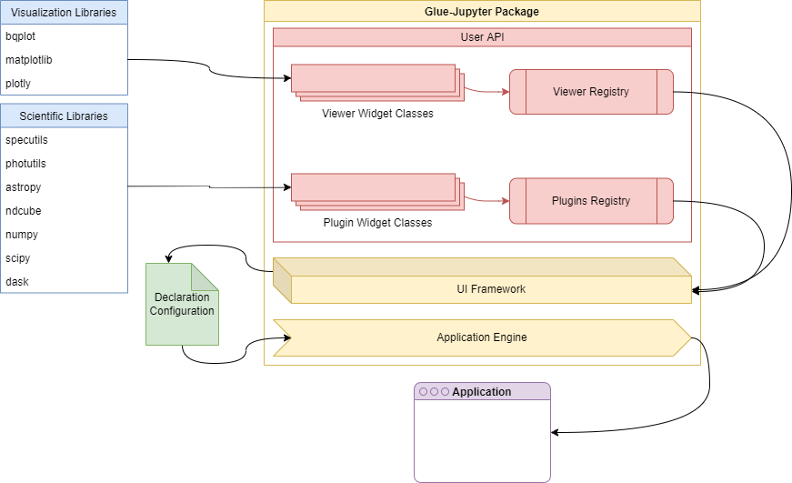

***************************
Glupyter Framework Overview
***************************

The glue-jupyter ("glupyter") package supports interacting with and
visualizing data within the Jupyter environment using core elements from
the glue python package. It is distinct because unlike the more
prominent glue package, glupyter does not leverage Qt as the front-end
GUI library. Instead, glupyter maintains the separation between the data
model (e.g. the core elements from glue that are not dependent on the
front-end library), and the view of the data (in this case, web-based
tooling provided by Jupyter).

Glupyter implements a base ``JupyterApplication`` object through which
users can manage their data, create viewers, and add links between data
sets. The data management and linking are controlled separate from the
viewers in that changes made directly to the data state propagate to the
UI -- that is, the UI does not contain any state, which allows the application to be easily controlled from code. The viewers themselves are based on the
IPyWidget package which allows the creation of widgets that can be used
and interacted with in python, but rendered in a browser environment.

There are two distinct use cases for the glupyter environment:

1. As a means to procedurally interact with pieces of a user's workflow
   *in addition* to their work in e.g. a Jupyter Notebook.
2. To provide users a web-based GUI to interact with and visualize their
   data while hiding the Python code, e.g. a standalone web application.

These two use cases describe a Python-first and GUI-first approach,
respectively. This document will focus on detailing the design of the
GUI-first approach, depicted in the following diagram.

.. note::
    The ``.xml`` file in the ``img`` directory can be used to edit the
    diagram using applications like, e.g.,
    `draw.io <https://draw.io>`_.

General user interface design
-----------------------------

The general user interface is a parallel design to the Qt desktop
interface. It is meant to be the standard scaffolding supporting the
display of the individual viewers, and implementation of data management functions and
user plugins in much the same way that the Qt desktop version does.

The implementation leverages three primary packages:

1. `glue-jupyter <https://github.com/glue-viz/glue-jupyter>`_: handles the data and state management, including
   the plugin infrastructure that provides the registry of available
   viewers, analysis functions, etc.
2. `ipyvuetify <https://github.com/mariobuikhuizen/ipyvuetify>`_: provides the UI widgets for composing the web-based
   front-end.
3. `ipygoldenlayout <https://github.com/nmearl/ipygoldenlayout>`_: an additional widget that supports tabbing and
   docking the displayed viewers.

Widget design
-------------

There are two potential approaches to designing widgets using the
ipyvuetify paradigm: composing everything in the python widget subclass
as a collection of python ipyvuetify components; or break the state of
the widget from its view and implement the latter as template file.

The first approach, while conceptually easier to understand, has a few
shortcomings. Chief of which is the fact that the view logic is jumbled
up with the state of the widget. That is, we are composing the visual
representation of the widget, defining the viewer logic, and defining
its state all during initialization. This is both extremely verbose --
as the nested nature of the Vuetify library means many of the
intermediate widget classes (e.g. ``Layout``, ``Container``, ``Row``,
etc) need to be defined as instance attributes -- and, perhaps more
severe, makes it more difficult to design reactive UI behavior that
responds to state changes in the widget classes automatically. This
means that we must constantly interact with the UI widgets to change
their state directly instead of simply having the UI *respond* to state
changes in the custom widget class. Fundamentally, this approach means
that *in addition to* the state of the custom widget (e.g. ``Toolbar``),
we must also be aware of the state of *each individual widget* that
composes it. Put another way, there's no *central source of truth* for
the state of the custom widget as each element may contain some kind of
stateful information about itself.

An alternative design, and the one used for the JDAViz tools, is to have each widget implemented as a
``VuetifyTemplate`` object. In this way, custom widgets are defined as
ipywidget-like elements whose visual representation is described by a
Vuetify template. The template composes the visual representation of the
custom widget using the Vue formalism, while the state is implemented as
`trailets <https://traitlets.readthedocs.io/en/stable/>`_ on the custom widget class. The template reads and responds to
state and state changes on the custom widget, and the custom widget need
not know or care about how that state is being represented (i.e. the
only state is that of the custom widget).

With this approach in hand, all widgets in the glupyter GUI are composed
of two files: the python file declaring the widget class (e.g.
``Toolbar``), and the ``.vue`` file containing the template describing
how the widget is to be rendered using components from the Vuetify
library in the nominal Vue framework. In this way, there is a clear
separation between the state of each widget (contained in the python
file) and the view of that state (contained in the Vuetify file). Below
is an example of what such a widget might looking like:

.. code::

    <template>
      <v-toolbar>
        <v-toolbar-side-icon></v-toolbar-side-icon>
        <v-toolbar-title>Title</v-toolbar-title>
        <v-spacer></v-spacer>
        <v-toolbar-items class="hidden-sm-and-down">
          <v-btn flat>Link One</v-btn>
          <v-btn flat>Link Two</v-btn>
          <v-btn flat>Link Three</v-btn>
        </v-toolbar-items>
      </v-toolbar>
    </template>

.. code:: python

    with open(os.path.join(os.path.dirname(__file__), "toolbar.vue")) as f:
        TEMPLATE = f.read()

    class Toolbar(VuetifyTemplate):
        template = Unicode(TEMPLATE).tag(sync=True)

        def __init__(self, *args, **kwargs):
            super().__init__(*args, **kwargs)
            ...

The state of the widget is contained in attributes on the python class
which allows them to be referenced in the Vuetify template. Notice in
the example below that the ``v-btn`` instances simply respond to the
state of the ``Toolbar`` widget's ``button_names`` attribute, and the
``Toolbar`` class could know nothing about *how* that state is being
represented.

.. code::

    <v-toolbar-items class="hidden-sm-and-down">
      <v-btn flat v-for="name in button_names">{{ name }}</v-btn>
    </v-toolbar-items>

.. code:: python

    class Toolbar(VuetifyTemplate):
        template = Unicode(TEMPLATE).tag(sync=True)
        button_names = List(['One', 'Two', 'Three']).tag(sync=True)

        def __init__(self, *args, **kwargs):
            super().__init__(*args, **kwargs)
            ...

The design of the interface can be broken down into three main areas:
the toolbar, the navigation drawer, and the dock area. Each of these
areas represents a single primary widget in the web-based application
built using ``ipyvuetify``, unified in the ``Application`` class.

Widget communication
--------------------

There are three fundamental forms of communication between widgets:

1. direction communication using the ``observer`` pattern using `Traitlets <https://traitlets.readthedocs.io/en/stable/>`_,
2. global communication using the centralized event hub provided by glue,
3. and callback properties on glue objects.

Direct messaging
~~~~~~~~~~~~~~~~

Because the software stack utilizes the ipywidgets package, attributes
on defined widget classes (e.g. ``button_names`` on the ``Toolbar``
widget in the example above) are implemented as traitlets, which can be
observed for changes. In order to register callbacks in response to
changes to attributes defined on widget classes, interested parties must
have a direct reference to the widget instance. Trailets are unique in that
they can be referenced in the front-end Vue code, so chaning a trailet-defined
attribute of a class will propagate that change to any front-end code that
references the value.

For example, if we consider that the ``Toolbar`` class above is
implemented as part of a broader ``Application``, we can respond to
changes in the ``button_names`` traitlet by setting a callback function
in the ``observe`` method of the ``Toolbar`` widget:

.. code:: python

    class Application(VuetifyTemplate):
        template = Unicode("""
            <template>
                <custom-toolbar></custom-toolbar>
            </template>
            """).tag(sync=True)

        def __init__(self, *args, **kwargs):
            # Associate the `custom-toolbar` element with the `Toolbar` class
            kwargs.set_default('components', {}).update({'custom-toolbar': Toolbar()})
            super().__init__(*args, **kwargs)

            self.toolbar = self.components['custom-toolbar']

            # This sets up the child-to-parent behavior
            self.toolbar.observe(self.on_button_names_changed, names='button_names')

            # Here we take advantage of the way trailets work

        def on_button_names_changed(self, *args, **kwargs):
            print("The list of button names has been changed.")

This type of direct child-to-parent (i.e. the parent is responding to
changes on the child) communication compliments the direct
parent-to-child communication (i.e. the parent passing data to the
child). However, this does not solve the application-level issue of
multiple components, conceivably several levels deep, trying to interact
with and pass data to each other. In this case, we decouple the widgets
from each other and instead have them interact with a central,
application-level communication hub through message objects.

Global event handing
~~~~~~~~~~~~~~~~~~~~

Communication between widgets that do not have a direct reference to
each other is handled using the ``Hub`` class of the glue-core package
(a dependency of glue-jupyter). The hub implements the publish/subscribe
paradigm wherein widgets subscribe to particular messages on the hub and
are notified whenever those messages are published by any part of the
UI. This system allows us to break hard dependencies between widgets in
the UI that require passing references around and to develop widgets
independently.

The JDAViz package includes a base class that can be used for adding
widgets that would need to communicate through global events. This is
is the ``TemplateMixin`` class and allows passing glue session objects
to widgets upon their instantiation. The glue session contains the ``Hub``
object available to the application and it, along with other useful
data objects, are easily accessible through the ``TemplateMixin``.

Using the glue event framework is covered in great detail in the
`glue documentation <http://docs.glueviz.org/en/stable/developer_guide/communication.html>`__.
The code snippet gives an example of how an event listener may be
implemented inside a widget:

.. code:: python

    from jdaviz.core.template_mixin import TemplateMixin
    from glue.core.message import DataMessage

    class TestWidget(TemplateMixin):
        text = Unicode("No messages...").tag(sync=True)
        template = Unicode("""
        <v-card>
            <v-card-text>
                
{{ text }}

            </v-card-text>
        </v-card>
        """).tag(sync=True)

        def __init__(self, *args, **kwargs):
            super().__init__(*args, **kwargs)

            self.hub.subscribe(self, DataMessage,
                               handler=self.on_data_message_received)

        def on_data_message_received(self, message):
            self.text = "Received data message!"

Glue callback properties
~~~~~~~~~~~~~~~~~~~~~~~~

In cases where trailets are not apppropriate (e.g. where some python object is
not a strict inherited class of ``HasTrailet``), glue's ``CallbackProperty`` s
can be used in conjunction with a ``State`` class object. It should be noted,
however, that glue callback properties do not interact with the front-end UI
as in the case using trailets; that is, changing the value of a callback
property will not automatically propagate that change to the front-end. More
information on using glue callback properties can be be found in the
`glue documentation <http://docs.glueviz.org/en/stable/customizing_guide/viewer.html#viewer-state>`__.

Plugin design
-------------

As shown in the diagram above, JDAViz applications are ostensibly collections
of widgets and viewers along with a configuration file that describes how the
widgets and viewers ought to be rendered in the front-end. These widgets and
viewers are defined as "Plugins", and everything in the front-end is an example
of using plugins in conjunction with the configuration file.

The UI supports four main areas currenty: the tool bar area, the menu bar area,
the tray bar area, and the content area. Plugins can be associated with one
of these areas. Plugins themselves **must** by IPyWidget subclasses, below
is an example of a plugin that adds a single button to the tool bar area.

.. code:: python

    @tools('test-button')
    class TestButton(TemplateMixin):
        template = Unicode("""
        <v-btn>Press me!</v-btn>
        """).tag(sync=True)

On loading the application, plugins are registered to the internal plugins
registry. Based on the configuration declaration file, registry items will be
referenced from these registries when rendering the front-end. An example of
using the above test button plugin class might be

.. code:: yaml

    components:
        menu_bar: false
        toolbar: true
        tray_bar: true
        content_area: true
    toolbar:
        - test-button
    menu_bar:
    tray_bar:
    content_area:

Plugin classes should **not** make any direct reference to the application, and
should communicate via events.