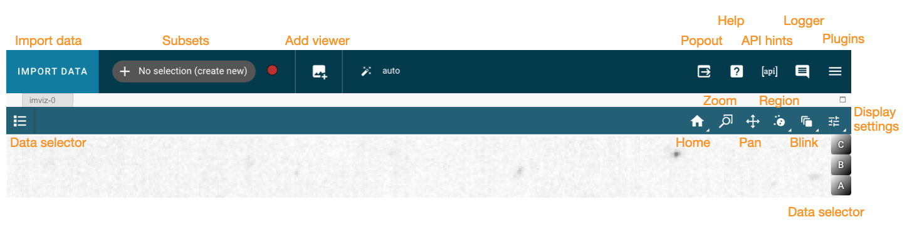
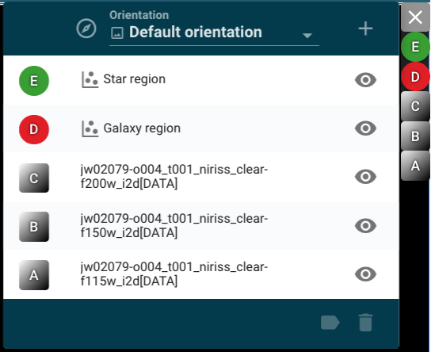
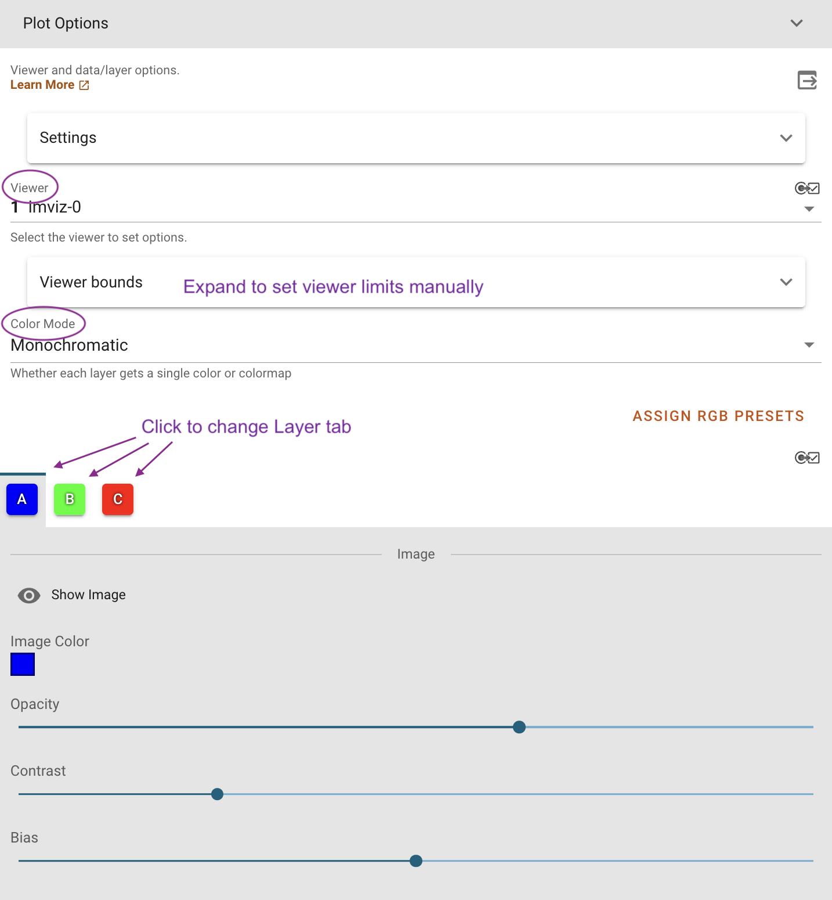

.. _imviz-display-images:

*****************
Displaying Images
*****************

.. include:: ../_templates/deprecated_config_banner.rst

Imviz uses image viewers to visualize data from supported formats.
Much of the functionality is available both from the application GUI and
from the Jupyter notebook using API calls.
The Toolbar below gives you several image display options.
Right-click will open a dropdown with access to different options for each button.

.. _imviz-selecting-data:

Selecting a Data Set
====================

Data can be selected and de-selected in each viewer's data menu, opened by clicking on
the legend in the top right of the viewer. Here, all the data and subset layers are listed
and their visibility can be toggled with the "eye" icon on the right.

To add an additional data layer or interactively create a new subset, click the "+" icon in
the top right of the data menu.  The datasets available in each viewer are filtered
to include only compatible data, so you may not see all loaded data in the menu for
every viewer. For example, 1D spectra will not be available in the image viewers.

Clicking on the rows in the data menu selects entries for further actions available in the
bottom bar of the data menu.  Here you can modify selected subsets, view metadata or subset
details, or remove layers from either the viewer or the entire application instance.

.. warning::
    Deleting the first image that was loaded into Imviz may be slow, as deleting this image
    requires Imviz to re-link any remaining data together and redefine any existing subsets.

.. _imviz-cursor-info:

Cursor Information
==================

By moving your cursor along the image viewer, you will be able to see information on the
cursor's location in pixel space (X and Y), the RA and Dec at that point, and the value
of the data there. This information is displayed in the top bar of the UI, on the
middle-right side.

By default, the cursor information will correspond to the top image layer in the viewer.
To change to a specific data-layer, click the layer-icon in the top bar to cycle between
"auto", "cursor", or specific data layers.

Notes on GWCS
-------------

If your *reference data* has GWCS with a bounding box, any coordinates transformation
outside that bounding box is less reliable. This still applies even when you are
looking at some other data that is not the reference data if they are linked by WCS
because all transformations in ``glue`` go through the reference data. Such a situation
is indicated by the affected coordinates becoming gray.

If your data of interest also has a GWCS with a bounding box, only
the mouseover data inside the bounding box is completely reliable.
Unreliable coordinates transformation here
will also be hidden or grayed out in a similar fashion as above.

To avoid inaccurate transforms, consider one of the following workflows:

* Make sure your reference data's GWCS has a bounding box that encompasses all
  the other data you are trying to visualize together.
* If the above is not possible, avoid overlaying different data with GWCS that
  do not overlap.

.. warning::

    If you rely on the GWCS bounding box, it will be set to ``None`` when
    you data is loaded into Imviz, but the original bounding box,
    if available, is now in a hidden ``_orig_bounding_box``
    attribute of the GWCS object. You can restore the bounding box by
    assigning the value of ``_orig_bounding_box`` back to its
    ``bounding_box`` attribute.

Note that FITS WCS has no similar concept of bounding box.

Home
====

This button will reset your zoom and panning to display the entire image.

Previous zoom is also available by right-clicking on the home icon and selecting
the previous zoom icon.  This will revert to the last saved zoom state.  Zoom states
are saved when beginning a zoom selection or when activating a pan/zoom tool.

.. _imviz-box-zoom:

Box Zoom and Linked Box Zoom
============================

Linked Box Zoom is an Imviz-specific feature enabled only when there are multiple viewers that
allows the user to zoom images in multiple different viewers simultaneously, not unlike
:ref:`imviz-pan-zoom`.

Single-viewer Box Zoom is also available and is used in a similar way as in
other Jdaviz tools. To access this option when there are multiple viewers,
right-click on the Linked Box Zoom button and left-click on the second option down to select it.

.. _imviz-pan-zoom:

Pan/Zoom and Linked Pan/Zoom
============================

Linked Pan/Zoom is an Imviz-specific feature enabled only when there are multiple viewers that
allows the user to pan and zoom images in multiple different viewers simultaneously. This works by matching images
based on the way they are linked together. Images are linked by pixels on load time,
but you can re-link them via WCS using :ref:`imviz-orientation`.

Single-viewer Pan/Zoom is also available and is used in a similar way as in
other Jdaviz tools. To access this option when there are multiple viewers, right-click on the
Linked Pan/Zoom button and left-click on the second option down to select it.

When in either of these modes, clicking on the image will recenter the image to the
location under cursor.

From the API
------------

From the API, you can programmatically zoom in and out. Zoom level:

    * 1 - real-pixel-size
    * 2 - zoomed in by a factor of 2
    * 0.5 - zoomed out by a factor of 2
    * ``'fit'`` - zoomed to fit the whole image width into display

For example:

.. code-block:: python

    viewer = imviz.default_viewer
    viewer.zoom_level
    viewer.zoom_level = 1  # Set the zoom level directly.
    viewer.zoom(2)  # Set the relative zoom based on current zoom level.

.. _imviz-defining-spatial-regions:

Defining Spatial Regions
========================

Spatial regions allow users to select subsets of the data array for use in
specific analysis functions in the plugin toolbar, for example in the
:ref:`aper-phot-simple` plugin.
Users can create spatial regions either in Imviz or the Jupyter notebook.

Regions can be created by first clicking the |icon-region-circ| icon (to draw a circular region),
then clicking and dragging (using the mouse) until the
desired region is covered by a colored shape, after which you release the mouse button.
If you want to draw other shapes, right click on the icon to see a dropdown of supported shapes
and left click on it to choose the shape, then draw as mentioned above.

Once you have completed the action of clicking and dragging, there is an opportunity to reposition
the region of interest by clicking on it and moving the region to a different location in the image viewer.
If you are satisfied with the positioning of your region of interest, simply click another part of the
viewer to lock it in place.

There are other options available for region of interest. At the top of the user interface,
there is a section that says either "+ No selection (create new)" or "Subset n" where n is an integer
that tells you which Subset is currently selected. Red circles to the right of this area allow
you to change the method of region selection. The options are:

* ``replace``: will remove the previously created selection and place the newly created subset.
* ``add``: allows you to create another subset that extends the existing subset.
* ``and``: only leaves behind the overlapping region between the existing subset and any additional subsets.
* ``xor``: only leaves behind the non-overlapping region between the existing subset and any additional subsets.
* ``remove``: will de-select any parts of the existing subset that overlaps with any additional subsets.

You can use these options to further adjust the region of interest and adapt it to your use case.

.. seealso::

    :ref:`Importing Spatial Regions <imviz-import-regions-api>`
        Importing regions from within the Jupyter notebook.

.. seealso::

    :ref:`Exporting Spatial Regions <imviz-export-regions>`
        Exporting regions from within the Jupyter notebook.

.. seealso::

    `Defining subsets using glue <http://docs.glueviz.org/en/stable/getting_started/#defining-subsets>`_
        Glueviz documentation on defining and refining subsets. Slightly different UI but same approach.

There are options available in the :guilabel:`Layer` tab under the |icon-settings-sliders| icon
to make subsets visible or invisible, to change their color, and to change their opacity.

.. _imviz-defining-spatial-regions-single-pixel:

Single-Pixel Selection
----------------------

This tool is no longer available as of Jdaviz v3.9; use the :ref:`markers-plugin` plugin instead.

Blinking
========

Blinking is an Imviz-specific functionality that allows a user to quickly switch
between viewing two or more images, as long as they are linked (see :ref:`imviz-pan-zoom` for
more on linking behavior). This can be done by selecting the |icon-blink| icon (only available if
there are more than one image loaded in the viewer) and then left-clicking on the image to blink
forward; right-clicking to blink backwards.

You can also blink forward by pressing the "b" key on your keyboard while moused over the image.
If you press Shift + "b" ("B"), you may blink backwards.

From the API
------------

From the API within the Jupyter notebook:

.. code-block:: python

    viewer = imviz.default_viewer
    viewer.blink_once()

And to blink backwards:

.. code-block:: python

    viewer.blink_once(reversed=True)

Contrast/Bias
=============

In addition to changing :ref:`contrast` and :ref:`bias` in the :ref:`imviz-display-settings`,
Imviz has a |icon-white-to-black| button under the |icon-blink| menu that can also
adjust those values.

After right-clicking on the blink icon, left click on the constrast/bias icon to activate it.
Now you can click and drag on the image viewer to change the contrast
and bias. Moving along the X-axis will change the bias and moving along the Y-axis will change the
contrast. If you would like to reset to the default contrast and bias settings, you can
double-click on the display while the mode is active.

.. _imviz-display-settings:

Display Settings
================

To access all of the different display settings for an image viewer, click the
|icon-settings-sliders| icon in the viewer toolbar or open the :ref:`Plot Options <cubeviz-plot-options>` plugin.
Changing the display settings **does not** change the underlying data, only the
visualization of that data.

If you wish to access plot options via API
(also see `~jdaviz.configs.default.plugins.plot_options.plot_options.PlotOptions`),
you can use the following generic example. More specific examples are given
later in this Section.

.. code-block:: python

    plot_options = imviz.plugins['Plot Options']
    plot_options.layer = 'my file'
    plot_options.image_colormap = 'Plasma'
    plot_options.stretch_function = 'Arcsinh'
    plot_options.stretch_vmin = 0.05
    plot_options.stretch_vmax = 1.0

Layer
-----

This option allows you to choose the layer for which you are changing the settings.

Show image
----------

This option selects whether to show or hide the image in the viewer.

Color mode
----------

This option allows you to choose whether to use a colormap or or a single color to visualize the image.
The colormap can be selected from a dropdown within the Layer tab.

In "Color" mode, the color can be chosen from a color picker under "Image Color"
within the Layer tab. The option "Assign RGB presets" also appears. This will automatically
assign colors (spanning from blue to red) to the available layers and will adjust opacity and
stretch to produce a composite color image (also known as an RGB image). You will then
be able to fine tune all options within each Layer tab.

From the API
^^^^^^^^^^^^

The colormap for just the image being displayed can be set using the Astrowidgets API:

.. code-block:: python

    viewer = imviz.default_viewer
    viewer.colormap_options
    viewer.set_colormap('Viridis')

Or it can be set using the Plugin API (in this example, the colormap is
being set for all the images at once):

.. code-block:: python

    plot_options = imviz.plugins['Plot Options']
    plot_options.select_all()
    plot_options.image_colormap = 'Viridis'

.. _imviz-custom-colormap:

Adding Custom Colormap
^^^^^^^^^^^^^^^^^^^^^^

A custom colormap can only be added when Imviz is run in a notebook, not from the
command line. The custom colormap must be added to ``glue`` *before* starting Imviz.
The example below adds a random colormap generated by ``photutils`` into glue:

.. code-block:: python

    from glue.config import colormaps
    from photutils.utils import make_random_cmap

    randcmap = make_random_cmap(ncolors=256)
    randcmap.colors[0] = 0.  # To make your background black
    colormaps.add('photutils_cmap', randcmap)

Only after the above is done can you start Imviz and use the custom colormap:

.. code-block:: python

    imviz = Imviz()
    imviz.load('myimage.fits', format='Image')
    imviz.default_viewer.set_colormap('photutils_cmap')

Opacity
-------

Change the translucence of the image.

.. _contrast:

Contrast
--------

Change the luminance of the color in the image.

.. _bias:

Bias
----

Set a constant to subtract from every point in the data array before
applying the conversion between data value and displayed pixel saturation.
The :guilabel:`bias` slider center position is 0 bias, such that a user can apply negative
bias values by sliding it left.

Stretch
-------

The Stretch Function
(see `Image stretching and normalization <https://docs.astropy.org/en/stable/visualization/normalization.html>`_)
allows you to change the equation that is used to convert data values between
:guilabel:`min` and :guilabel:`max` to the 0 to 1 scale of pixel saturation on the
image. The "Stretch Percentile Preset" can be used to set the :guilabel:`min` and :guilabel:`max`
values based on percentiles of the data.
An interactive histogram is available. It shows vertical lines representing
the ``stretch_vmin`` and ``stretch_vmax`` values, and a colorbar on top.
The stretch "curve" is plotted on the histogram to represent
how pixel values are mapped to the colorbar and can be toggled on and off in the plugin.
The collapsed menu "More Stretch Options"
includes a toggle to limit the histogram to the current zoom limits (which is not on by default)
and fields to set :guilabel:`min` and :guilabel:`max` manually.

From the API
^^^^^^^^^^^^

The stretch function for just the image being displayed
(the acceptable values are as defined by ``glue`` backend) can be set using
the Astrowidgets API:

.. code-block:: python

    viewer = imviz.default_viewer
    viewer.stretch_options
    viewer.stretch = 'sqrt'

Or it can be set using the Plugin API for a single image or all the images at once
(the acceptable values are the same as the GUI menu options
and can be accessed with ``plot_options.stretch_function.choices``):

.. code-block:: python

    plot_options = imviz.plugins['Plot Options']
    plot_options.select_all()
    plot_options.stretch_function = 'Square Root'

The stretch curve on the histogram can also be toggled using the Plugin API:

.. code-block:: python

    plot_options = imviz.plugins['Plot Options']
    plot_options.stretch_curve_visible = True

The percentile for just the image being displayed can be set
using the Astrowidgets API:

.. code-block:: python

    viewer = imviz.default_viewer
    viewer.cuts = '95%'  # Preset
    viewer.cuts = (0, 1000)  # Custom

Or it can be set using the Plugin API for one image or all the images at once:

.. code-block:: python

    plot_options = imviz.plugins['Plot Options']
    plot_options.select_all()

    # Preset
    plot_options.stretch_preset = '95%'

    # Custom
    plot_options.stretch_preset = 'Custom'
    plot_options.stretch_vmin = 0
    plot_options.stretch_vmax = 1000

Contour
-------

This option selects whether to show or hide contours. It is off by default and can be
turned on by clicking the eye icon. The :guilabel:`Contours` of a second image can
be plotted over a first image or cube. The contours of the second image will appear
superimposed on the first image. If contours are overplotted on a cube, the contours
will remain unchanged as you scrub through the cube. Please note that this feature is in
development and will be improved in the future.

Adding New Viewers
==================

In the toolbar towards the top of the UI, there is a |icon-plus| icon
that when clicked will add new viewers to the application. You can then select from the data
that has been loaded into the application to be visualized in these additional viewers.
You can then utilize some of the Imviz-specific features, like :ref:`imviz-pan-zoom`.

From the API
------------

From the API within the Jupyter notebook:

.. code-block:: python

    viewer_2_name = 'Window 2'
    viewer_2 = imviz.create_image_viewer(viewer_name=viewer_2_name)
    imviz.app.add_data_to_viewer(viewer_2_name, 'MyImportedData')

where ``'MyImportedData'`` is a data set that has already been imported into Imviz.
