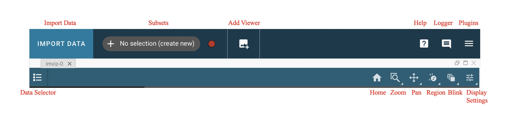

.. _imviz-display-images:

*****************
Displaying Images
*****************

Imviz uses image viewers to visualize data from supported formats.
Much of the functionality is available both from the application GUI and
from the Jupyter notebook using API calls.
The Toolbar below gives you several image display options.
Right-click will open a dropdown with access to different options for each button.

.. _imviz-selecting-data:

Selecting a Data Set
====================

Data can be selected and de-selected in each viewer's data menu, opened by clicking the
|icon-viewer-data-select| button in the top left of the viewer. Here, you can click a
checkbox next to the listed data to make the data visible (checked) or invisible (unchecked).
The datasets available in each viewer are filtered
to include only compatible data, so you may not see all loaded data in the menu for
every viewer. For example, 1D spectra will not be available in the image viewers.

.. _imviz_cursor_info:

Cursor Information
==================

By moving your cursor along the image viewer, you will be able to see information on the
cursor's location in pixel space (X and Y), the RA and Dec at that point, and the value
of the data there. This information is displayed in the top bar of the UI, on the
middle-right side.

Home
====

This button will reset your zoom and panning to display the entire image.

Previous zoom is also available by right-clicking on the home icon and selecting
the previous zoom icon.  This will revert to the last saved zoom state.  Zoom states
are saved when beginning a zoom selection or when activating a pan/zoom tool.

.. _imviz_box_zoom:

Box Zoom and Linked Box Zoom
============================

Linked Box Zoom is an Imviz-specific feature that allows the user to zoom
images in multiple different viewers simultaneously, not unlike
:ref:`imviz_pan_zoom`.

Single-viewer Box Zoom is also available and is used in a similar way as in
other Jdaviz tools. To access this option, right-click on the Linked Box Zoom button
and left-click on the second option down to select it.

.. _imviz_pan_zoom:

Pan/Zoom and Linked Pan/Zoom
============================

Linked Pan/Zoom is an Imviz-specific feature that allows the user to pan and zoom
images in multiple different viewers simultaneously. This works by matching images
based on the way they are linked together. Images are linked by pixels on load time,
but you can re-link them via WCS using :ref:`imviz-link-control`.

Single-viewer Pan/Zoom is also available and is used in a similar way as in
other Jdaviz tools. To access this option, right-click on the Linked Pan/Zoom button
and left-click on the second option down to select it.

When in either of these modes, clicking on the image will recenter the image to the
location under cursor.

From the API
------------

From the API, you can programmatically zoom in and out. Zoom level:

    * 1 - real-pixel-size
    * 2 - zoomed in by a factor of 2
    * 0.5 - zoomed out by a factor of 2
    * ``'fit'`` - zoomed to fit the whole image width into display

For example::

    viewer = imviz.default_viewer
    viewer.zoom_level
    viewer.zoom_level = 1  # Set the zoom level directly.
    viewer.zoom(2)  # Set the relative zoom based on current zoom level.

.. _imviz_defining_spatial_regions:

Defining Spatial Regions
========================

Spatial regions allow users to select subsets of the data array for use in
specific analysis functions in the plugin toolbar, for example in the
:ref:`aper-phot-simple` plugin.
Users can create spatial regions either in Imviz or the Jupyter notebook.

Regions can be created by first clicking the |icon-region-circ| icon (to draw a circular region),
then clicking and dragging (using the mouse) until the
desired region is covered by a colored shape, after which you release the mouse button.
If you want to draw other shapes, right click on the icon to see a dropdown of supported shapes
and left click on it to choose the shape, then draw as mentioned above.

Once you have completed the action of clicking and dragging, there is an opportunity to reposition
the region of interest by clicking on it and moving the region to a different location in the image viewer.
If you are satisfied with the positioning of your region of interest, simply click another part of the
viewer to lock it in place.

There are other options available for region of interest. At the top of the user interface,
there is a section that says either "+ No selection (create new)" or "Subset n" where n is an integer
that tells you which Subset is currently selected. To the right of this area, are red circles that allow
you to change the method of region selection. The options are:

* ``replace``: will remove the previously created selection and place the newly created subset.
* ``add``: allows you to create another subset that extends the existing subset.
* ``and``: only leaves behind the overlapping region between the existing subset and any additional subsets.
* ``xor``: only leaves behind the non-overlapping region between the existing subset and any additional subsets.
* ``remove``: will de-select any parts of the existing subset that overlaps with any additional subsets.

You can use these options to further adjust the region of interest and adapt it to your use case.

.. seealso::

    :ref:`Importing Spatial Regions <imviz-import-regions-api>`
        Importing regions from within the Jupyter notebook.

.. seealso::

    :ref:`Exporting Spatial Regions <imviz_export_regions>`
        Exporting regions from within the Jupyter notebook.

You can :ref:`import <imviz-import-regions-api>` and :ref:`export <imviz_export_regions>` regions from the API.

.. seealso::

    `Defining subsets using Glue <http://docs.glueviz.org/en/stable/getting_started/#defining-subsets>`_
        Glueviz documentation on defining and refining subsets. Slightly different UI but same approach.

There are options available in the :guilabel:`Layer` tab under the |icon-settings-sliders| icon
to make subsets visible or invisible, to change their color, and to change their opacity.

.. _imviz_defining_spatial_regions_single_pixel:

Single-Pixel Selection
----------------------

This tool allows the user to create a single-pixel spatial region
in an image viewer. Activate this tool and then left-click to create
the new region.

When you have multiple images loaded and linked by WCS
(see :ref:`imviz-link-control`), the region defined is with respect to
the reference image, which might not be the image you are viewing.
This behavior is consistent with glue.

.. warning::

    Region created might not accurately represent area you think you are
    clicking under the mouse if you click on an image that is zoomed out
    too much. It is recommended that you zoom in sufficiently to see the
    individual pixels to use this feature.

.. note::

    Creating too many single-pixel regions may affect performance.

Blinking
========

Blinking is an Imviz-specific functionality that allows a user to quickly switch
between viewing two or more images, as long as they are linked (see :ref:`imviz_pan_zoom` for
more on linking behavior). This can be done by selecting the |icon-blink| icon and
then left-clicking on the image to blink forward; right-clicking would blink backwards.

You can also blink forward by pressing the "b" key on your keyboard while moused over the image.
If you press Shift + "b" ("B"), you may blink backwards.

From the API
------------

From the API within the Jupyter notebook::

    viewer = imviz.default_viewer
    viewer.blink_once()

And to blink backwards::

    viewer.blink_once(reversed=True)

Contrast/Bias
=============

In addition to changing :ref:`contrast` and :ref:`bias` in the :ref:`imviz-display-settings`,
Imviz has a |icon-white-to-black| button under the |icon-blink| menu that can also
adjust those values.

After right-clicking on the blink icon, left click on the constrast/bias icon to activate it.
Now you can click and drag on the image viewer to change to change the contrast
and bias. Moving along the X-axis will change the bias and moving along the Y-axis will change the
contrast. If you would like to reset to the default contrast and bias settings, you can
double-click on the display while the mode is active.

.. _imviz-display-settings:

Display Settings
================

To access all of the different display settings for an image viewer, click the
|icon-settings-sliders| icon in the viewer toolbar or open the :ref:`Plot Options <cubeviz-plot-options>` plugin.
Changing the display settings DOES NOT change the underlying data, only the
visualization of that data.

Layer
-----

This option allows you to change which layer you are changing the settings for.

Attribute
---------

This shows which extension of the data is being displayed in the current viewer.

Contour
-------

This option selects whether to show or hide contours.

The :guilabel:`Contours` of a second image can also be plotted over a first image or cube. Add
the second image as data in the data dropdown tab, and select both images. To visualize the contours
of the second image, go to the :guilabel:`Layer` tab, select the layer to be contour-mapped, and
set its :guilabel:`Contour` to be on and its :guilabel:`Bitmap` to be off. The contours of
the second image will appear superimposed on the first image. In the second figure below, we
show the contours of an image generated using the Collapse plugin plotted over leftmost cube
viewer.  If you overplot them on a cube, the contours will remain unchanged as you scrub through
the cube.

Bitmap
------

This option selects whether to show or hide the bitmap (image) in the viewer.

Opacity
-------

Change the translucence of the image.

.. _contrast:

Contrast
--------

Change the luminance of the color in the image.

.. _bias:

Bias
----

Set a constant to subtract from every point in the data array before
applying the conversion between data value and displayed pixel saturation.
The :guilabel:`bias` slider center position is 0 bias, such that a user can apply negative
bias values by sliding it left.

Stretch
-------

Change the equation that is used to convert data values between
:guilabel:`min` and :guilabel:`max` to the 0 to 1 scale of pixel saturation on the displayed
image.

Percentile
----------

Can be used to set the :guilabel:`min` and :guilabel:`max` values based on percentiles of the data.

Min
^^^

If the percentile is "custom", then the data value corresponding to the
minimum of the colormap scale (e.g. black in grayscale) can be set.

Max
^^^

If the percentile is "custom", then the data value corresponding to the
maximum of the colormap scale (e.g. white in grayscale) can be set.

Colormap
--------

The spectrum of colors used to visualize data can be changed using this drop down.

From the API
^^^^^^^^^^^^

From the API within the Jupyter notebook::

    viewer = imviz.default_viewer
    viewer.cuts = '95%'
    viewer.colormap_options
    viewer.set_colormap('Viridis')

.. _imviz_custom_colormap:

Adding Custom Colormap
^^^^^^^^^^^^^^^^^^^^^^

A custom colormap can only be added when Imviz is run in a notebook, not from the
command line. The custom colormap must be added to Glue *before* starting Imviz.
The example below adds a random colormap generated by ``photutils`` into Glue::

    from glue.config import colormaps
    from photutils.utils import make_random_cmap

    randcmap = make_random_cmap(ncolors=256)
    randcmap.colors[0] = 0.  # To make your background black
    colormaps.add('photutils_cmap', randcmap)

Only after the above is done can you start Imviz and use the custom colormap::

    imviz = Imviz()
    imviz.load_data('myimage.fits')
    imviz.default_viewer.set_colormap('photutils_cmap')

Adding New Viewers
==================

In the toolbar towards the top of the UI, there is a |icon-plus| icon
that when clicked will add new viewers to the application. You can then select from the data
that has been loaded into the application to be visualized in these additional viewers.
You can then utilize some of the Imviz-specific features, like :ref:`imviz_pan_zoom`.

From the API
------------

From the API within the Jupyter notebook::

    viewer_2_name = 'Window 2'
    viewer_2 = imviz.create_image_viewer(viewer_name=viewer_2_name)
    imviz.app.add_data_to_viewer(viewer_2_name, 'MyImportedData')

where ``'MyImportedData'`` is a data set that has already been imported into Imviz.
