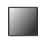

.. _imviz-display-images:

*****************
Displaying Images
*****************

Imviz uses image viewers to visualize data from supported formats.

Selecting Data Set
==================

.. seealso::

    :ref:`Selecting Data Set<cubeviz-selecting-data>`
        Documentation on selecting data sets in the Jdaviz viewers.

Adding New Viewers
==================

In the toolbar towards the top of the UI, there is a :guilabel:`picture with a plus` icon

that when clicked will add new viewers to the application. You can then select from the data
that has been loaded into the application to be visualized in these additional viewers.
You can then utilize some of the Imviz-specific features, like Linked Pan/Zoom.

Defining Spatial Regions
========================

Spatial regions can be created the same way as in Cubeviz.

.. seealso::

    :ref:`Defining Spatial Regions <spatial-regions>`
        Documentation on defining spatial regions in an image viewer.

Blinking
========

Blinking is an Imviz-specific functionality that allows a user to quickly switch
between viewing two or more images, as long as they are linked. This can be done
by selecting the :guilabel:`hammer and screwdriver` icon and then clicking the
:guilabel:`right arrow` icon. You can also blink by selecting the "b" key on your keyboard.

Contrast/Bias
=============

In addition to changing contrast and bias information in the :guilabel:`layer` tab
(see :ref:`Contrast <contrast>`), Imviz has a :guilabel:`white to black` button

under the :guilabel:`hammer and screwdriver` menu that can also edit those options. After clicking
that button, you can click and drag on the image viewer to change to change the contrast
and bias. Moving along the x-axis will change the bias and moving along the y-axis will change the
contrast. If you would like to reset to the default contrast and bias settings, you can
double-click.

Cursor Information
==================

By moving your cursor along the image viewer, you will be able to see information on the
cursor's location in pixel space (X and Y), the RA and Dec at that point, and the value
of the data there. This information is located in the top bar of the UI, on the
middle-right side.

Pan/Zoom and Linked Pan/Zoom
============================

Linked pan zoom is an Imviz-specific feature that allows the user to Pan and Zoom
images in multiple different viewers simultaneously. This works by matching images
based on the way they are linked together. Images are linked by pixels on load time,
but you can re-link them via WCS using `~jdaviz.configs.imviz.helper.Imviz.link_data`.

Regular Pan/Zoom is also available and is used in a similar way as other Jdaviz tools.

.. seealso::

    :ref:`Pan/Zoom <cubeviz-pan-zoom>`
        Documentation on using Pan/Zoom in the Jdaviz viewers.

Display Settings
================

.. seealso::

    :ref:`Display Settings <display-settings>`
        Documentation on various display settings in the jdaviz viewers.
