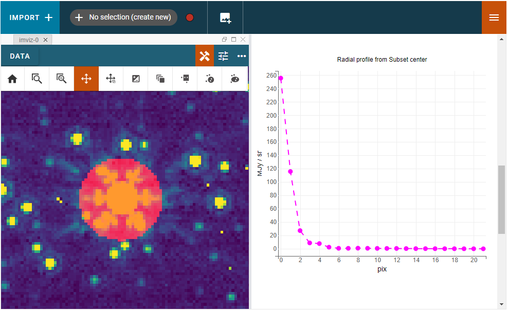
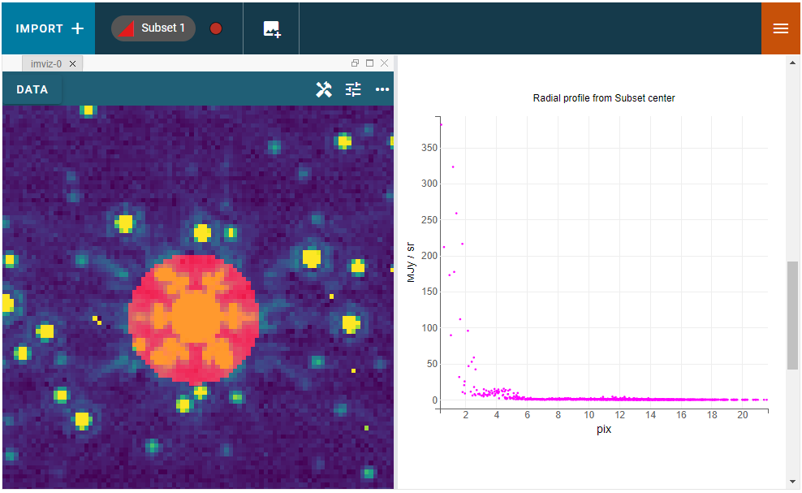

.. _imviz_plugins:

*********************
Data Analysis Plugins
*********************

The Imviz data analysis plugins are meant to aid quick-look analysis
of 2D image data. All plugins are accessed via the :guilabel:`plugin`
icon in the upper right corner of the Imviz application.

.. _metadata-viewer:

Metadata Viewer
===============

This plugin allows viewing of any metadata associated with the selected data.

.. _imviz-export-plot:

Export Plot
===========

This plugin allows exporting the plot in a given viewer to various image formats.

.. _imviz-plot-options:

Plot Options
============

This plugin gives access to per-viewer and per-layer plotting options.

.. _imviz-link-control:

Link Control
============

This plugin is used to re-link images by pixels or WCS using
:func:`~jdaviz.configs.imviz.helper.link_image_data`.
All images are automatically linked by pixels on load but you can use
it to re-link by pixels or WCS as needed. Once you have set your
options, click :guilabel:`LINK` to perform the linking.

For WCS linking, the "fast approximation" option uses an affine transform
to represent the offset between images, if possible. It is much more
performant at the cost of accuracy but should be accurate to within a pixel
for most cases. If approximation fails, WCS linking still automatically
falls back to full transformation.

For more details on linking, see :ref:`dev_glue_linking`.

.. _imviz-compass:

Compass
=======

For an image with a valid WCS, the compass would show directions to North (N)
and East (E) for ICRS sky coordinates. It also shows the currently displayed
data label, the X and Y directions, and the zoom box.

When you have multiple viewers created in Imviz, use the Viewer dropdown menu
to change the active viewer that it tracks.

.. _line-profile-xy:

Line Profiles
=============

This plugin plots line profiles across X and Y for the pixel under cursor
when ``l`` key is pressed on the image viewer. You can also manually type in the
values of X and Y, and then press the :guilabel:`PLOT` button.
The top visible image, the same one displayed under :ref:`imviz-compass`,
will be used for these plots.

This plugin only considers pixel locations, regardless of linking type set in
:ref:`imviz-link-control`.

.. _aper-phot-simple:

Simple Aperture Photometry
==========================

This plugin performs simple aperture photometry
and plots a radial profile for one object within
an interactively selected region. A typical workflow is as follows:

1. Load image(s) in Imviz (see :ref:`imviz-import-data`).
2. Draw a region over the object of interest (see :ref:`imviz_defining_spatial_regions`).
3. Select the desired image using the :guilabel:`Data` drop-down menu.
4. Select the desired region using the :guilabel:`Subset` drop-down menu.
5. If you want to subtract background before performing photometry, enter
   the background value in the :guilabel:`Background value` field.
   This value must be in the same unit as display data, if applicable.
   Alternately, you can also define a region for background calculation (median)
   and select that region using the :guilabel:`Subset (background)` drop-down menu.
   If your image is already background subtracted, leave it at 0.
6. For some JWST and HST images, pixel area in arcsec squared is automatically
   populated in the :guilabel:`Pixel area` field from image metadata. If it does
   not auto-populate for you, you can manually enter a value but it must be in the
   unit of arcsec squared. This field is only used if per steradian is detected
   in display data unit. Otherwise, it is only informational.
   If this field is not applicable for you, leave it at 0.
   **This field resets every time Data selection changes if auto-population not possible.**
7. If you also want photometry result in the unit of counts, you can enter a
   conversion factor in the :guilabel:`Counts conversion factor` field. The value
   must be in the unit of display data unit per counts. This is used to convert linear
   flux unit (e.g., MJy/sr) to counts. This field is only used if data has a valid unit.
   If this field is not applicable for you, leave it at 0.
   **This field resets every time Data selection changes.**
8. If you also want photometry result in magnitude unit, you can enter a flux
   scaling factor in the :guilabel:`Flux scaling` field. The value must be in the
   same unit as display data unit. A magnitude is then calculated using
   ``-2.5 * log(flux / flux_scaling)``. This calculation only makes sense if your
   display data unit is already in linear flux unit. Setting this to 1 is equivalent
   to not applying any scaling. This field is only used if data has a valid unit.
   If this field is not applicable for you, leave it at 0.
   **This field resets every time Data selection changes.**
9. Select the desired radial profile plot type using the :guilabel:`Plot Type` drop-down menu:

  * Radial Profile: Binned average as a function of radius from the center of the region.
  * Radial Profile (Raw): Raw image data points as a function of radius from the center of the region.
    Caution: having too many data points may cause performance issues with this feature. 
    The exact limitations depend on your hardware.

10. Once all inputs are populated correctly, click on the :guilabel:`CALCULATE`
    button to perform simple aperture photometry.

.. note::

    Masking and weights by uncertainty are currently not supported.
    However, if NaN exists in data, it will be treated as 0.

When calculation is complete, a plot would show the radial profile
of the background subtracted data and the photometry results are displayed under the
:guilabel:`CALCULATE` button.

    Radial profile.

    Radial profile (raw).

You can also retrieve the results as `~astropy.table.QTable` as follows,
assuming ``imviz`` is the instance of your Imviz application::

    results = imviz.get_aperture_photometry_results()

When multiple calculations are done in the same session (e.g., calculating
aperture photometry for the same region across different images or for
different regions on the same image), ``imviz.get_aperture_photometry_results()``
will return all the calculations in the same table, if possible.
However, if the newest result is incompatible with the existing ones (e.g., two
images have very different units), only the newest is kept in the table.
When you are unsure, save the results after each calculation as different
variables in your Python session.

The output table contains the results you see in the plugin and then some.
The columns are as follow:

* :attr:`~photutils.aperture.ApertureStats.id`: ID number assigned to the row,
  starting from 1.
* :attr:`~photutils.aperture.ApertureStats.xcentroid`,
  :attr:`~photutils.aperture.ApertureStats.ycentroid`: Pixel centroids
  calculated using moments. This might differ from center of the aperture.
* :attr:`~photutils.aperture.ApertureStats.sky_centroid`:
  `~astropy.coordinates.SkyCoord` associated with the centroid.
  If WCS is not available, this field is `None`.
* ``background``: The value from :guilabel:`Background value`, with unit attached.
* :attr:`~photutils.aperture.ApertureStats.sum`: Sum of flux in the aperture.
  If per steradian is in input data unit, total pixel area covered in steradian
  is already multiplied here, if applicable, so there will be no per steradian
  in its unit. Otherwise, it has the same unit as input data. For more details
  on how the photometry is done, see :ref:`photutils:photutils-aperture`.
* :attr:`~photutils.aperture.ApertureStats.sum_aper_area`: The pixel area
  covered by the region. Partial coverage is reported as fraction.
* ``pixarea_tot``: If per steradian is in input data unit and pixel area is
  provided, this contains the total pixel area covered by the aperture in
  steradian. Otherwise, it is `None`.
* ``aperture_sum_counts``: This is the aperture sum converted to counts,
  if :guilabel:`Counts conversion factor` was set. Otherwise, it is `None`.
  This calculation is done without taking account of ``pixarea_tot``, even
  when it is available.
* ``aperture_sum_counts_err``: This is the Poisson uncertainty (square root)
  for ``aperture_sum_counts``. Other uncertainty factors like readnoise are
  not included. In the plugin, it is displayed within parenthesis next to
  the value for ``aperture_sum_counts``, if applicable.
* ``counts_fac``: The value from :guilabel:`Counts conversion factor`, with
  unit attached, if applicable. Otherwise, it is `None`.
* ``aperture_sum_mag``: This is the aperture sum converted to magnitude, if
  :guilabel:`Flux scaling` was set. Otherwise, it is `None`. This calculation
  is done without taking account of ``pixarea_tot``, even when it is available.
* ``flux_scaling``: The value from :guilabel:`Flux scaling`, with unit attached,
  if applicable. Otherwise, it is `None`.
* :attr:`~photutils.aperture.ApertureStats.min`,
  :attr:`~photutils.aperture.ApertureStats.max`,
  :attr:`~photutils.aperture.ApertureStats.mean`,
  :attr:`~photutils.aperture.ApertureStats.median`,
  :attr:`~photutils.aperture.ApertureStats.mode`,
  :attr:`~photutils.aperture.ApertureStats.std`,
  :attr:`~photutils.aperture.ApertureStats.mad_std`,
  :attr:`~photutils.aperture.ApertureStats.var`,
  :attr:`~photutils.aperture.ApertureStats.biweight_location`,
  :attr:`~photutils.aperture.ApertureStats.biweight_midvariance`: Basic statistics
  from the aperture.
* :attr:`~photutils.aperture.ApertureStats.fwhm`,
  :attr:`~photutils.aperture.ApertureStats.semimajor_sigma`,
  :attr:`~photutils.aperture.ApertureStats.semiminor_sigma`,
  :attr:`~photutils.aperture.ApertureStats.orientation`,
  :attr:`~photutils.aperture.ApertureStats.eccentricity`: Properties of a 2D
  Gaussian function that has the same second-order central moments as the source.
* ``data_label``: Data label of the image used.
* ``subset_label``: Subset label of the region used.
* ``timestamp``: Timestamp of when the photometry was performed as
  `~astropy.time.Time`.

Once you have the results in a table, you can further manipulated them as
documented in :ref:`astropy:astropy-table`.
