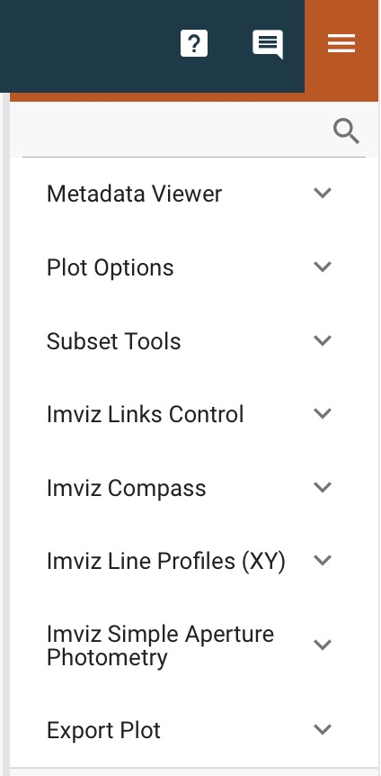

.. _imviz_plugins:

*********************
Data Analysis Plugins
*********************

The Imviz data analysis plugins are meant to aid quick-look analysis
of 2D image data. All plugins are accessed via the :guilabel:`plugin`
icon in the upper right corner of the Imviz application.

.. _imviz_metadata-viewer:

Metadata Viewer
===============

This plugin allows viewing of any metadata associated with the selected data.

If the data is loaded from multi-extension FITS that contains a primary header,
you will also see a :guilabel:`Show primary header` toggle, when enabled, would
display just the primary header metadata.

.. _imviz-plot-options:

Plot Options
============

This plugin gives access to per-viewer and per-layer plotting options.

.. seealso::

    :ref:`Display Settings <imviz-display-settings>`
        Documentation on various display settings in the Jdaviz viewers.

.. _imviz-subset-plugin:

Subset Tools
============

This plugin allows you to select an existing subset to modify, or to select
:guilabel:`Create new` to create a new subset by selecting and using the region selector
in the spectrum viewer toolbar. You can also choose the operation that will be
applied by the selector tool. Note that these are synched with the subset tools
in the app-level toolbar. It might not show some static regions loaded
via the API unless an interactive region is drawn after.

If an existing subset is selected, the parameters of the subset will also be
shown. Note that while parameters for compound regions (e.g., a subset with
multiple disjoint regions) are displayed, the logical operations joining them
(``OR``, ``AND``, etc.) are not shown.

For a simple subset in Imviz only, you can choose to recenter it based
on the selected Data. The centroid is calculated by
:attr:`photutils.aperture.ApertureStats.centroid`, which is the
center-of-mass of the data within the aperture.
No background subtraction is performed. Click :guilabel:`Recenter`
to change its parameters and move it to the calculated centroid.

.. note::

    If you want accurate centroid calculations, it is recommended that you
    use a background-subtracted image. Alternately, you could calculate
    the centroid outside of Jdaviz (e.g., using ``photutils``) and then
    manually edit the subset (see below) or load your own aperture object
    (:ref:`imviz-import-regions-api`).

For a simple subset, you can edit its parameters by changing the values
in the corresponding editable text fields. Once you have entered the new
value(s), click :guilabel:`Update` to apply. You should see the subset
parameters, shape, and orientation (if applicable) all update concurrently.

Angle is counter-clockwise rotation around the center in degrees.

.. _markers-plugin:

Markers
=======

This plugin allows for interactively creating markers in any viewer and logging information about
the location of that marker along with the applicable data and viewer labels into a table.

With the plugin open in the tray, mouse over any viewer and press the "m" key to log the information
displayed in the app toolbar into the table.  The markers remain at that fixed pixel-position in
the viewer they were created (regardless of changes to the underlying data or linking) and are only
visible when the plugin is opened.

In Imviz, the table also exposed columns labeled "pixel:unreliable", "world:unreliable", and
"value:unreliable".  These will be logged as ``True`` in cases where the information is outside
the bounds of the reference image's WCS (noted in the mouseover display by the information showing
as grayed).

To export the table into the notebook via the API, call
:meth:`~jdaviz.core.template_mixin.TableMixin.export_table`
(see :ref:`plugin-apis`).

.. _imviz-link-control:

Link Control
============

This plugin is used to re-link images by pixels or WCS using
:func:`~jdaviz.configs.imviz.helper.link_image_data`.
All images are automatically linked by pixels on load but you can use
it to re-link by pixels or WCS as needed.

For WCS linking, the "fast approximation" option uses an affine transform
to represent the offset between images, if possible. It is much more
performant at the cost of accuracy but should be accurate to within a pixel
for most cases. If approximation fails, WCS linking still automatically
falls back to full transformation.

For the best experience, it is recommended that you decide what kind of
link you want and set it at the beginning of your Imviz session,
rather than later.

For more details on linking, see :ref:`dev_glue_linking`.

From the API
------------

From the API within the Jupyter notebook (if linking by WCS):

.. code-block:: python

    imviz.link_data(link_type='wcs')

.. _imviz-compass:

Compass
=======

For an image with a valid WCS, the compass will show directions to North (N)
and East (E) for ICRS sky coordinates. It also shows the currently displayed
data label, the X and Y directions, and the zoom box.

Note that when the axes canvas is rotated (by :ref:`rotate-canvas`), the zoom box corresponds
to the set zoom limits, not the extent of the viewer.  Instead, the compass image itself is
shown rotated/flipped to the same orientation.

When you have multiple viewers created in Imviz, use the Viewer dropdown menu
to change the active viewer that it tracks.

.. _line-profile-xy:

Line Profiles
=============

This plugin plots line profiles across X and Y for the pixel under cursor
when ``l`` key is pressed on the image viewer. You can also manually type in the
values of X and Y, and then press the :guilabel:`PLOT` button.
The top visible image, the same one displayed under :ref:`imviz-compass`,
will be used for these plots.

This plugin only considers pixel locations, not sky coordinates.

.. _aper-phot-simple:

Simple Aperture Photometry
==========================

.. warning::

    Regardless of your workflow, any WCS distortion in an image is ignored.

This plugin performs simple aperture photometry
and plots a radial profile for one object within
an interactively selected region. A typical workflow is as follows:

1. Load image(s) in Imviz (see :ref:`imviz-import-data`).
2. Draw a region over the object of interest (see :ref:`imviz_defining_spatial_regions`).
3. Select the desired image using the :guilabel:`Data` dropdown menu.
4. Select the desired region using the :guilabel:`Subset` dropdown menu.
   You can use the :ref:`imviz-subset-plugin` plugin to center it first on the
   object of interest using its center of mass, if you wish.
   Depending on the object, it may take several iterations for re-centering
   to converge, or it may never converge at all.

   .. note::

       You cannot use annulus region as aperture (an exception will be thrown)
       but you may use it for background (see below).

5. If you want to subtract background before performing photometry,
   you have the following 3 options. Otherwise if your image is already
   background subtracted, choose "Manual" and leave the background set at 0:

  * Manual: Enter the background value in the :guilabel:`Background value` field.
    This value must be in the same unit as display data, if applicable.
  * Subset: Define a region for background calculation (median) using Subset draw tool
    and select that region using the :guilabel:`Background` dropdown menu. Only regions
    created with the :guilabel:`replace` option are acceptable as background regions
    (see :ref:`imviz_defining_spatial_regions`).

6. For some JWST and HST images, pixel area in arcsec squared is automatically
   populated in the :guilabel:`Pixel area` field from image metadata. If it does
   not auto-populate for you, you can manually enter a value but it must be in the
   unit of arcsec squared. This field is only used if per steradian is detected
   in display data unit. Otherwise, it is only informational.
   If this field is not applicable for you, leave it at 0.
   **This field resets every time Data selection changes if auto-population not possible.**

   .. warning::

       If your data is in surface brightness units and pixels on the image
       have varying sky area, you should first convert your data from
       surface brightness to flux units before using this plugin.
       This is because, for performance reasons, the plugin multiplies
       by the area after the aperture sum is calculated.

7. If you also want photometry result in the unit of counts, you can enter a
   conversion factor in the :guilabel:`Counts conversion factor` field. The value
   must be in the unit of display data unit per counts. This is used to convert linear
   flux unit (e.g., MJy/sr) to counts. This field is only used if data has a valid unit.
   If this field is not applicable for you, leave it at 0.
   **This field resets every time Data selection changes.**
8. If you also want photometry result in magnitude unit, you can enter a flux
   scaling factor in the :guilabel:`Flux scaling` field.
   :guilabel:`Flux scaling` is populated for JWST images
   if MJy/sr data unit is detected and pixel area is given to factor out the per-steradian unit.
   The value used, if this is the case, is the scaling to convert MJy to AB magnitude.
   Otherwise, the value must be in the
   same unit as display data unit. A magnitude is then calculated using
   ``-2.5 * log(flux / flux_scaling)``. This calculation only makes sense if your
   display data unit is already in linear flux unit. Setting this to 1 is equivalent
   to not applying any scaling. This field is only used if data has a valid unit.
   If this field is not applicable for you, leave it at 0.
   **This field resets every time Data selection changes.**
9. Select the desired radial profile plot type using the :guilabel:`Plot Type` dropdown menu:

  * Curve of Growth: :attr:`~photutils.aperture.ApertureStats.sum` (sum of flux in the aperture)
    across radii from center out to the edge of the aperture. This is calculated in the same
    way as the final aperture sum in the output table, which is explained farther down on
    this page.
  * Radial Profile: Binned average as a function of radius from the center of the region.
  * Radial Profile (Raw): Raw image data points as a function of radius from the center of the region.
    Caution: having too many data points may cause performance issues with this feature.
    The exact limitations depend on your hardware.

10. Toggle :guilabel:`Fit Gaussian` on to fit a `~astropy.modeling.functional_models.Gaussian1D`
    model to the radial profile data. This is disabled for curve-of-growth.
11. Once all inputs are populated correctly, click on the :guilabel:`CALCULATE`
    button to perform simple aperture photometry.

.. note::

    The shape you see drawn from :ref:`imviz_defining_spatial_regions` is not
    exactly the aperture mask being used by ``photutils``. This is because
    ``photutils`` uses fractional pixels and this is not reflected in the display.

    Masking and weights by uncertainty are currently not supported.
    However, if NaN exists in data, it will be treated as 0.

When calculation is complete, a plot would show the radial profile
of the background subtracted data and the photometry and model fitting (if requested)
results are displayed under the :guilabel:`CALCULATE` button.

.. figure:: img/imviz_radial_profile.png
    :alt: Imviz radial profile plot.

    Radial profile.

.. figure:: img/imviz_radial_profile_raw.png
    :alt: Imviz radial profile plot (raw).

    Radial profile (raw).

.. seealso::

    :ref:`Export Photometry <imviz_export_photometry>`
        Documentation on exporting photometry results.

.. _imviz-catalogs:

Catalog Search
==============

This plugin queries a catalog around the zoom window of the active image, marks the sources from the results of the query, and
provides the number of sources found. After zooming into a specific region of the image, the query uses the center
point of the region with a radius determined by the farthest edge point of the region. Clicking on :guilabel:`CLEAR`
will remove all markers on the active viewer.

To select which catalog you would like to use for the search, please pick one of the available options from the
catalog dropdown menu.

.. note::

    This plugin is still under active development. As a result, the search only uses the SDSS DR17 catalog
    and works best when you only have a single image loaded in a viewer.

To load a catalog from a supported `JWST ECSV catalog file <https://jwst-pipeline.readthedocs.io/en/latest/jwst/source_catalog/main.html#output-products>`_, choose "From File...".
The file must be able to be parsed by `astropy.table.Table.read` and contain a column labeled 'sky_centroid'.
Clicking :guilabel:`SEARCH` will show markers for any entry within the filtered zoom window.

If you have multiple viewers open, you will see another dropdown menu to select the active
viewer.

Additionally, the query starts anew every time :guilabel:`SEARCH` is clicked, so previous results and marks
are not stored. To save the current result before submitting a new query, you can save the table to a variable:

.. code-block:: python

    results = imviz.get_catalog_source_results()

.. note::

    The table returned from the API above may cover more sources than shown in the currently zoomed-in
    portion of the image. Additional steps will be needed to filter out these points, if necessary.

.. _imviz-footprints:

Footprints
==========

This plugin supports loading and overplotting instrument footprint overlays on the image viewers.
Any number of overlays can be plotted simultaneously from any number of the available
preset instruments or by loading an astropy regions object from a file.

The top dropdown allows renaming, adding, and removing footprint overlays.  To modify the display
and input parameters for a given overlay, select it in the dropdown, and modify the choices
in the plugin to change its color, opacity, visibilities in any image viewer in the app, or to
select between various preset instruments and change the input options (position on the sky,
position angle, offsets, etc).

To import a file, choose "From File..." from the presets dropdown and select a valid file (must
be able to be parsed by `regions.Regions.read`).

.. _rotate-canvas:

Canvas Rotation
===============

The canvas rotation plugin allows rotating and horizontally flipping the image to any arbitrary 
value by rotating the canvas axes themselves.  Note that this does not affect the underlying data, and
exporting data to the notebook via the API will therefore not exhibit the same rotation.

The :ref:`imviz-compass` will also rotate (and flip) accordingly, but will show the zoom box
corresponding to the zoom limits, not the region shown in the viewer itself.

Presets are provided to reset the orientation as well as to set north up and east either to the
right or the left, as well as a slider and input to set the angle and a switch to set whether the
axes should be flipped horizontally after applying the rotation (a vertical flip can be achieved
via a 180 deg rotation and a horizontal flip).

Due to browser limitations, Canvas Rotation is only available on Chromium-based browsers.

.. _imviz-export-plot:

Export Plot
===========

This plugin allows exporting the plot in a given viewer to a PNG or SVG file.
