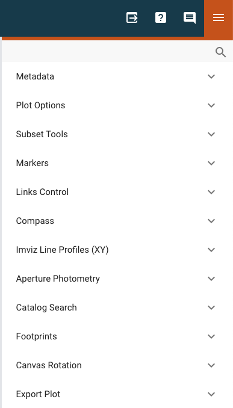
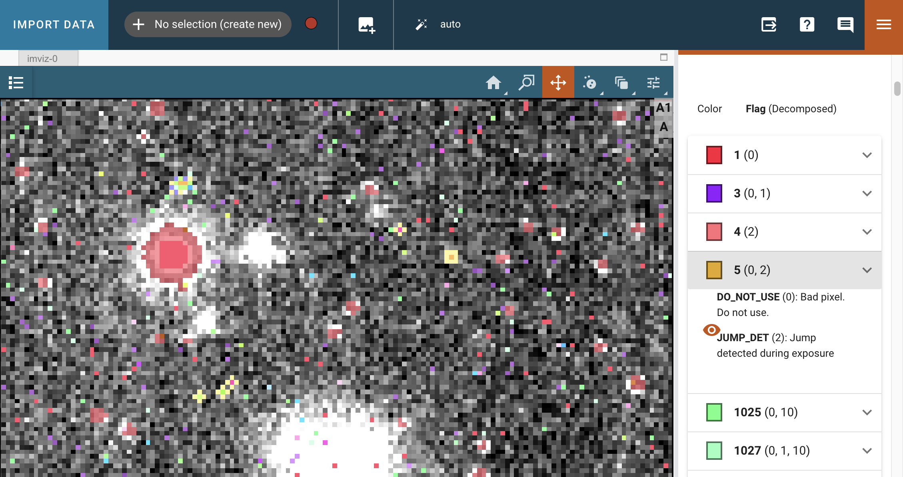

.. _imviz-plugins:

*********************
Data Analysis Plugins
*********************

The Imviz data analysis plugins are meant to aid quick-look analysis
of 2D image data. All plugins are accessed via the :guilabel:`plugin`
icon in the upper right corner of the Imviz application.

.. _imviz-metadata-viewer:

Metadata Viewer
===============

This plugin allows viewing of any metadata associated with the selected data.

If the data is loaded from multi-extension FITS that contains a primary header,
you will also see a :guilabel:`Show primary header` toggle, when enabled, would
display just the primary header metadata.

.. _imviz-plot-options:

Plot Options
============

This plugin gives access to per-viewer and per-layer plotting options.

.. seealso::

    :ref:`Display Settings <imviz-display-settings>`
        Documentation on various display settings in the Jdaviz viewers.

.. _imviz-data-quality:

Data Quality
============

This plugin allows you to visualize data quality arrays for science data.
The currently supported data quality flag mappings include JWST (all instruments)
and Roman/WFI.

Each science data layer can have one associated data quality layer.
The visibility of the data quality layer can be toggled from the data
dropdown menu, and toggling the science data visibility will do the
same for the data quality layer. The mapping between bits and data quality
flags is defined differently for each mission or instrument, and the
plugin will infer the correct flag mapping from the file metadata.
The opacity of the data quality layer can be changed relative to the
opacity of the science data layer using the slider.

The "Quality Flag" section contains a dropdown for applying a filter to the
visualized bits. Select bits from the dropdown to visualize only flags
containing those bits. The list of data quality flags beneath shows
every flag in the data quality layer in bold, followed by the
decomposed bits in that flag in parentheses. Clicking on a row
will expand to flag to reveal the flag's short name and description,
as well as a visibility toggle for that flag. Click on the color swatch
to select a color for any flag.

How to load the data quality array
----------------------------------

The data quality array can be loaded by simply passing the appropriate
extension when loading the data.

.. code-block:: python

    imviz = Imviz()
    imviz.load('path/to/file', format='Image', ext=('SCI', 'DQ'))
    imviz.show()

From the API
------------

If only a few of the bits are relevant to your workflow, it can be useful to
hide all flags without the important bits. Say we want to see only flags
containing bits zero and two. From the UI, we could select those bits
in the "Filter by bits" dropdown, or from the API we could:

.. code-block:: python

    dq_plugin = imviz.plugins['Data Quality']
    dq_plugin.flags_filter = [0, 2]

.. _imviz-subset-plugin:

Subset Tools
============

This plugin allows you to create new subsets or modify existing subsets.

To create a new subset, select :guilabel:`Create new`, and use the region
selector in the spectrum viewer toolbar. You can also choose the operation that will be
applied by the selector tool. Note that these are synched with the subset tools
in the app-level toolbar. It might not show some static regions loaded
via the API unless an interactive region is drawn after.

If an existing subset is selected, the parameters of the subset will also be
shown. Note that in addition to parameters for compound regions (e.g., a subset with
multiple disjoint regions) being displayed, the logical operations joining them
(``OR``, ``AND``, etc.) are shown as well for each region. This shows how all regions
are added together to create the subset shown in the viewer.

In Imviz only, you can choose to recenter the viewer on a single subset
or group of subsets. To switch to multiselect mode, click the icon in the
top right of the plugin and select multiple subsets from the drop-down menu.
The centroid is calculated by :attr:`photutils.aperture.ApertureStats.centroid`,
which is the center-of-mass of the data within the aperture.
No background subtraction is performed. Click :guilabel:`Recenter`
to change its parameters and move it to the calculated centroid.
This may take multiple iterations to converge.

.. note::

    If you want accurate centroid calculations, it is recommended that you
    use a background-subtracted image. Alternately, you could calculate
    the centroid outside of Jdaviz (e.g., using ``photutils``) and then
    manually edit the subset (see below) or load your own aperture object
    (:ref:`imviz-import-regions-api`).

For a simple subset, you can edit its parameters by changing the values
in the corresponding editable text fields. Once you have entered the new
value(s), click :guilabel:`Update` to apply. You should see the subset
parameters, shape, and orientation (if applicable) as all update concurrently.

Note, angle is reported in degrees as a counter-clockwise rotation about the center.

From the API
------------

You can update the attributes of an existing subset via the Subset Tools plugin API. To
see what attributes are available for a given subset, call the ``update_subset`` method
with only the subset specified:

.. code-block:: python

  st = imviz.plugins['Subset Tools']
  st.update_subset(subset_label='Subset 1')

This will return a dictionary with the name (as displayed in the UI), attribute, and
value for each editable attribute of each subregion of the specified subset. Note that
passing ``subset_label`` in the ``update_subset`` call will also set the selected subset
in the plugin UI to the specified subset. If ``subset_label`` is not specified,
``update_subset`` will operate on the currently selected subset in the plugin.
The attributes returned by the call above can be updated by passing their new
values as keyword arguments, for example:

.. code-block:: python

  st.update_subset(subset_label='Subset 1', xmin=10, xmax = 20)

In the case of a compound subset, the subregion to update must be specified as well:

.. code-block:: python

  st.update_subset(subset_label='Subset 1', subregion=0, xmin=10, xmax = 20)

.. note::

    This is a new behavior introduced in version 4.3.

You can also create a new subset using the ``import_region`` method. This method takes a
region and either creates a new subset with that region or appends it to another subset
using the ``edit_subset`` and ``combination_mode`` arguments. for example:

.. code-block:: python

  st.import_region(CirclePixelRegion(center=PixCoord(x=4.5, y=4.5), radius=4.5))

will create a new subset but

.. code-block:: python

  st.import_region(CirclePixelRegion(center=PixCoord(x=4.5, y=4.5), radius=4.5), edit_subset='Subset 1',
   combination_mode='or')

will append the region to the existing Subset 1 using the 'or' ``combination_mode``.
Other options for ``combination_mode`` include "and", "andnot", "new", "replace", and "xor".
If you set a value for ``edit_subset`` but not ``combination_mode``, the assumption will be
that the new region is replacing the existing subset named in ``edit_subset``.
This API method acts independently of the UI so all settings from before ``import_region``
was called will be restored afterward.

.. _markers-plugin:

Markers
=======

This plugin allows for interactively creating markers in any viewer and logging information about
the location of that marker along with the applicable data and viewer labels into a table.

With the plugin open in the tray, mouse over any viewer and press the "m" key to log the information
displayed in the app toolbar into the table.  The markers remain at that fixed pixel-position in
the viewer they were created (regardless of changes to the underlying data or linking,
see :ref:`dev_glue_linking`) and are only visible when the plugin is opened.

In Imviz, the table also exposes columns labeled "pixel:unreliable", "world:unreliable", and
"value:unreliable".  These will be logged as ``True`` in cases where the information is outside
the bounds of the reference image's WCS (noted in the mouseover display by the information showing
as grayed).

.. _imviz_distance-tool:

Distance Tool
-------------

The Markers plugin also includes a tool for measuring the distance and position angle between
two points in a viewer. This functionality is available whenever the Markers plugin is open.

1. Mouse over the desired start point in a viewer and press the ``d`` key. A ``...`` indicator
   will appear in the :guilabel:`Last Measured Distance` field at the bottom of the plugin,
   showing that the first point is set.
2. Mouse over the desired end point and press the ``d`` key again.

This will draw a line between the two points. A label showing the distance will appear,
rotated to be parallel with the line, and offset to prevent intersecting the line.

A new table, :guilabel:`Measurements`, will also appear below the main markers table. This
table logs the start and end coordinates (both pixel and world, if available), the on-sky
separation, the pixel distance, and the position angle for each measurement.

**Additional Features:**

* **Snapping**: To measure the distance from or to an existing marker, hold down the ``Alt`` key
  (or ``Option`` on Mac) when you press ``d``. The tool will "snap" to the nearest marker
  already in the main table.
* **Clearing**: Pressing the ``r`` key will clear all markers from the main table *and* all
  distance lines from the viewers.

From the API
------------

To export the table into the notebook via the API:

.. code-block:: python

    markersplugin = imviz.plugins['Markers']
    markersplugin.export_table()

.. _imviz-orientation:

Orientation
===========

.. note::

    This plugin was previous called "Links Control".

This plugin is used to align image layers by pixels or sky (WCS).
All images are automatically linked by pixels on load but you can use
it to re-link by pixels or WCS as needed.

For WCS linking, the "fast approximation" option uses an affine transform
to represent the offset between images, if possible. This method, although less accurate,
is much more performant and should still be accurate to within a pixel for most cases.
If approximation fails, WCS linking will fall back to the full transformation.

Since Jdaviz v3.9, when linking by WCS, a hidden reference data layer
without distortion (labeled "Default orientation") will be created and all the data would be linked to
it instead of the first loaded data. As a result, working in pixel
space when linked by WCS is not recommended. Additionally, any data
with distorted WCS would show as distorted on the display. Furthermore,
any data without WCS can no longer be shown in WCS linking mode.

For the best experience, it is recommended that you decide what kind of
link you want and set it at the beginning of your Imviz session,
rather than later.

For more details on linking, see :ref:`dev_glue_linking`.

From the API
------------

From the API within the Jupyter notebook (if linking by WCS):

.. code-block:: python

    imviz.link_data(align_by='wcs')

.. _imviz-orientation-rotation:

Orientation: Image Rotation
===========================

When linked by WCS, sky rotation is also possible. You can choose from
presets (N-up, E-left/right) or provide your own sky angle.

.. warning::

    Each rotation request creates a new reference data layer in the background.
    Just as in :ref:`imviz-import-data`, the performance would be impacted by
    the number of active rotation layers you have; only keep the desired rotation layer.
    Note that the "default orientation" layer cannot be removed.

.. _imviz-compass:

Compass
=======

For an image with a valid WCS, the compass will show directions to North (N)
and East (E) for ICRS sky coordinates. It also shows the currently displayed
data label, the X and Y directions, and the zoom box.

When you have multiple viewers created in Imviz, use the Viewer dropdown menu
to change the active viewer that it tracks.

.. _line-profile-xy:

Image Profiles (XY)
===================

This plugin plots line profiles across X and Y. The plugin can be activated by either:
pressing ``l`` at the desired pixel location on the image viewer, or by manually
specifying the pixel coordinates X and Y, before selecting the :guilabel:`PLOT` button.
The top visible image, the same one displayed under :ref:`imviz-compass`,
will be used for these plots.

This plugin only considers pixel locations, not sky coordinates.

.. _aper-phot-simple:

Aperture Photometry
===================

.. warning::

    Regardless of your workflow, any WCS distortion in an image is ignored.

This plugin performs simple aperture photometry
and plots a radial profile for one object within
an interactively selected region. A typical workflow is as follows:

1. Load image(s) in Imviz (see :ref:`imviz-import-data`).
2. Draw a region over the object of interest (see :ref:`imviz-defining-spatial-regions`).
3. Select the desired image using the :guilabel:`Data` dropdown menu.
4. Select the desired region using the :guilabel:`Subset` dropdown menu.
   You can use the :ref:`imviz-subset-plugin` plugin to center it first on the
   object of interest using its center of mass, if you wish.
   Depending on the object, it may take several iterations for re-centering
   to converge, or it may never converge at all.

   .. note::

       You cannot use annulus region as aperture (an exception will be thrown)
       but you may use it for background (see below).

5. If you would like to subtract background before performing photometry,
   you have the following options:

  * Manual: Enter the background value in the :guilabel:`Background value` field.
    This value must be in the same unit as display data, if applicable.
  * Subset: Define a region for background calculation (median) using Subset draw tool
    and select that region using the :guilabel:`Background` dropdown menu. Only regions
    created with the :guilabel:`replace` option are acceptable as background regions
    (see :ref:`imviz-defining-spatial-regions`).

   If your image is already background subtracted, choose "Manual" and set the
   :guilabel:`Background value` to 0.

6. For some JWST and HST images, pixel area in arcsec2 is automatically
   populated in the :guilabel:`Pixel area` field from image metadata. If it does
   not auto-populate for you, you can manually enter a value but it must be in the
   unit of arcsec2. This field is only used if "per steradian" is detected
   in display data unit. Otherwise, it is solely informational.
   If this field is not applicable for you, leave it at 0.
   **This field resets every time Data selection changes if auto-population is not possible.**

   .. warning::

       If your data is in surface brightness units and pixels on the image
       have varying sky area, you should first convert your data from
       surface brightness to flux units before using this plugin.
       This is because, for performance reasons, the plugin multiplies
       by the area after the aperture sum is calculated.

7. If you also want your photometry result in the unit of counts, you can enter a
   conversion factor in the :guilabel:`Counts conversion factor` field. The value
   must be in the unit of display data unit per counts. This is used to convert linear
   flux unit (e.g., MJy/sr) to counts. This field is only used if data has a valid unit.
   If this field is not applicable for you, leave it at 0.
   **This field resets every time Data selection changes.**

8. If you also want your photometry result in magnitude units, you can enter a flux
   scaling factor in the :guilabel:`Flux scaling` field.
   :guilabel:`Flux scaling` is populated for JWST images
   if MJy/sr data unit is detected and pixel area is given to factor out the per-steradian unit.
   The value used, if this is the case, is the scaling to convert MJy to AB magnitude.
   Otherwise, the value must be in the
   same unit as display data unit. A magnitude is then calculated using
   $-2.5 * \text{log}(\text{flux} / \text{flux_scaling})$. This calculation only makes sense if your
   display data unit is already in linear flux unit. Setting this to 1 is equivalent
   to no scaling. This field is only used if data has a valid unit.
   If this field is not applicable for you, leave it at 0.
   **This field resets every time Data selection changes.**
9. Select the desired radial profile plot type using the :guilabel:`Plot Type` dropdown menu
   (see :ref:`photutils:profiles` for more details):

  * Curve of Growth
  * Radial Profile
  * Radial Profile (Raw)

10. Toggle :guilabel:`Fit Gaussian` on to fit a `~astropy.modeling.functional_models.Gaussian1D`
    model to the radial profile data. This is disabled for curve-of-growth.
11. Once all inputs are populated correctly, click on the :guilabel:`CALCULATE`
    button to perform simple aperture photometry.

.. note::

    The shape you see drawn from :ref:`imviz-defining-spatial-regions` is not
    exactly the aperture mask being used by ``photutils``. This is because
    ``photutils`` uses fractional pixels and this is not reflected in the display.

    Masking and weights by uncertainty are currently not supported.
    However, if NaN exists in data, it will be treated as 0.

When calculation is complete, a plot would show the radial profile
of the background subtracted data and the photometry and model fitting (if requested)
results are displayed under the :guilabel:`CALCULATE` button.

.. figure:: img/imviz_radial_profile.png
    :alt: Imviz radial profile plot.

    Radial profile.

.. figure:: img/imviz_radial_profile_raw.png
    :alt: Imviz radial profile plot (raw).

    Radial profile (raw).

.. seealso::

    :ref:`Export Photometry <imviz-export-photometry>`
        Documentation on exporting photometry results.

.. _imviz-catalogs:

Catalog Search
==============

This plugin queries a catalog around the zoom window of the active image, marks the sources from the results of the query, and
provides the number of sources found. After zooming into a specific region of the image, the query uses the center
point of the region with a radius determined by the farthest edge point of the region. Clicking on :guilabel:`CLEAR`
will remove all markers on the active viewer.

To select which catalog you would like to use for the search, please pick one of the available options from the
catalog dropdown menu.

.. note::

    This plugin is still under active development. As a result, the search only uses the SDSS DR17 catalog and
    the Gaia catalog and works best when you only have a single image loaded in a viewer.

To load a catalog from a supported `JWST ECSV catalog file <https://jwst-pipeline.readthedocs.io/en/latest/jwst/source_catalog/main.html#output-products>`_,
choose "From File..." from the menu.
The file must be parseable by `astropy.table.Table.read` and must contain either the sky_centroid column, or Right Ascension and Declination columns:

* ``'sky_centroid'`` (Optional): Column with `~astropy.coordinates.SkyCoord` sky coordinates of the sources.
* ``'Right Ascension & Declination'`` (Optional): Two separate columns giving the sky coordinates in degrees,
  typically labeled Right Ascension (degrees) and Declination (degrees) (or simply ra/RA and dec/DEC).
* ``'label'`` (Optional): Column with string identifiers of the sources.
  If not provided, unique string identifiers will be generated automatically.
  If you have numerical identifiers, they will be recast as strings.

Alternately, if you already have the table object, you could load it in directly via API:

.. code-block:: python

    imviz.plugins["Catalog Search"].import_catalog(table_object)

Clicking :guilabel:`SEARCH` will show markers for any entry within the filtered zoom window.

If you have multiple viewers open, you will see another dropdown menu to select the active
viewer.

Additionally, the query starts anew every time :guilabel:`SEARCH` is clicked, so previous results and marks
are not stored. To save the current result before submitting a new query, you can save the table to a variable:

.. code-block:: python

    results = imviz.plugins["Catalog Search"].export_table()

.. note::

    The table returned from the API above may cover more sources than shown in the currently zoomed-in
    portion of the image. Additional steps will be needed to filter out these points, if necessary.

Performing a search populates a table that contains the
right ascension, declination, and the object ID of the found sources. Checkboxes next to the rows
can be selected and the corresponding marks in the viewer will change to orange circles. When :guilabel:`Zoom to Selected`,
the viewer will zoom to encompass the selected rows in the table.

.. _imviz-footprints:

Footprints
==========

This plugin supports loading and overplotting instrument footprint overlays on the image viewers.
Any number of overlays can be plotted simultaneously from any number of the available
preset instruments (requires ``pysiaf`` to be installed), by loading an Astropy regions object from
a file, or by passing an ``STC-S`` string.

The top dropdown allows renaming, adding, and removing footprint overlays.  To modify the display
and input parameters for a given overlay, select the overlay in the dropdown, and modify the choices
in the plugin to change its color, opacity, visibilities in any image viewer in the app.
You can also select between various preset instruments and change the input options
(position on the sky, position angle, offsets, etc).

To import a file, open the "Import" section at the top of the dropdown and select a valid file (must
be able to be parsed by `regions.Regions.read`) from the applicable source.

To import a regions file, object, or ``STC-S`` string from the API:

.. code-block:: python

  fp = imviz.plugins['Footprints']
  fp.open_in_tray()
  fp.add_overlay('my imported overlay')  # or fp.rename_overlay to rename an existing entry
  fp.import_region(region)

.. _imviz-export-plot:

Export
======

This plugin allows exporting:

* the plot in a given viewer to a PNG or SVG file,
* a table in a plugin to ecsv
* subsets as a region to .fits or .reg file.
