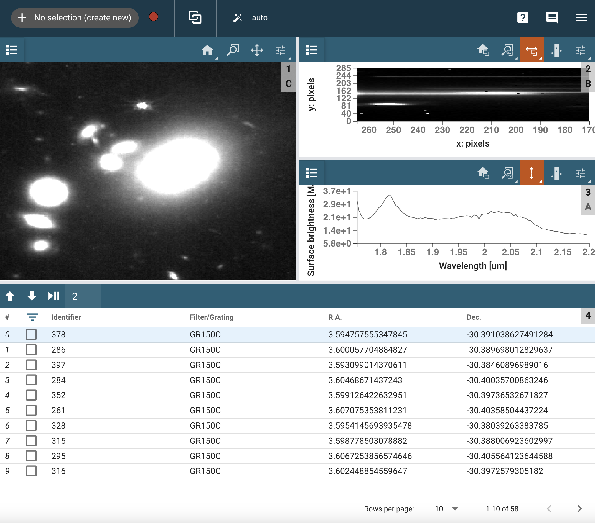

*****************
Navigating the UI
*****************

The Mosviz User Interface contains an image viewer in the top left section and
a 2D spectrum viewer over a specviz viewer in the top right section. The bottom
section houses the :ref:`table viewer<table-viewer>`.
The image viewer contains all of the same functionality as an image viewer
in Cubeviz, with the addition that there is a :ref:`slit overlay<slit-overlay>` that uses data from a
spectrum 2d file that is linked to the image file to determine where to plot the slit.
The 2D spectrum viewer and the 1D spectrum viewer have their x axes locked to one another,
meaning that when you pan or zoom the x axis in one viewer, the same action happens in the other.

.. _table-viewer:

Using the Table Viewer
======================

Clicking on a row in the table viewer populates the other viewers with the data
corresponding to that row. Note that the checkbox at the far left of the row does
not need to be checked to display the data - that checkbox is related to selecting
subsets of rows. By default, 10 rows are shown at a time but this can be changed
with the selector at the bottom right of the table viewer. To the right of the 
rows-per-page selector are left and right arrows that are used to move between
pages of the table, if there is more data than fits on a single page. 

.. _slit-overlay:

Using the Slit Overlay
======================

Currently, the option to overlay slit geometry is enabled by default if the 
required information is present. The option to toggle whether slits are displayed
is located in the top right tool menu under the "Slit Overlay" heading, as seen
in the screenshot below.

image:: ../img/slit_overlay.png
