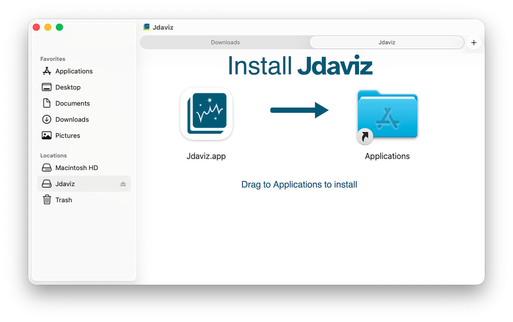

.. _setup-desktop:

Standalone Desktop UI Installation
==================================

The standalone desktop application provides a native Jdaviz experience without requiring
a Python installation or Jupyter environment.

Download and Installation Instructions 
--------------------------------------

All downloads are available on the latest `release <https://github.com/spacetelescope/jdaviz/releases/latest/>`_ page. 

Mac 
^^^
The Jdaviz standalone app is supported on macOS 14 (Sonoma) or higher. Currently, there is no automatic update capabilities.  
If you want to download the latest version, please remove the previous version first! 

.. button-link::  https://github.com/spacetelescope/jdaviz/releases/latest/download/jdaviz-standalone-macosx.zip
    :color: primary
    :align: center
    :shadow:
    
    Download Jdaviz for MacOS
    
Jdaviz can be installed on macOS as a .dmg package from the downloadable .zipped package. After downloading, unzip the package, and 
then mount the disk image by clicking on the .dmg.  You will see the application, which you can then drag and drop into the Application folder 
using the provided shortcut (or you can drag and drop into any folder of your choice).  

You can now unmount the installer.  

Click the Jdaviz.app to launch Jdaviz! If you see the message that "Jdaviz can't be opned as it is from an unidentifed developer",
right click on the application, select open, and accept to open the app.  

Windows and Linux
^^^^^^^^^^^^^^^^^
We maintain distributions for both windows and linux; however, these are far less tested. If you run into any issues, please open an issue on the github repo so we can investigate!

Windows
~~~~~~~
The windows standalone app is supported on Windows 11 or higher.  Currently, there is no automatic update capabilities.  
If you want to download the latest version, please remove the previous version first! 

.. button-link::  https://github.com/spacetelescope/jdaviz/releases/latest/download/jdaviz-standalone-windows.zip
    :color: primary
    :align: center
    :shadow:
    
    Download Jdaviz for Windows

After downloading, unzip the package, and click to open the executable to launch Jdaviz!

Linux
~~~~~
The linux standalone app is supported on Ubuntu 22.04 or higher. Currently, there is no automatic update capabilities.  
If you want to download the latest version, please remove the previous version first! 

.. button-link::  https://github.com/spacetelescope/jdaviz/releases/latest/download/jdaviz-standalone-ubuntu.zip
    :color: primary
    :align: center
    :shadow:
    
    Download Jdaviz for Ubuntu

After downloading, unzip the package, and click to open the executable to launch Jdaviz!

