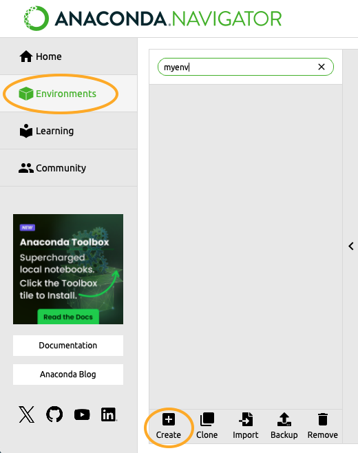
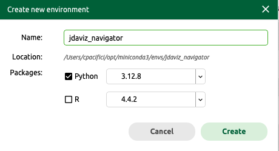
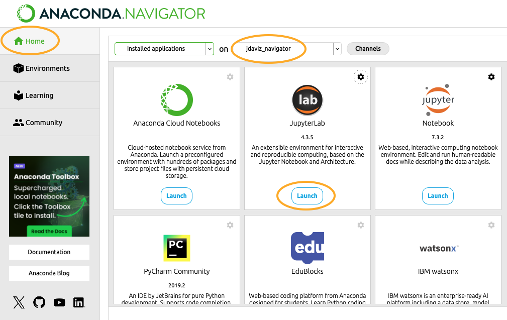
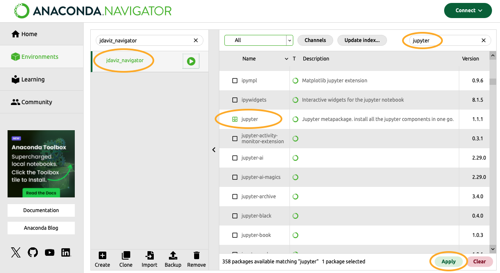

.. _setup-local:

Local Jupyter Installation
==========================

.. note::

    ``jdaviz`` is undergoing constant development. We encourage users to always update
    to the latest version. In general, it is good practice to install the development
    version following the instructions below as full released versions may lag behind.

User Installation
-----------------

Windows-Specific Dependencies
^^^^^^^^^^^^^^^^^^^^^^^^^^^^^
Some of our dependencies require C++ compilers to install properly. These are usually
included with macOS and most Linux distributions, but are not included by default in
Windows. Microsoft provides these tools as part of their
`Build Tools for Visual Studio <https://visualstudio.microsoft.com/downloads>`_,
which can be found under "Tools for Visual Studio" towards the bottom of the page.

Create Your Local Environment
^^^^^^^^^^^^^^^^^^^^^^^^^^^^^

Some of Jdaviz's dependencies require non-Python packages to work
(particularly the front-end stack that is part of the Jupyter ecosystem).
We recommend using `Miniconda <https://docs.conda.io/en/latest/miniconda.html>`_
to easily manage a compatible Python environment for ``jdaviz``; it should work
with most modern shells, except CSH/TCSH.

You may want to consider installing ``jdaviz`` in a new virtual or conda environment
to avoid version conflicts with other packages you may have installed, for example:

.. code-block:: bash

    conda create -n jdaviz-env python=3.11
    conda activate jdaviz-env

Pip Install
^^^^^^^^^^^

As noted above, we typically recommend installing the latest development version:

.. code-block:: bash

    pip install git+https://github.com/spacetelescope/jdaviz --upgrade

A normal install will also work by installing the latest release version:

.. code-block:: bash

    pip install jdaviz --upgrade

Common Issues
^^^^^^^^^^^^^

If you encounter problems while following these installation instructions,
please consult :ref:`known installation issues <known_issues_installation>`.

Note that ``jdaviz`` requires Python 3.11 or newer. If your ``pip`` corresponds to an older version of
Python, it will raise an error that it cannot find a valid package.

Users occasionally encounter problems running the pure ``pip`` install above. For those
using ``conda``, some problems may be resolved by pulling the following from ``conda``
instead of ``pip``:

.. code-block:: bash

    conda install bottleneck
    conda install -c conda-forge notebook
    conda install -c conda-forge jupyterlab

You might also want to enable the ``ipywidgets`` notebook extension, as follows:

.. code-block:: bash

    jupyter nbextension enable --py widgetsnbextension

User Installation with Anaconda Navigator
-----------------------------------------

If you prefer to go through `Anaconda navigator <https://docs.anaconda.com/navigator/>`_,
you will have to first create a new environment within the navigator interface.
Click on Environments in the left bar and then click on Create in the bottom part of
the interface.

Give a name to the environment (in this example we call it jdaviz_navigator) and
select Python with a version greater than 3.11.

When the environment is ready, you will find it in the list of available environments
in the interface. Click on the name of the environment and then on
the green play symbol next to the name
and select Open Terminal. If the terminal window shows the name of the environment and
no errors, proceed to install ``jdaviz`` using ``pip``.

.. code-block:: bash

    pip install jdaviz

If this did not return any problems, you can go back to the Navigator and select the Home
tab. Make sure the environment is selected at the top, then click Launch under JupyterLab.
This will open a Jupyter Lab instance in your default browser and you
are ready to use ``jdaviz``.

In case the terminal returns errors or cannot run the ``pip`` command, there is
a workaround. In the Navigator interface, click on the environment you created
(we called it jdaviz_navigator in this example), then search for the package
``jupyter`` in the top right search field. Find ``jupyter``, select it, and click Apply
at the bottom right of the interface. Click again Apply after it has resolved
the necessary packages.

This installs ``jupyter`` in the environment. When it is done, go back to the Home tab
and make sure the environment is selected at the top. Click Launch under JupyterLab
and wait for the browser to open a JupyterLab instance. Open an empty notebook by
clicking on the Python 3 icon under Notebook. In the first cell, run the command

.. code-block:: bash

    pip install jdaviz

This will serve as your terminal and should install ``jdaviz`` in the environment. If this does
not return any errors, you are ready to use ``jdaviz`` with this empty notebook or any
other as long as you launch Jupyter from this environment we created.

If you have a problem with the installation, feel free to submit an issue in
Github or contact the `JWST Help Desk <https://jwsthelp.stsci.edu>`_.

.. _local-optional-deps-roman:

Optional Dependencies
---------------------

Dependencies for working with data products from the Roman Space Telescope
are available for optional installation from PyPI with::

    pip install -U "jdaviz[roman]"

or while building from source with::

    pip install -U ".[roman]"

Dependencies for sonifying data may be similarly installed with the ``strauss`` flag::

    pip install -U "jdaviz[strauss]"

Note that any installation including the ``strauss`` dependencies may require you to
install ``libportaudio2``, for example on Ubuntu::

    sudo apt-get install libportaudio2

Finally, dependencies for running the standalone version of Jdaviz in an embedded browser
instead of a system browser using QT can be installed with::

    pip install -U "jdaviz[qt]"

All optional dependencies can be installed using the ``all`` flag::

    pip install -U "jdaviz[all]"

.. _local-dev-install:

Developer Installation
----------------------

If you wish to contribute to Jdaviz, please fork the project to your
own GitHub account. The following instructions assume your have forked
the project and have connected
`your GitHub to SSH <https://docs.github.com/en/authentication/connecting-to-github-with-ssh>`_
and ``username`` is your GitHub username. This is a one-setup setup:

.. code-block:: bash

    git clone git@github.com:username/jdaviz.git
    cd jdaviz
    git remote add upstream git@github.com:spacetelescope/jdaviz.git
    git fetch upstream main
    git fetch upstream --tags

To work on a new feature or bug-fix, it is recommended that you build upon
the latest dev code in a new branch (e.g., ``my-new-feature``).
You also need the up-to-date tags for proper software versioning:

.. code-block:: bash

    git checkout -b my-new-feature
    git fetch upstream --tags
    git fetch upstream main
    git rebase upstream/main

For the rest of contributing workflow, it is very similar to
`how to make a code contribution to astropy <https://docs.astropy.org/en/latest/development/quickstart.html>`_,
including setting up virtual environments, git basics, and more.

An exception is the change log; if your patch requires a change log, see ``CHANGES.rst`` for examples.

One option is to enable the hot reloading of Vue.js templates, install
``watchdog``:

.. code-block:: bash

    pip install watchdog

After installing ``watchdog``, to use it, add the following to the top
of a notebook:

.. code-block:: python

    from jdaviz import enable_hot_reloading
    enable_hot_reloading()

Another option is to enable magic commands for Python autoreloading, to use it,
add the following to the top of a notebook:

.. code-block:: python

    %load_ext autoreload
    %autoreload 2

To install ``jdaviz`` for development or from source in an editable mode
(i.e., changes to the locally checked out code would reflect in runtime
after you restarted the Python kernel):

.. code-block:: bash

    pip install -e .

Note: It is recommended to install the package without ``-e`` flag initially
to ensure that the template files are copied correctly.
