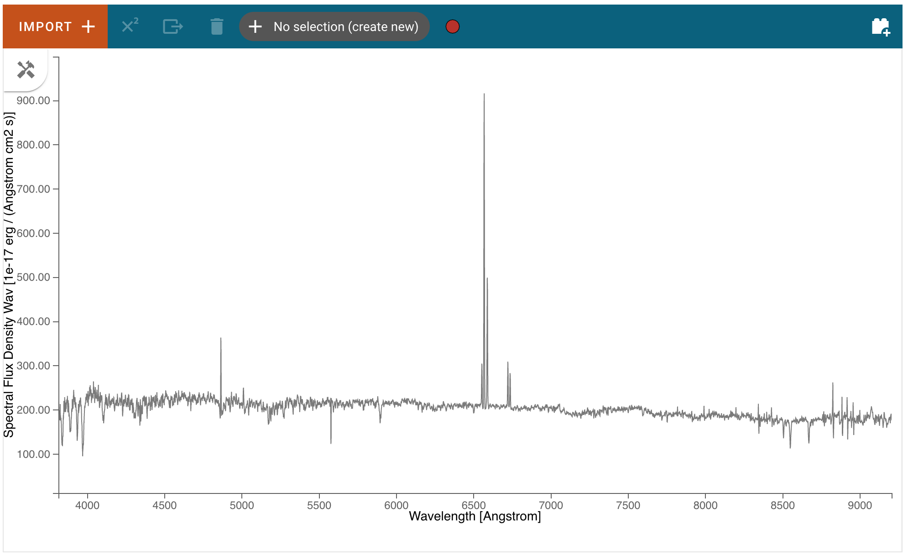
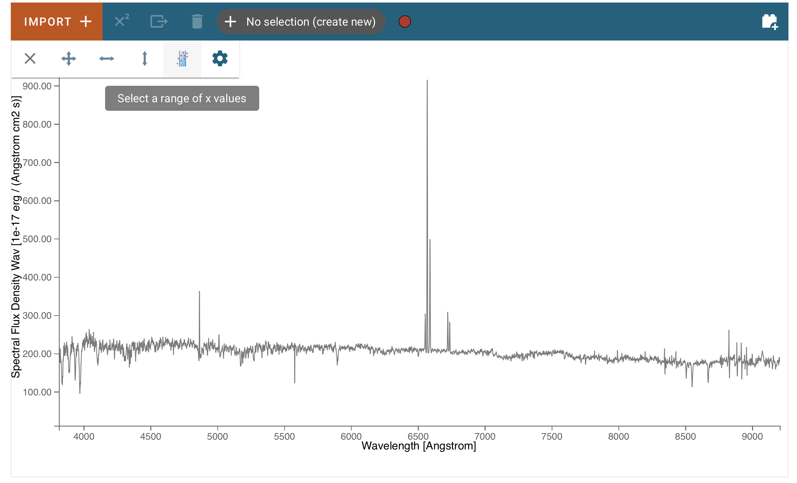
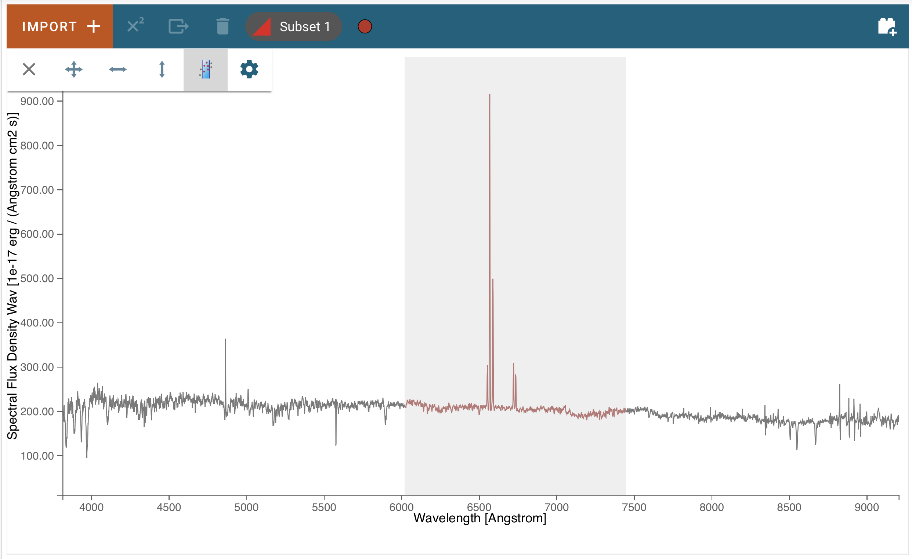
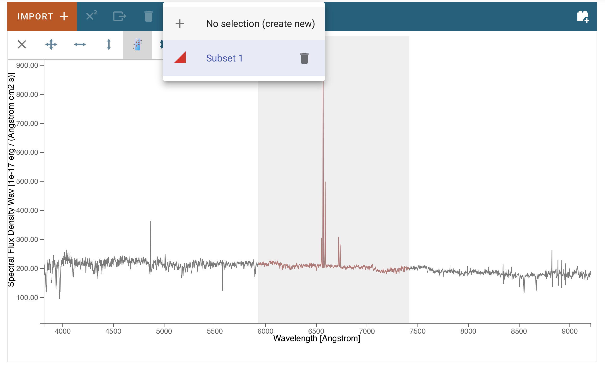
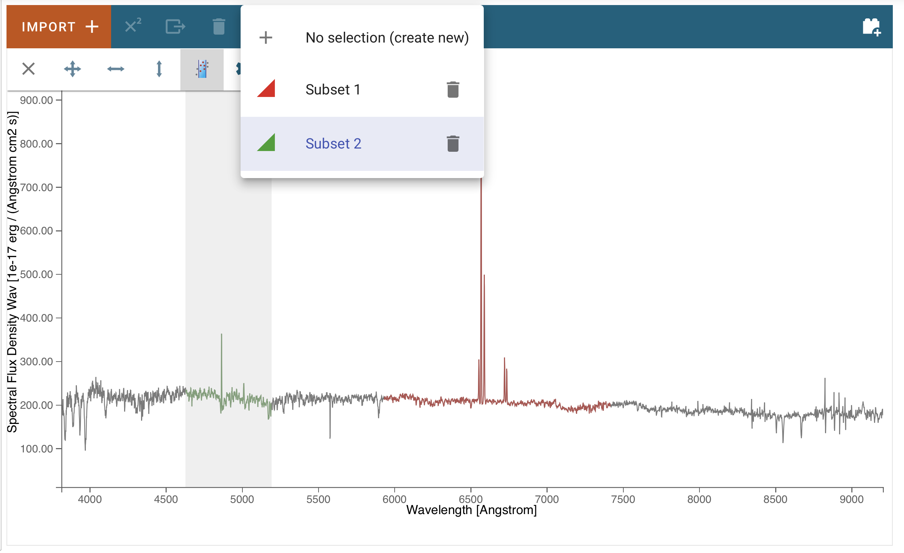
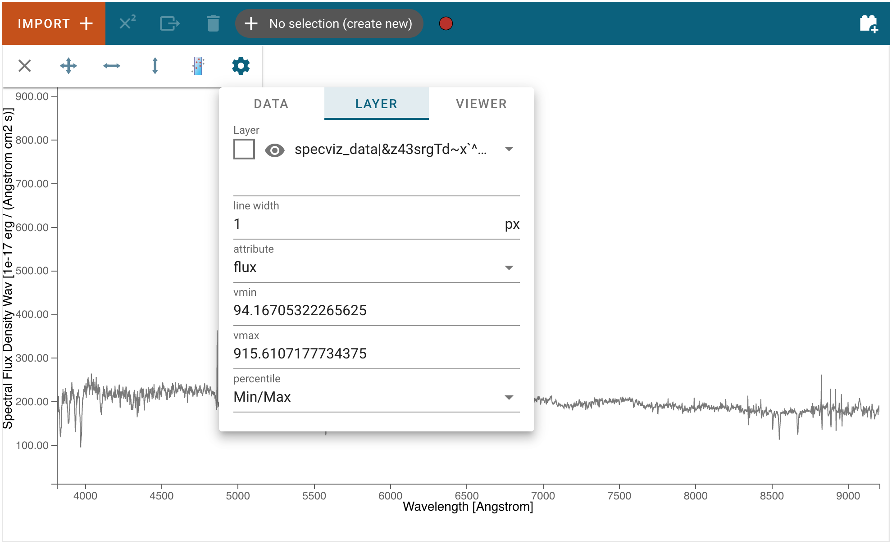

******************
Displaying Spectra
******************

Spectra loaded by the user will be automatically displayed in the viewer, 
although additional spectra loaded after the first may not be fully shown 
if they exceed the bounds of the plotted area, which are set based on the 
first displayed spectrum. The bounds can be changed via the 
:ref:`Pan/Zoom <pan-zoom>` tool or by deselecting the current spectra and 
selecting a different spectrum for display. Spectra generated by plugins 
(e.g a spectrum generated by the Gaussian Smooth plugin) will generally be 
automatically displayed as well, and one can always see the spectra 
available and toggle their visibility in the data selection dropdown menu 
(see :ref:`Selecting Data Set<selecting-data-set>` for more detail).

.. _selecting-data-set:

Selecting Data Set
==================

Data can be selected and de-selected by clicking on the "hammer and screwdriver" icon at the top left of an image viewer. Then, click the "gear" icon to access the "Data" tab. Here, you can click a checkbox next to the listed data to make the data visible (checked) or invisible (unchecked).

.. image:: img/data_tab.png

.. _pan-zoom:

Pan/Zoom
========

More words...

Defining Spectral Regions
=========================

Spectral regions can be defined by clicking on the "hammer and screwdriver" icon at the top left of an image
viewer. Then, click the "region" icon to set the cursor dragging function in "spectral region selection" mode.

Now, you can move the mouse to one of the end points (in wavelength) of the region you want to select, and drag
it to the other end point. The selected region background will display in light gray color, and the spectral trace
in color, coded to subset number.

You also see in the top tool bar that the region was added to the data hold, and is named "Subset 1".

Clicking on that selector, you can add more regions by selecting the "create new" entry:

Now just select the end points of the new region as before. It will be added to the data hold with name "Subset 2":

In a notebook cell, you can access the regions using the `get_spectral_regions()` function:

.. image:: img/spectral_region_5.png

Plot Settings
=============

To access plot settings for a particular viewer (including the spectrum viewer), click the :guilabel:`hammer and screwdriver` icon, followed by the :guilabel:`gear` icon, followed by the  :guilabel:`Layer` tab.

Layer
-----

The top section of the :guilabel:`Layer` tab contains options to change the color of the spectrum (click the :guilabel:`square` icon to see a color change menu), change visibility of the spectrum (:guilabel:`eye` icon), and a drop-down box to select which layer will have its settings changed.

Line Width
----------

Width of the spectrum in pixels. Larger values correspond to thicker lines on the plot.

Vmin and Vmax
-------------

Minimum and maximum values of the y axis.

Percentile
----------

Sets the bounds of the plot (Vmin and Vmax) such that the selected percentage of the data is shown in the viewer. Editing either bound manually changes the "Percentile" selection to "Custom."
