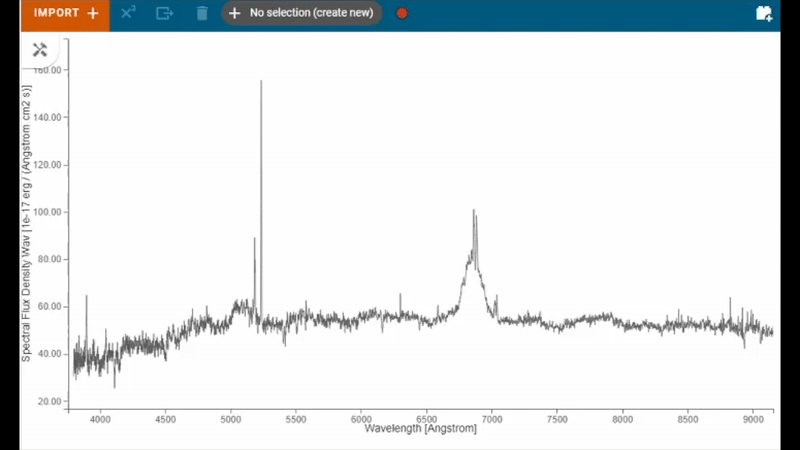
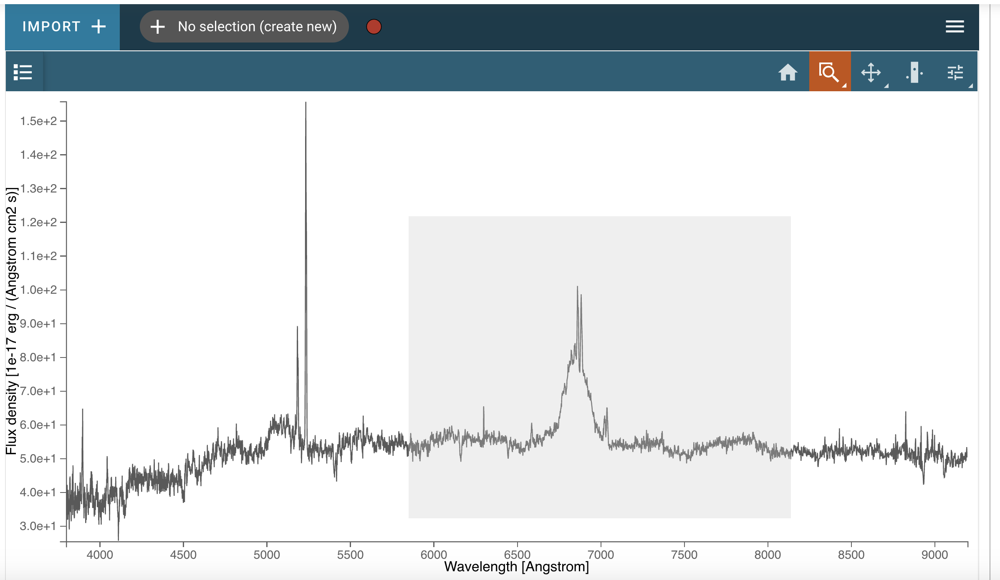
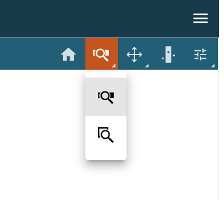

.. _specviz-displaying:

******************
Displaying Spectra
******************

Because of its use of `glue <https://glueviz.org/>`_ as the underlying data-handling layer and its
applicability in several different contexts, Specviz takes a modular approach
to displaying data that has been loaded.  This section describes how to
affect how your spectra are being shown.

The first spectrum you load will be automatically displayed in the viewer with
the view window set by the extent of the spectrum.
Additional spectra loaded after the first may not be fully shown
if they exceed the bounds of the plotted area, which are set based on the
first displayed spectrum. The bounds can be changed via the
:ref:`Pan/Zoom <pan-zoom>` tool or by deselecting the current spectra and
selecting a different spectrum for display. Spectra generated by plugins
(e.g., a spectrum generated by the Gaussian Smooth plugin) will generally be
automatically displayed as well, and one can always see the spectra
available and toggle their visibility in the data selection dropdown menu
(see :ref:`Selecting Data Set <selecting-data-set>` for more detail). If you are
working in the notebook, you can also enable more reproducible analysis by
using the Python API.  Both are detailed further below.

.. _selecting-data-set:

Selecting/Showing Data Sets
===========================

Data can be selected and de-selected under the "Data" tab. Here, you can click a checkbox next to the listed data to make the data visible (checked) or invisible (unchecked).

.. image:: img/spec_viewer_with_data.png

.. image:: img/data_tab.png

.. _pan-zoom:

Pan/Zoom
========

There are several ways to pan around a spectrum or zoom in on features of
interest.

Interactive Pan/Zoom (Desktop or Notebook Interface)
----------------------------------------------------
You can find the following Pan/Zoom tools available under the |icon-hammer-and-screwdriver| icon in the viewer toolbar:

2D Bidirectional Pan/Zoom
^^^^^^^^^^^^^^^^^^^^^^^^^
The |icon-zoom-pan-2d| icon allows you to zoom using the scroll wheel. The window will zoom into the area around your cursor:

To pan, simply click and drag the window.

Horizontal/Vertical Zoom
^^^^^^^^^^^^^^^^^^^^^^^^
The |icon-zoom-pan-horiz| (horizontal) and |icon-zoom-pan-vert| (vertical) Zoom tools allow you to zoom along each axis, while locking the other.  You can also zoom by scrolling.

Box Zoom
^^^^^^^^

The |icon-box-zoom| (box) and |icon-xrange-zoom| (x-range) zoom tools allow you to zoom by
clicking and dragging with your mouse. The box zoom tool adjusts both the x and y range of
the plot, whereas the x-range tool zooms only the x-axis to the selected region. While
clicking and dragging you will see the selected region as a gray box, as below.

You can switch between the x-range zoom tool and the plot tool by right-clicking
(or your trackpad equivalent) on the currently selected zoom icon on the viewer
toolbar, which will open a menu of choices as in the screenshot below:

API Pan/Zoom (Notebook Interface)
---------------------------------
The Specviz helper contains a set of convenience methods to programmatically define the view of the spectrum viewer. You may instantiate a Specviz Helper via:

>>> from jdaviz import Specviz
>>> # Instantiate an instance of Specviz
>>> specviz = Specviz()
>>> # Display Specviz
>>> specviz.app  # doctest: +SKIP

Limit methods
^^^^^^^^^^^^^
You can use the methods :meth:`jdaviz.configs.specviz.helper.Specviz.x_limits` and
:meth:`jdaviz.configs.specviz.helper.Specviz.y_limits` to modify the field of
view of Specviz. You can provide a scalar (which assumes the units of the loaded spectra),
a `~astropy.units.Quantity`, or ``'auto'`` to automatically scale::

>>> from astropy import units as u
>>> specviz.x_limits() #doctest: +SKIP
>>> specviz.x_limits(650*u.nm,750*u.nm) #doctest: +SKIP
>>> specviz.y_limits('auto', 110.0) #doctest: +SKIP

Additionally, you can provide the limit methods with a `~specutils.SpectralRegion`. Specviz shall set the bounds the upper and lower bounds of the SpectralRegion

>>> from specutils import SpectralRegion
>>> bounds = SpectralRegion(0.45*u.nm, 0.6*u.nm)
>>> specviz.x_limits(bounds) #doctest: +SKIP

Autoscale methods
^^^^^^^^^^^^^^^^^
You can also quickly return to the default zoom using
:meth:`jdaviz.configs.specviz.helper.Specviz.autoscale_x` and
:meth:`jdaviz.configs.specviz.helper.Specviz.autoscale_y`.

Axis Orientation methods
^^^^^^^^^^^^^^^^^^^^^^^^
To quickly flip an axis to change to and from ascending/descending, use
:meth:`jdaviz.configs.specviz.helper.Specviz.flip_x` and
:meth:`jdaviz.configs.specviz.helper.Specviz.flip_y`.

.. _spectral-regions:

Defining Spectral Regions
=========================

Spectral regions can be defined by clicking on the |icon-hammer-and-screwdriver| icon at the right of the
viewer toolbar. Then, click the |icon-region-horiz| icon to set the cursor dragging function in "spectral region selection" mode.

.. image:: img/spectral_region_1.png

Now, you can move the mouse to one of the end points (in wavelength) of the region you want to select, and drag
it to the other end point. The selected region background will display in light gray color, and the spectral trace
in color, coded to subset number.

You also see in the top tool bar that the region was added to the data hold, and is named "Subset 1".

.. image:: img/spectral_region_2.png

Clicking on that selector, you can add more regions by selecting the "create new" entry:

.. image:: img/spectral_region_3.png

Now just select the end points of the new region as before. It will be added to the data hold with name "Subset 2":

.. image:: img/spectral_region_4.png

In a notebook cell, you can access the regions using the
:meth:`~jdaviz.configs.specviz.helper.Specviz.get_spectral_regions` method:

.. image:: img/spectral_region_5.png

.. _plot-settings:

Plot Settings
=============

To access plot settings for a particular viewer (including the spectrum viewer), click the |icon-settings-sliders| icon in the viewer toolbar or open the :ref:`Plot Options<specviz-plot-options>` plugin.

.. image:: img/specviz_plot_settings.png

Layer
-----

The top section of the :guilabel:`Layer` tab contains options to change the color of the spectrum (click the |icon-color-square| icon to see a color change menu), change visibility of the spectrum (|icon-eye| icon), and a drop-down box to select which layer will have its settings changed.

Line Width
----------

Width of the line for the spectrum in pixels. Larger values are thicker lines on the plot.

Vmin and Vmax
-------------

Minimum and maximum values of the y axis.

Percentile
----------

Sets the bounds of the plot (Vmin and Vmax) such that the selected percentage of the data is shown in the viewer. Editing either bound manually changes the "Percentile" selection to "Custom."
