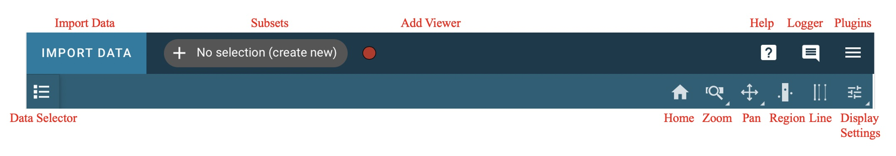
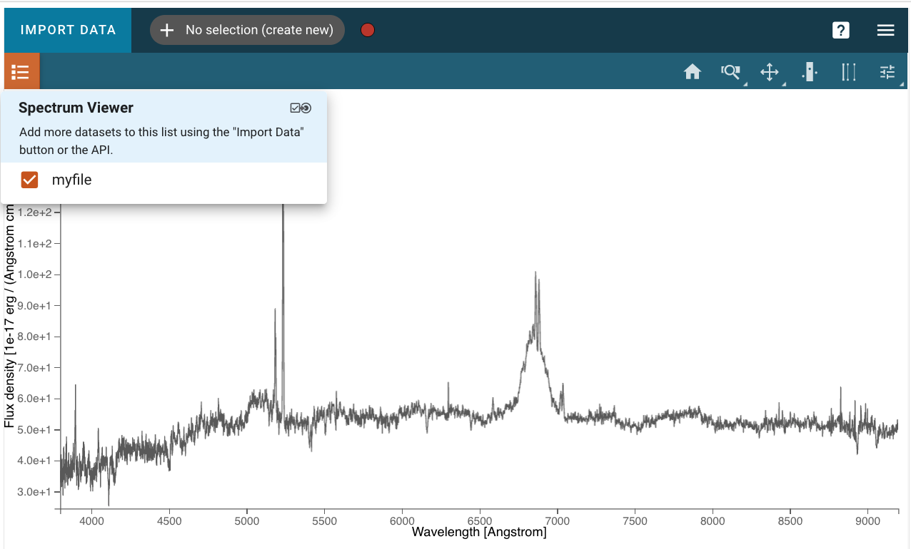
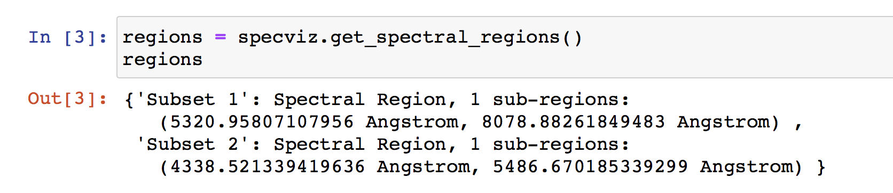

.. _specviz-displaying:

******************
Displaying Spectra
******************

Because of its use of `glue <https://glueviz.org/>`_ as the underlying data-handling layer and its
applicability in several different contexts, Specviz takes a modular approach
to displaying data that has been loaded.

The first spectrum you load will be automatically displayed in the viewer with
the view window set by the extent of the spectrum. Additional spectra may not be
fully shown if they exceed the bounds of the plotted area, which are set based
on the first displayed spectrum. The bounds can be changed via the
:ref:`Pan/Zoom <specviz-pan-zoom>` tool or by deselecting the current spectra and
selecting a different spectrum for display.

Much of the Specviz functionality can be handled within the tool or the
Jupyter notebook using an API. The Toolbar below gives you several spectroscopic
display options. Right click will open a dropdown with access to different options
for each button.

.. _selecting-data-set:

Selecting/Showing Data Sets
===========================

Data can be selected and de-selected in each viewer's data menu, opened by clicking the 
|icon-viewer-data-select| button in the top left of the viewer. Here, you can click a 
checkbox next to the listed data to make the data visible (checked) or invisible (unchecked).

In addition to toggling the visibility of a data layer, the data can be unloaded from a viewer
by clicking the "x" button on the right.  Data unloaded from the viewer will also be excluded
as options from dataset dropdown menus in the various plugins.  Unloaded data will be available
to re-load into the viewer or remove permanently from the app from an expandable section in the
data menu.

.. _specviz_cursor_info:

Cursor Information
==================

By moving your cursor along the spectrum viewer, you will be able to see information on the
index, spectral axis value, and flux value of the closest data point to the cursor
(not to be confused with the actual cursor position).
This information is displayed in the top bar of the UI, on the middle-right side.

Home
====

This button will reset your zoom and panning to display the entire image.

.. _box-zoom:

Box Zoom
========

The |icon-box-zoom| (box) and |icon-xrange-zoom| (x-range) zoom tools allow you to zoom by
clicking and dragging with your mouse. The box zoom tool adjusts both the x and y range of
the plot, whereas the x-range tool zooms only the x-axis to the selected region. While
clicking and dragging you will see the selected region as a gray box, as below.

You can switch between the x-range zoom tool and the plot tool by right-clicking
(or your trackpad equivalent) on the currently selected zoom icon on the viewer
toolbar, which will open a menu of choices as in the screenshot below.

.. _specviz-pan-zoom:

Pan Zoom
========

There are several ways to pan around a spectrum or zoom in on features of
interest. Right click will open a dropdown with access to different
options described below.

Interactive Pan/Zoom (Desktop or Notebook Interface)
----------------------------------------------------
You can find the following Pan/Zoom tools available in the viewer toolbar
on the top right of the viewer.

Home
^^^^

This button will reset your zoom and panning to display the spectrum.

Previous zoom is also available by right-clicking on the home icon and selecting
the previous zoom icon.  This will revert to the last saved zoom state.  Zoom states
are saved when beginning a zoom selection or when activating a pan/zoom tool.

.. _image-pan-zoom:

2D Bidirectional Pan/Zoom
^^^^^^^^^^^^^^^^^^^^^^^^^

The |icon-zoom-pan-2d| icon allows you to zoom using the scroll wheel.
The window will zoom into the area around your cursor.
To pan, simply click and drag the window.

Horizontal/Vertical Zoom
^^^^^^^^^^^^^^^^^^^^^^^^
The |icon-zoom-pan-horiz| (horizontal) and |icon-zoom-pan-vert| (vertical) Zoom tools allow you to zoom along each axis, while locking the other.  You can also zoom by scrolling.

From the API
------------

The Specviz helper contains a set of convenience methods to programmatically define the view of the spectrum viewer. You may instantiate a Specviz Helper via::

    from jdaviz import Specviz
    # Instantiate an instance of Specviz
    specviz = Specviz()
    # Display Specviz
    specviz.show()

Limit methods
^^^^^^^^^^^^^
You can use the methods :py:meth:`~jdaviz.configs.specviz.helper.Specviz.x_limits` and
:py:meth:`~jdaviz.configs.specviz.helper.Specviz.y_limits` to modify the field of
view of Specviz. You can provide a scalar (which assumes the units of the loaded spectra),
a `~astropy.units.Quantity`, or ``'auto'`` to automatically scale:

.. code-block:: python

    from astropy import units as u
    specviz.x_limits()
    specviz.x_limits(650*u.nm,750*u.nm)
    specviz.y_limits('auto', 110.0)

Additionally, you can provide the limit methods with a `~specutils.SpectralRegion`. Specviz shall set the bounds the upper and lower bounds of the SpectralRegion:

.. code-block:: python

    from specutils import SpectralRegion
    bounds = SpectralRegion(0.45*u.nm, 0.6*u.nm)
    specviz.x_limits(bounds)

Autoscale methods
^^^^^^^^^^^^^^^^^
You can also quickly return to the default zoom using
:py:meth:`~jdaviz.configs.specviz.helper.Specviz.autoscale_x` and
:py:meth:`~jdaviz.configs.specviz.helper.Specviz.autoscale_y`.

Axis Orientation methods
^^^^^^^^^^^^^^^^^^^^^^^^
To quickly flip an axis to change to and from ascending/descending, use
:py:meth:`~jdaviz.configs.specviz.helper.Specviz.flip_x` and
:py:meth:`~jdaviz.configs.specviz.helper.Specviz.flip_y`.

.. _spectral-regions:

Defining Spectral Regions
=========================

Spectral regions can be defined by clicking on the |icon-region-horiz| icon at the right of the
viewer toolbar.

To select a region of interest, move the cursor to one of the end points
(in wavelength) of the region you want to select, and drag
it to the other end point. The selected region background will display in light gray color,
and the spectral trace in color, coded to subset number and listed under the subsets dropdown.

Clicking on that selector, you can add more regions by selecting the "create new" entry.

From the API, you can use the :py:meth:`~jdaviz.configs.specviz.helper.Specviz.get_spectral_regions` method:

.. _line-selection:

Line Selection
==============

This button will allow you to click and select a vertical line when multiple
lines from a line list are over-plotted. Futher analysis can be performed on this
line of interest.

.. seealso::

    :ref:`Line Lists <line-lists>`
        Documentation on using line lists within Specviz.

.. _specviz-plot-settings:

Plot Settings
=============

To access plot settings for a particular viewer (including the spectrum viewer),
click the |icon-settings-sliders| icon in the viewer toolbar or open the
:ref:`Plot Options <specviz-plot-options>` plugin.

Layer
-----

The top section of the :guilabel:`Layer` tab contains options to change the color
of the spectrum (click the |icon-color-square| icon to see a color change menu),
change visibility of the spectrum (|icon-eye| icon), and a dropdown box to select
which layer will have its settings changed.

Line Width
----------

Width of the line for the spectrum in pixels. Larger values are thicker lines on the plot.

Line Opacity
------------

Opacity of the line. Maximum (1) is fully opaque and minimum (0) is fully transparent.

Plot profile as steps
---------------------

Toggle on to view the spectrum as a continuous line or a step function.

Plot uncertainties
------------------

Toggle on to view uncertainties attached to the spectrum, if any.

From the API
^^^^^^^^^^^^

.. code-block:: python

    plot_options = specviz.plugins['Plot Options']
    plot_options.uncertainty_visible = True
