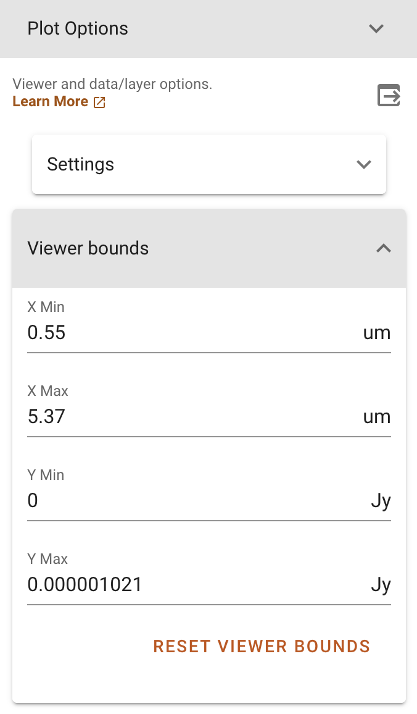

.. _specviz-displaying:

******************
Displaying Spectra
******************

.. include:: ../_templates/deprecated_config_banner.rst

Specviz takes a modular approach to displaying data to take advantage of the flexibility of
 `glue <https://glueviz.org/>`_ as the data-handling layer in the many applicable contexts.

The first spectrum you load will be automatically displayed in the viewer with
the view window set by the extent of the spectrum. Additional spectra may not be
fully shown if they exceed the bounds of the plotted area, which are set based
on the first displayed spectrum. The bounds can be changed via the
:ref:`Pan/Zoom <specviz-pan-zoom>` tool or by deselecting the current spectra and
selecting a different spectrum for display.

Much of the Specviz functionality can be handled within the tool or the
Jupyter notebook using an API. The Toolbar below gives you several spectroscopic
display options. Right click will open a dropdown with access to different options
for each button.

.. image:: ./img/specviztoolbar.png
    :alt: Specviz Toolbar

.. _selecting-data-set:

Selecting/Showing Data Sets
===========================

Data layers can be toggled in each viewer's data menu, opened by clicking the
legend in the top right of the viewer. Here, you can click the "eye" icon
next to the listed data to toggle that layer's visibility.

Data can be unloaded from a viewer by clicking on the data row
and selecting "Remove from viewer" in the delete submenu on the
bottom bar of the data menu.  Data unloaded from the viewer will also be excluded
as options from dataset dropdown menus in the various plugins.  Unloaded data will be available
to re-load into the viewer (by clicking the ``+`` icon in the top right of the data menu).

.. _specviz-cursor-info:

Cursor Information
==================

By moving your cursor along the spectrum viewer, you will be able to see information on the
cursor position as well as the spectral axis value, pixel, and flux of the closest data point
to the cursor.
This information is displayed in the top bar of the UI, on the middle-right side.

By default, the cursor information will correspond to the closest data layer to the cursor.
To change to a specific data-layer, click the layer-icon in the top bar to cycle between
"auto", "cursor", or specific data layers.

Home
====

This button will reset your zoom and panning to display the entire image.

Previous zoom is also available by right-clicking on the home icon and selecting
the previous zoom icon.  This will revert to the last saved zoom state.  Zoom states
are saved when beginning a zoom selection or when activating a pan/zoom tool.

.. _box-zoom:

Box Zoom
========

The |icon-box-zoom| (box) and |icon-xrange-zoom| (x-range) zoom tools allow you to zoom by
clicking and dragging with your mouse. The box zoom tool adjusts both the x and y range of
the plot, whereas the x-range tool zooms only the x-axis to the selected region. While
clicking and dragging you will see the selected region as a gray box, as below.

You can switch between the x-range zoom tool and the plot tool by right-clicking
(or your trackpad equivalent) on the currently selected zoom icon on the viewer
toolbar, which will open a menu of choices as in the screenshot below.

.. _specviz-pan-zoom:

Pan Zoom
========

There are several ways to pan around a spectrum or zoom in on features of
interest. Right click will open a dropdown with access to different
options described below.

Interactive Pan/Zoom (Desktop or Notebook Interface)
----------------------------------------------------
You can find the following Pan/Zoom tools available in the viewer toolbar
on the top right of the viewer.

.. _image-pan-zoom:

2D Bidirectional Pan/Zoom
^^^^^^^^^^^^^^^^^^^^^^^^^

The |icon-zoom-pan-2d| icon allows you to zoom using the scroll wheel.
The window will zoom into the area around your cursor.
To pan, simply click and drag the window.

Horizontal/Vertical Zoom
^^^^^^^^^^^^^^^^^^^^^^^^
The |icon-zoom-pan-horiz| (Horizontal) and |icon-zoom-pan-vert| (Vertical) Zoom tools allow you to zoom along each axis, while locking the other.  You can also zoom by scrolling.

Setting Viewer Bounds
^^^^^^^^^^^^^^^^^^^^^
The limits of the x and y axes can be set in the Plot Option plugin using the
expandable menu "Viewer bounds".

From the API
------------

The Specviz helper contains a set of convenience methods to programmatically define the view of the spectrum viewer. You may instantiate a Specviz Helper via:

.. code-block:: python

    from jdaviz import Specviz
    # Instantiate an instance of Specviz
    specviz = Specviz()
    # Display Specviz
    specviz.show()

Limit methods
^^^^^^^^^^^^^

You can use the
method :py:meth:`~jdaviz.configs.default.plugins.viewers.JdavizViewerMixin.set_limits`
to modify the field of view of Specviz. You can provide an int, float, or ``None`` in current
axis units:

.. code-block:: python

    from astropy import units as u
    # set_limits takes arguments in the order of: x_min, x_max, y_min, y_max
    specviz.viewers['spectrum-viewer'].set_limits(650, 750, None, 110.0)

.. note::
   In previous versions of the code, units could be provided as well as the string 'auto'. This
   behavior is now deprecated as of version 4.2.

Autoscale methods
^^^^^^^^^^^^^^^^^
You can also quickly return to the default zoom using
:py:meth:`~jdaviz.configs.default.plugins.viewers.JdavizViewerMixin.reset_limits`.

.. _spectral-regions:

Defining Spectral Regions
=========================

Spectral regions allow users to select subsets of the data array.
These can be defined by clicking on the |icon-region-horiz| icon at the right of the
viewer toolbar.

To select a region of interest, move the cursor to one of the end points
(in wavelength) of the region you want to select, and drag
it to the other end point. The selected region background will display in light gray color,
and the spectral trace in color, coded to subset number and listed under the subsets dropdown.

Clicking on that selector, you can add more regions by selecting the "create new" entry.

From the API
------------
You can define a spectral region programmatically, by using the ``glue`` XRangeROI method
and specifying the bounds of the spectral region (xmin, xmax).

.. code-block:: python

    from glue.core.roi import XRangeROI
    sv = specviz.app.get_viewer('spectrum-viewer')
    sv.toolbar_active_subset.selected = []
    sv.apply_roi(XRangeROI(xmin, xmax))

To extract the properties of the defined spectral regions, you can use
the :py:meth:`~jdaviz.configs.specviz.helper.Specviz.get_spectral_regions` method:

.. image:: img/spectral_region_5.png

.. _line-selection:

Line Selection
==============

The |icon-line-select| icon, which appears when lines from a line list are over-plotted,
allows you to click and select a vertical line. Further analysis can be performed on this
line of interest.

.. seealso::

    :ref:`Line Lists <line-lists>`
        Documentation on using line lists within Specviz.

.. _specviz-plot-settings:

Plot Settings
=============

To access plot settings for a particular viewer (including the spectrum viewer),
click the |icon-settings-sliders| icon in the viewer toolbar or open the
:ref:`Plot Options <specviz-plot-options>` plugin.

Layer
-----

The top section of the :guilabel:`Layer` tab contains options to change the color
of the spectrum (click the |icon-color-square| icon to see a color change menu
and a default color palette), change visibility of the spectrum (|icon-eye| icon),
and a dropdown box to select which layer will have its settings changed.

Line Width
----------

Width of the line for the spectrum in pixels. Larger values are thicker lines on the plot.

Line Opacity
------------

Opacity of the line. Maximum (1) is fully opaque and minimum (0) is fully transparent.

Plot profile as steps
---------------------

Toggle on to view the spectrum as a continuous line or a step function.

Plot uncertainties
------------------

Toggle on to view uncertainties attached to the spectrum, if any.

From the API
------------

Here is an example on how to set the plot options from the API.

.. code-block:: python

    plot_options = specviz.plugins['Plot Options']
    plot_options.line_color = 'blue'
    plot_options.line_width = 3
    plot_options.uncertainty_visible = True
