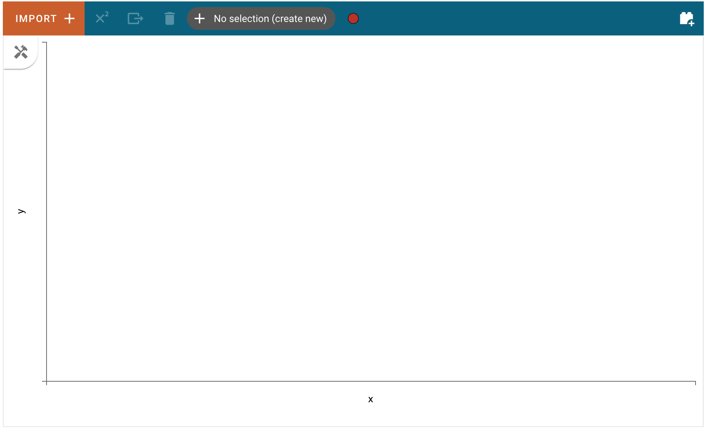
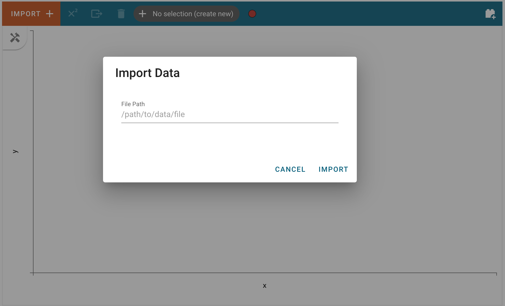
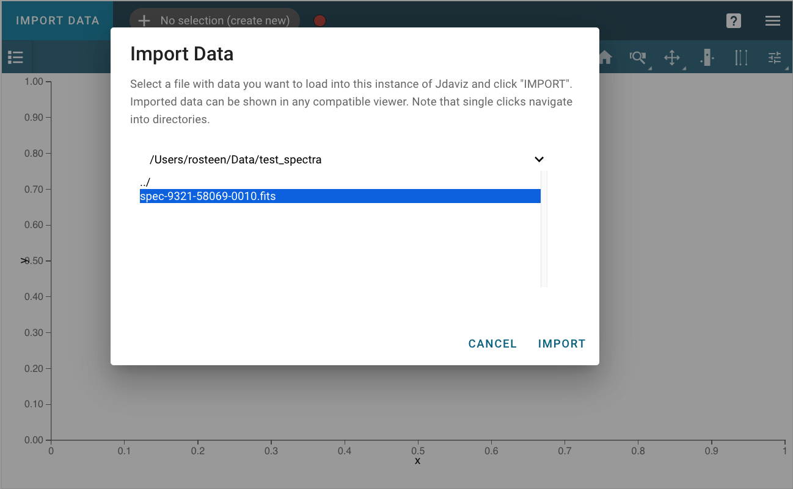
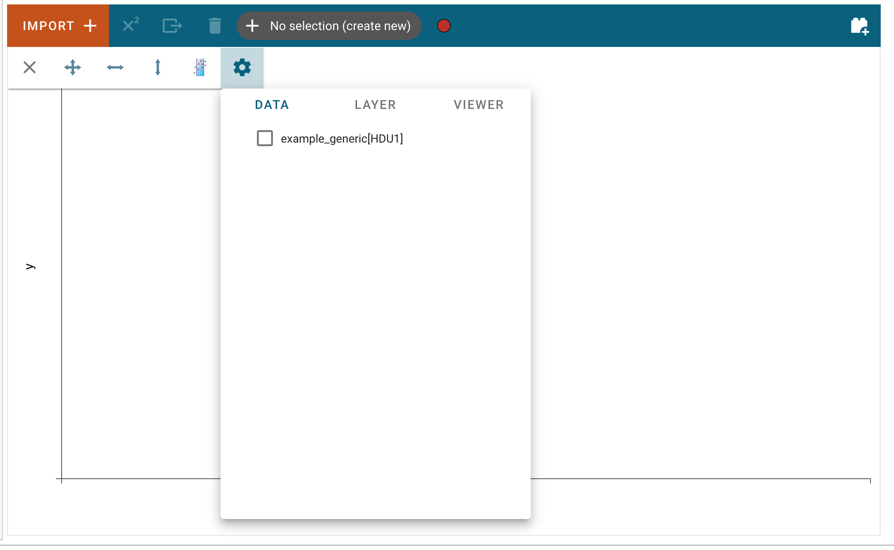

***********
Import Data
***********

There are two primary ways in which a user can load their data into the Specviz application. It should be noted that currently, Specviz only supports data that can be parsed as :class:`~specutils.Spectrum1D` objects.

.. seealso::

    `Reading from a File <https://specutils.readthedocs.io/en/stable/spectrum1d.html#reading-from-a-file>`_
        SpecUtils documentation on loading data as :class:`~specutils.Spectrum1D` objects.

Importing data through the GUI
------------------------------

The first way that users can load their data into the Specviz application is by using the "Import Data" button in the application's user interface.

This process is fairly straightforward, users need only click on the "Import Data" button:

and enter the path of file that can be parsed as a :class:`~specutils.Spectrum1D` in the text field:

After clicking "Import", the data file will be parsed and loaded into the application. A notification will appear to let users know if the data import was successful. Afterward, the new data set can be found in the "Data" tab of each viewer's options menu.
To access the data tab, click the "hammer and screwdriver" icon to open the tool menu of a viewer. Then, click the "gear" icon.

Here, users can select the loaded data set to be visualized in the viewer.

.. image:: img/data_selected_1.png

Importing data via the API
--------------------------
Alternatively, if users are working in a coding environment like a Jupyter notebook, they have access to the Specviz helper class API. Using this API, users can load data into the application through code.
Below is an example of importing the Specviz helper class, creating a :class:`~specutils.Spectrum1D` using randomly generated data, and loading that :class:`~specutils.Spectrum1D` object into the Specviz application::

    >>> from jdaviz.configs.specviz.helper import SpecViz
    >>> import numpy as np
    >>> import astropy.units as u
    >>> from specutils import Spectrum1D
    >>> flux = np.random.randn(200)*u.Jy
    >>> wavelength = np.arange(5100, 5300)*u.AA
    >>> spec1d = Spectrum1D(spectral_axis=wavelength, flux=flux)
    >>> specviz = SpecViz()
    >>> specviz.load_spectrum(spec1d)

Similarly, users can create their :class:`~specutils.Spectrum1D` objects by providing file paths to the :func:`~specutils.Spectrum1D.read` method::

    >>> from specutils import Spectrum1D
    >>> #spec1d = Spectrum1D.read("/path/to/data/file")

For more information about using the SpecUtils package, please see the 
`SpecUtils documentation <https://specutils.readthedocs.io>`_.
