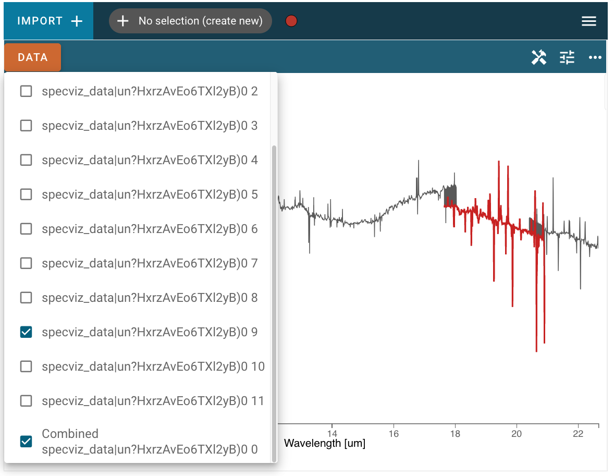

*************************
Loading Data into Specviz
*************************

By design, Specviz only supports data that can be parsed as :class:`~specutils.Spectrum1D` objects, as that allows the Python-level interface and parsing tools to be defined in ``specutils`` instead of being duplicated in Jdaviz.  :class:`~specutils.Spectrum1D` objects are very flexible in their capabilities, however, and hence should address most astronomical spectrum use cases.

.. seealso::

    `Reading from a File <https://specutils.readthedocs.io/en/stable/spectrum1d.html#reading-from-a-file>`_
        Specutils documentation on loading data as :class:`~specutils.Spectrum1D` objects.

There are two primary ways in which a user can load their data into the Specviz application: through the UI, or via the Python API (for most user cases this means inside a notebook).  These are separately detailed below.

Importing data through the GUI
------------------------------

The first way that users can load their data into the Specviz application is by using the :guilabel:`Import Data` button in the application's user interface.

.. image:: img/specviz_viewer.png

This process is fairly straightforward, users need only click on the :guilabel:`Import Data` button:

.. image:: img/import_data_1.png

and choose a file that can be parsed as a :class:`~specutils.Spectrum1D` in the text field:

.. image:: img/import_data_2.png

After clicking :guilabel:`Import`, the data file will be parsed and loaded into the
application. A notification will appear to let users know if the data import was 
successful, and if possible the data will be immediately displayed. If an incompatible
spectrum is already being displayed, the newly loaded data will be available in the 
:guilabel:`Data` menu but not immediately visible in the viewer. Afterward, the new 
dataset can be found in the :guilabel:`Data` tab of each viewer's menu. Here, 
users can select which spectra that have be loaded to be visualized in the viewer.

.. image:: img/data_selected_1.png

.. _api-import:

Loading data via the API
------------------------
Alternatively, if users are working in a coding environment like a Jupyter notebook, they have access to the :class:`~jdaviz.configs.specviz.helper.Specviz` helper class API. Using this API, users can load data into the application through code.
Below is an example of importing the :class:`~jdaviz.configs.specviz.helper.Specviz` helper class, creating a :class:`~specutils.Spectrum1D` object from a data file via the `specutils.Spectrum1D.read` method::

    >>> from specutils import Spectrum1D
    >>> spec1d = Spectrum1D.read("/path/to/data/file") #doctest: +SKIP
    >>> specviz = Specviz()  # doctest: +SKIP
    >>> specviz.load_spectrum(spec1d)  # doctest: +SKIP

You can also pass the path to a file that `~specutils.Spectrum1D` understands directly to the
:meth:`jdaviz.configs.specviz.helper.Specviz.load_spectrum` method::

    >>> specviz.load_spectrum("path/to/data/file") #doctest: +SKIP

This method works well for data files that ``specutils`` understands.  However, if you are using your own data file or in-memory data, you can instead create a :class:`~specutils.Spectrum1D` object directly. In this example that is done using randomly generated data, and then that :class:`~specutils.Spectrum1D` object is loaded into the Specviz application::

    >>> from jdaviz import Specviz
    >>> import numpy as np
    >>> import astropy.units as u
    >>> from specutils import Spectrum1D
    >>> flux = np.random.randn(200)*u.Jy
    >>> wavelength = np.arange(5100, 5300)*u.AA
    >>> spec1d = Spectrum1D(spectral_axis=wavelength, flux=flux)
    >>> specviz = Specviz()
    >>> specviz.load_spectrum(spec1d)  # doctest: +IGNORE_OUTPUT

For more information about using the Specutils package, please see the
`Specutils documentation <https://specutils.readthedocs.io>`_.

Loading multiple spectra via the API
------------------------------------
In addition to loading single spectra as above, in some cases it may be useful
to load multiple related spectra at once into the Jdaviz application. The most common
such case is when you have spectra of the same object covering multiple wavelength
ranges and want to look at and analyze the entire range of spectral coverage
simultaneously. The :meth:`jdaviz.configs.specviz.helper.Specviz.load_spectrum` accepts
a `~specutils.SpectrumList` object, in which case it will both load the
individual `~specutils.Spectrum1D` objects in the list and additionally attempt
to stitch together the spectra into a single data object so that
they can be manipulated and analyzed in the application as a single entity::

    >>> from specutils import SpectrumList
    >>> spec_list = SpectrumList([spec1d_1, spec1d_2]) #doctest: +SKIP
    >>> specviz.load_spectrum(spec_list) #doctest: +SKIP

In the screenshot below, the combined spectrum is plotted in gray, and one of
the single component spectra are also selected and plotted in red. Note that the
"stitching" algorithm to combine the spectra is a simple concatenation of data,
so in areas where the wavelength ranges of component spectra overlap you may see
the line plot jumping between points of the two spectra, as at the beginning and
end of the red region in the screenshot below:

This functionality is also available in limited instances by providing a directory path
to the :meth:`jdaviz.configs.specviz.helper.Specviz.load_spectrum` method. Note
that the ``read`` method of :class:`~specutils.SpectrumList` is only set up to handle
directory input in limited cases, for example JWST MIRI MRS data, and will throw an error
in other cases. In cases that it does work, only files in the directory level specified
will be read, with no recursion into deeper folders.
