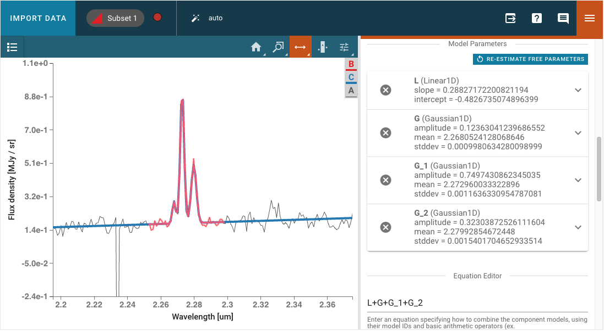

.. _specviz-plugins:

*********************
Data Analysis Plugins
*********************

The Specviz data analysis plugins are meant to aid quick-look analysis
of 1D spectroscopic data. All plugins are accessed via the :guilabel:`plugin`
icon in the upper right corner of the Specviz application. These plugins are
built upon :ref:`specutils` to do the actual analysis work

.. image:: ./img/specvizplugins.jpg
    :alt: Specviz Plugins
    :width: 200px

Any spectra generated by plugins (e.g., Gaussian Smooth) will be
automatically displayed in the spectral viewer. These spectra, and any other that is available,
can be found in the data selection dropdown menu
(see :ref:`Selecting Data Set <selecting-data-set>` for more detail) where you can also
toggle their visibility. This functionality is also available through the Python API.

.. _specviz-metadata-viewer:

Metadata Viewer
===============

.. seealso::

    :ref:`Metadata Viewer <imviz-metadata-viewer>`
        Imviz documentation on using the metadata viewer.

.. _specviz-plot-options:

Plot Options
============

.. seealso::

    :ref:`Spectral Plot Options <specviz-plot-settings>`
        Documentation on further details regarding the plot setting controls.

.. _specviz-subset-plugin:

Subset Tools
============

.. seealso::

    :ref:`Subset Tools <imviz-subset-plugin>`
        Imviz documentation describing the concept of subsets in Jdaviz. Subsets
        in Specviz are strictly spectral subsets and do not support rotation or
        recentering.

Markers
=======

.. seealso::

    :ref:`Markers <markers-plugin>`
        Imviz documentation describing the markers plugin.

.. _gaussian-smooth:

Gaussian Smooth
===============

Gaussian Smooth convolves a Gaussian function (kernel) with a Spectrum data object
to smooth the data. The convolution requires a Gaussian standard deviation value
(in pixels) which can be entered into the :guilabel:`Standard deviation`
field in the plugin.

A new Spectrum object is generated and is added to the spectrum viewer.
The object can be selected and shown in the viewer via the
:guilabel:`Data` icon in the viewer toolbar.

.. _specviz-model-fitting:

Model Fitting
=============

Astropy models can be fit to a spectrum via the Model Fitting plugin.
Model components are selected via the :guilabel:`Model Component` pulldown menu.
The :guilabel:`Add Component` button adds a Model Components block.

Model Parameters are automatically initialized with a guess.
These starting values can be edited by the user.
They may also be fixed by selecting the checkbox,
so that they are not fit or changed by the model fitting.

A mathematical expression must be entered into the
:guilabel:`Equation Editor` to specify the mathematical
combination of models.
This is also necessary even if there is only one model component.
The model components are specified by their labels and the equation
defaults to the sum of all created components, but can be modified to
exclude some of components without needing to delete them entirely
or to change to subtraction, for example. The user can also select
a different fitter to use for the model and adjust the corresponding
parameters that appear in the :guilabel:`Fitter Parameters`
accordion menu. The default fitter used is
`astropy.modeling.fitting.TRFLSQFitter <https://docs.astropy.org/en/latest/api/astropy.modeling.fitting.TRFLSQFitter.html#astropy.modeling.fitting.TRFLSQFitter>`_.
The fitter can be changed to any of the available Astropy fitters,
which can be found here `<https://docs.astropy.org/en/latest/modeling/reference_api.html#id6>`_.

After fitting, the expandable menu for each component model will update to
show the fitted value of each parameter rather than the initial value, and
will additionally show the standard deviation uncertainty of the fitted
parameter value if the parameter was not set to be fixed to the initial value
and if the spectrum uncertainty was loaded.

.. note::

   When a `1D Spline Models <https://docs.astropy.org/en/stable/modeling/spline_models.html>`_. model is selected, the plugin uses
   `astropy.modeling.spline.SplineSmoothingFitter <https://docs.astropy.org/en/stable/api/astropy.modeling.spline.SplineSmoothingFitter.html#astropy.modeling.spline.SplineSmoothingFitter>`_. to compute the fit.
   The initial value of the smoothing factor is automatically set to:
   (``len(data) * (standard_deviation(data))**2``).

   Refer to the section of the Scipy spline modeling documentation explaining
   the ``s`` parameter for advice on setting the smoothing factor/condition manually:
   https://docs.scipy.org/doc/scipy/reference/generated/scipy.interpolate.UnivariateSpline.html#scipy.interpolate.UnivariateSpline

From the API
------------

The model fitting plugin can be run from the API:

.. code-block:: python

    # Open model fitting plugin
    plugin_mf = specviz.plugins['Model Fitting']
    plugin_mf.open_in_tray()
    # Input the appropriate dataset and subset
    plugin_mf.dataset = 'my spectrum'
    plugin_mf.spectral_subset = 'Subset 1'
    # Input the model components
    plugin_mf.create_model_component(model_component='Linear1D',
                                     model_component_label='L')
    plugin_mf.create_model_component(model_component='Gaussian1D',
                                     model_component_label='G')
    # Set the initial guess of some model parameters
    plugin_mf.set_model_component('G', 'stddev', 0.002)
    plugin_mf.set_model_component('G', 'mean', 2.2729)
    # Model equation gets populated automatically, but can be overwritten
    plugin_mf.equation = 'L+G'
    # Set fitter
    plugin_mf.fitter.selected = 'TRFLSQFitter'
    # Calculate fit
    plugin_mf.calculate_fit()

Customizing Fitter Parameters
^^^^^^^^^^^^^^^^^^^^^^^^^^^^^^

The fitter parameters (such as maximum iterations, filtering non-finite values, etc.)
can be accessed and modified programmatically using the
:meth:`~jdaviz.configs.default.plugins.model_fitting.model_fitting.ModelFitting.get_fitter_parameter`
and :meth:`~jdaviz.configs.default.plugins.model_fitting.model_fitting.ModelFitting.set_fitter_parameter`
methods. The available parameters depend on the selected fitter.

Common parameters include:

* ``maxiter``: Maximum number of iterations (available for most fitters)
* ``filter_non_finite``: Whether to filter non-finite values like NaNs (available for most fitters)
* ``calc_uncertainties``: Whether to calculate parameter uncertainties (available for most fitters)

.. code-block:: python

    # Get the current value of a fitter parameter
    max_iterations = plugin_mf.get_fitter_parameter('maxiter')
    print(f"Current max iterations: {max_iterations}")
    
    # Set a new value for a fitter parameter
    plugin_mf.set_fitter_parameter('maxiter', 200)
    plugin_mf.set_fitter_parameter('filter_non_finite', False)
    
    # Verify the change
    new_max_iterations = plugin_mf.get_fitter_parameter('maxiter')
    print(f"New max iterations: {new_max_iterations}")

Note that different fitters support different parameters. For example, ``LinearLSQFitter``
does not support the ``maxiter`` parameter. If you attempt to get a parameter that doesn't
exist for the selected fitter, the method will return ``None``.

Exporting Fit Results
^^^^^^^^^^^^^^^^^^^^^^

Parameter values for each fitting run are stored in the plugin table.
To export the table into the notebook, call
:meth:`~jdaviz.core.template_mixin.TableMixin.export_table`
(see :ref:`plugin-apis`).

.. seealso::

    :ref:`Export Models <specviz-export-model>`
        Documentation on exporting model fitting results.

.. _unit-conversion:

Unit Conversion
===============

The spectral flux density and spectral axis units can be converted
using the Unit Conversion plugin.

Select the frequency, wavelength, or energy unit in the
:guilabel:`Spectral Unit` pulldown
(e.g., Angstrom, Hertz, erg).

Select the flux density unit in the :guilabel:`Flux Unit` pulldown
(e.g., Jansky, W/Hz/m2, ph/Angstrom cm2 s).

Note that this affects the default units in all viewers and plugins, where applicable,
but does not affect the underlying data.

From the API
------------

The Unit Conversion plugin can be called from the API:

.. code-block:: python

    unitconv_pl = specviz.plugins['Unit Conversion']
    unitconv_pl.spectral_unit = 'Angstrom'

.. _line-lists:

Line Lists
==========

Line wavelengths can be plotted in the spectrum viewer using
the Line Lists plugin.

Line lists (e.g. Common Stellar, SDSS, CO) can be selected from
Preset Line Lists via the :guilabel:`Available Line Lists`
pulldown.
They are loaded and displayed by pressing :guilabel:`Load List`.
Each loaded list is shown under :guilabel:`Loaded Lines` and can
be be removed manually.

.. image:: ../img/line_lists.png

Loaded Lines includes a :guilabel:`Custom` line list which is
automatically created, but populated with no lines.
Lines may be added to the Custom line list by entering
:guilabel:`Line Name`, :guilabel:`Rest Value`, and :guilabel:`Unit`
for the spectral axis and pressing :guilabel:`Add Line`.
Selected lines may be hidden by deselecting the associated check box.

The color of each line list may be adjusted with the color and
saturation sliders.
Entire line lists may be hidden in the display via
:guilabel:`Show All` and :guilabel:`Hide All`, located at the
bottom of each list.
Similarly, all of the line lists may be shown or hidden via
:guilabel:`Plot All` and :guilabel:`Erase All`, located at the
bottom of the plugin.

.. _custom-line-lists:

Importing Custom Line Lists
---------------------------

Jdaviz comes with curated line lists built by the scientific community.
If you cannot find the lines you need, you can add your own by constructing
an :ref:`astropy table <astropy:construct_table>`. For example:

.. code-block:: python

    from astropy.table import QTable
    from astropy import units as u

    my_line_list = QTable()
    my_line_list['linename'] = ['Hbeta','Halpha']
    my_line_list['rest'] = [4851.3, 6563]*u.AA

    viz.load_line_list(my_line_list)
    # Show all imported line lists
    viz.spectral_lines

Redshift Slider
---------------

.. warning::
    Using the redshift slider with many active spectral lines causes performance issues.
    If the shifting of spectral lines lag behind the slider, try plotting fewer lines.
    You can deselect lines using, e.g., the "Erase All" button in the line lists UI.

The :ref:`line-lists` plugin also contains a redshift slider which shifts all of the plotted
lines according to the provided redshift/RV.  The slider applies a delta-redshift,
snaps back to the center when releasing, and has limits that default based
on the x-limits of the spectrum viewer.  This provides a convenient method
to fine-tune the position of the redshifted lines to the observed lines in
the spectrum.

From the API
^^^^^^^^^^^^

The range and step size of the slider can be set from a notebook cell using the
:py:meth:`~jdaviz.configs.default.plugins.line_lists.line_list_mixin.LineListMixin.set_redshift_slider_bounds`
method in Specviz by specifying the ``range`` or ``step`` keywords, respectively.
Setting either keyword to ``'auto'`` means its value will be calculated
automatically based on the x-limits of the spectrum plot.

The redshift itself can be set from the notebook using the ``set_redshift`` method.

Any set redshift values are applied to spectra output using the
:py:meth:`~jdaviz.configs.specviz.helper.Specviz.get_spectra` helper method.
Note that using the lower-level app data retrieval (e.g., ``specviz.get_data()``)
will return the data as originally loaded, with the redshift unchanged.

.. _line-analysis:

Line Analysis
=============

The Line Analysis plugin returns
`specutils analysis <https://specutils.readthedocs.io/en/stable/analysis.html>`_
for a single spectral line.
The line is selected via the :guilabel:`region` tool in
the spectrum viewer to select a spectral subset. Note that you can have
multiple subsets in Specviz, but the plugin will only show statistics for the
selected subset.

A linear continuum is fitted and subtracted (divided for the case of equivalenth width) before
computing the line statistics.  By default, the continuum is fitted to a region surrounding
the select line.  The width of this region can be adjusted, with a visual indicator shown
in the spectrum plot while the plugin is open.  The thick line shows the linear fit which
is then interpolated into the line region as shown by a thin line.  Alternatively, a custom
secondary region can be created and selected as the region to fit the linear continuum.

The properties returned include the line centroid, gaussian sigma width, gaussian FWHM,
total flux, and equivalent width. Uncertainties on the derived properties are also
returned. For more information on the algorithms used, refer to the `specutils documentation
<https://specutils.readthedocs.io/en/stable/analysis.html>`_.

The line flux results are automatically converted to Watts/meter2,
when appropriate.

From the API
------------

The Line Analysis plugin can be run from the API:

.. code-block:: python

    # Open line analysis plugin
    plugin_la = specviz.plugins['Line Analysis']
    plugin_la.open_in_tray()
    # Input the appropriate spectrum and region
    plugin_la.dataset = 'my spectrum'
    plugin_la.spectral_subset = 'Subset 2'
    # Input the values for the continuum
    plugin_la.continuum = 'Subset 3'
    # Return line analysis results
    plugin_la.get_results()

Redshift from Centroid
----------------------

Following the table of statistics, the centroid can be used to set the redshift by assigning
the centroid value to a line added in the :ref:`Line List Plugin <line-lists>`.  Select the
corresponding line from the dropdown, or by locking the selection to the identified line and
using the |icon-line-select| (line selector) tool in the spectrum viewer.

.. _specviz-export-plot:

Export
======

This plugin allows exporting the contents of a viewer or a plot within a plugin
to various image formats. Additionally, spatial and spectral (Astropy) regions
can be exported to files. Spatial regions may be exported as either FITS or REG
files while Spectral regions may be exported as ECSV files.
Note that multiple spectral regions can be saved to the same file so long as
they are subregions of a single subset rather than independent subsets.