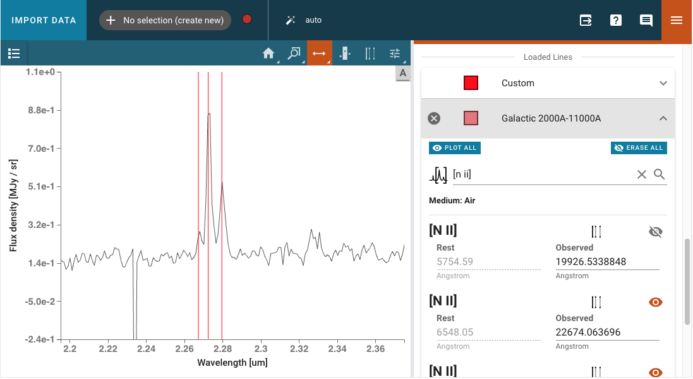

*********************
Data Analysis Plugins
*********************

To enable quick analysis of astronomical spectra, Specviz ships with a number of
plugins that let you do various standard spectral analysis tasks.  Note that
these plugins all depend on `specutils` to do the actual analysis work - when
doing these operations in the Notebook you are often better off using
the `specutils` or `astropy` APIs directly instead of using the plugins. But
for quick-look or interaction heavy workflows, the plugins provide a UI-based
alternative.

Data analysis plugins are found in the plugin tray, accessed via the
:guilabel:`plugin` icon in the upper right corner of the Specviz application window.
Each plugin may be used to perform data analysis tasks on
selected datasets.

Input/Output
============
Data to be operated on are selected in each plugin via a
:guilabel:`Data` pulldown menu.

Gaussian Smooth
===============

.. image:: ../img/gaussian_smooth.png

Gaussian Smooth is performed on a Spectrum1D data object.
The spectrum is convolved with a Gaussian function.
The Gaussian standard deviation in pixels must be entered into the
:guilabel:`Standard deviation` field in the plugin.

A new Spectrum1D object is generated and is added to the spectrum
viewer.
It can be selected and shown in the viewer via the
:guilabel:`gear-->Data` tab.

Model Fitting
=============

.. image:: ../img/model_fitting_components.png

Astropy models can be fit to a spectrum via the Model Fitting plugin.
Model components are selected via the :guilabel:`Model` pulldown menu.
Each component should be given a :guilabel:`Model ID`.
The :guilabel:`Add Model` button adds a Model Parameters block.

Model Parameters are automatically initialized with a guess.
These starting values can be edited by the user.
They may also be fixed by selecting the :guilabel:`Fixed?` checkbox,
so that they are not fit or changed by the model fitting.

A mathematical expression must be entered into the
:guilabel:`Model Equation Editor` to specify the mathematical
combination of models.
This is also necessary even if there is only one model component.
The model components are specified by their :guilabel:`Model ID`.
For example, add together Constant and Gaussian models with
model IDs 'C' and 'G1' by entering the Model Equation 'C+G1'.

Fitted models can be extracted from the app into notebook cells by using
the `get_models` method of the configuration `helper` class , e.g. ::

    specviz.get_models(model_label="Model")

The `get_models` method returns the fitted `astropy` model objects. If only
the parameters of the model are needed, those can be extracted using the
following code::

    specviz.get_model_parameters(model_label="Model")

If nothing is specified for the `model_label` parameter, information for
all models will be returned.

Unit Conversion
===============

The spectral flux density and spectral axis units can be converted
using the Unit Conversion plugin.  The Spectrum1D object to be
converted is the currently selected spectrum in the spectrum viewer :guilabel:`gear-->Data` tab.

Select the frequency, wavelength, or energy unit in the
:guilabel:`New Spectral Axis Unit` pulldown
(e.g. Angstrom, Hertz, erg).

Select the flux density unit in the :guilabel:`New Flux Unit` pulldown
(e.g. Jansky, W/(Hz/m2), ph/(Angstrom cm2 s)).

The :guilabel:`Apply` button will convert the flux density and/or
spectral axis units and create a new Spectrum1D object that
is automatically switched to in the spectrum viewer.
The name of the new Spectrum1D object is "_units_copy_" plus
the flux and spectral units of the spectrum.

.. _line-lists:

Line Lists
==========

Line wavelengths can be plotted in the spectrum viewer using
the Line Lists plugin.

Line lists (e.g. Common Stellar, SDSS, CO) can be selected from
Preset Line Lists via the :guilabel:`Available Line Lists`
pulldown.
They are loaded and displayed by pressing :guilabel:`Load List`.
Each loaded list is shown under :guilabel:`Loaded Lines`.
Loaded line lists may be removed by pressing the
:guilabel:`circled-x` button.

The Loaded Lines include a :guilabel:`Custom` line list which is
automatically created, but populated with no lines.
Lines may be added to the Custom line list by entering
:guilabel:`Line Name`, :guilabel:`Rest Value`, and :guilabel:`Unit`
for the spectral axis and pressing :guilabel:`Add Line`.
Selected lines may be hidden by deselecting the associated check box.

The color of each line list may be adjusted with the color and
saturation sliders.
Entire line lists may be hidden in the display via
:guilabel:`Show All` and :guilabel:`Hide All`, located at the
bottom of each list.
Similarly, all of the line lists may be shown or hidden via
:guilabel:`Plot All` and :guilabel:`Erase All`, located at the
bottom of the plugin.

Line Analysis
=============

The Line Analysis plugin returns statistics for a single spectral line.
The line is selected via the :guilabel:`region` tool in
the spectrum viewer to select a spectral subset. Note that you can have
multiple subsets in Specviz, but the plugin will only show statistics for the
selected subset.

The statistics returned include the line centroid, gaussian sigma width, gaussian FWHM,
total flux, and equivalent width.

No continuum operations are performed as part of this plugin.  This means that
the statistics may or may not be correct depending on how you have prepared
your spectrum - most statistics assume a continuum-subtracted spectrum, aside
from equivalent width which assumes continuum-normalized. If your continuum is
not in this form initially, you may wish to either use the `specutils` API in
the Notebook Interface to perform continuum subtraction/normalization, or
make use of the model fitting plugin to do the appropriate corrections.
